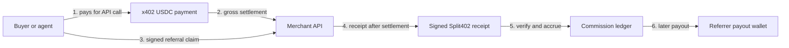
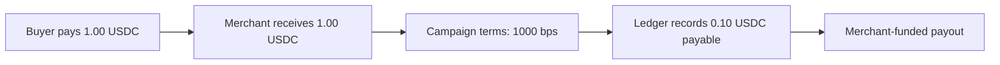
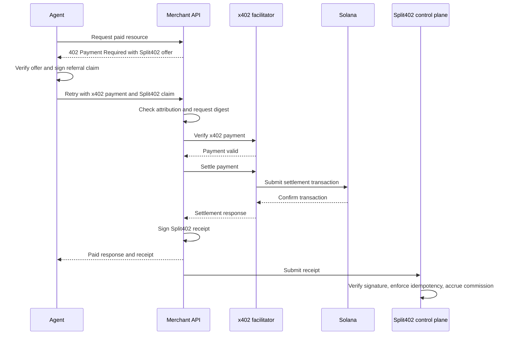
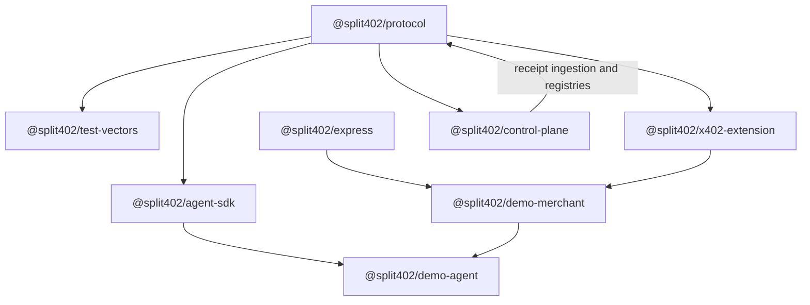
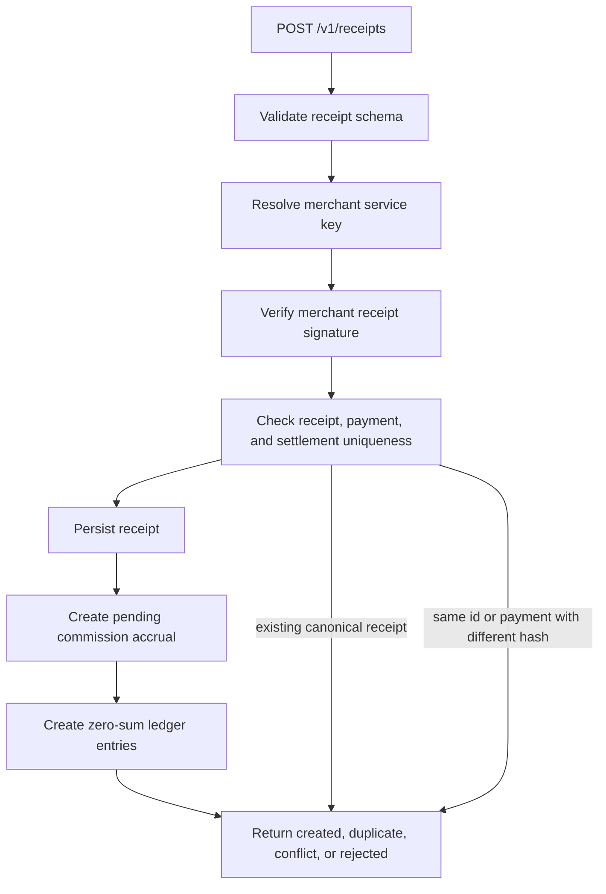

# Split402

[](https://github.com/split402protocol/splitx402/actions/workflows/ci.yml)


> Referral attribution, commission accounting, and payout infrastructure for
> x402-paid APIs and agent transactions.

Split402 lets merchants sell paid API calls through standard x402 USDC payment
flows while giving agents, apps, and route publishers a verifiable way to earn
referral commission.

In simple terms: an agent pays USDC for an x402 API call, attaches a signed
Split402 referral claim, and the merchant still receives the normal x402
settlement. If the campaign says the referral earns 10 percent, Split402 records
that 10 percent as an auditable commission owed to the referrer's payout wallet.
The actual referrer payout happens later from a merchant-funded payout process.

That means Split402 is a referral commission protocol, not a replacement
settlement path in the MVP. A `1.00 USDC` call with `1000` basis points of
commission creates a `0.10 USDC` referrer credit; it does not yet split the live
settlement into `0.90 USDC` and `0.10 USDC` inside the same transaction.

Split402 is the project and protocol name. This repository,
[`split402protocol/splitx402`](https://github.com/split402protocol/splitx402),
is the v2 implementation line for the protocol work that started in
[`splitx402/ffff`](https://github.com/splitx402/ffff). The canonical product
scope is the [Split402 protocol architecture v0.1 spec](docs/reference/split402_protocol_architecture_v0.1.md).

## What We Are Building

Split402 is an accrual-and-payout protocol layered on top of x402. It does not
fork or replace the x402 payment in the MVP.

| Layer | Responsibility |
| --- | --- |
| x402 payment | Buyer pays the merchant in USDC for the API call. |
| Split402 attribution | Buyer or agent attaches a signed referral claim to the paid request. |
| Merchant receipt | Merchant signs a receipt after x402 verification and settlement. |
| Control plane | Receipt is verified, deduplicated, and turned into a commission accrual. |
| Payout engine | Later worker pays accumulated commissions from merchant-funded liquidity. |



## Example Commission

| Item | Value |
| --- | --- |
| API price | `1.00 USDC` |
| x402 settlement | `1.00 USDC` to the merchant |
| Campaign commission | `1000` bps, or 10 percent |
| Split402 accrual | `0.10 USDC` owed to the referrer |
| Payout timing | Later, after verification and payout selection |



## Protocol Flow



## Repository Map



| Package | Purpose |
| --- | --- |
| `@split402/protocol` | Schemas, canonical hashes, IDs, amount math, operation digests, signing, verification, and test-vector generation. |
| `@split402/test-vectors` | Language-neutral protocol fixtures generated from the protocol package. |
| `@split402/x402-extension` | x402 client and resource-server extension hooks for Split402 offers, attribution, and receipts. |
| `@split402/express` | Express request-context adapter used to bind receipts to stable operation digests. |
| `@split402/agent-sdk` | Buyer-side offer inspection, referral claim creation, paid calls, and receipt verification. |
| `@split402/demo-merchant` | Solana Devnet x402 merchant demo with Split402 receipt generation. |
| `@split402/demo-agent` | Runnable buyer/agent harness for setup, preflight, and paid-suite proof. |
| `@split402/control-plane` | Receipt ingestion, merchant/key/origin registry, wallet auth, campaign versions, accruals, and ledger model. |

## Current Status

Split402 is public-alpha protocol infrastructure. There are no production
contracts, no mainnet payment flows, and no custody of real production balances.

| Area | Main branch status |
| --- | --- |
| Protocol core and deterministic test vectors | Implemented |
| x402 extension and Express request context adapter | Implemented |
| Demo merchant and demo agent Devnet harness | Implemented |
| Existing-token Devnet receipt proof | Recorded |
| Control-plane receipt ingestion API | Implemented foundation |
| PostgreSQL receipt, accrual, and ledger persistence | Implemented foundation |
| Merchant/key/origin registry APIs | Implemented foundation |
| PostgreSQL merchant/key/origin persistence | Implemented foundation |
| Wallet-authenticated merchant mutations | Implemented foundation |
| PostgreSQL wallet-auth persistence | Implemented foundation |
| Campaign draft/version/activation APIs | Implemented foundation |
| Wallet-auth refresh-token rotation | Active PR stack |
| Route draft/activation/suspension APIs and route persistence | Active PR stack |
| Receipt outbox, worker stores, chain verification, runtime wiring | Active PR stack |
| Route search, route history, payout-wallet rotation, webhooks | Not implemented |
| Payout engine | Not implemented |
| `$SPLIT` bonding and atomic split settlement | Later research |

The latest recorded Devnet proof is
[docs/proofs/phase3-paid-suite-2026-06-24.md](docs/proofs/phase3-paid-suite-2026-06-24.md).

## Control-Plane Shape



Current public API surface on `main`:

```text
GET  /v1/health
POST /v1/auth/challenges
POST /v1/auth/sessions
POST /v1/receipts
POST /v1/merchants
GET  /v1/merchants/:merchantId
POST /v1/merchants/:merchantId/origins
POST /v1/merchants/:merchantId/keys
POST /v1/merchants/:merchantId/keys/:kid/revoke
POST /v1/campaigns
GET  /v1/campaigns/:campaignId
POST /v1/campaigns/:campaignId/activate
GET  /v1/campaigns/:campaignId/versions/:version
POST /v1/campaigns/:campaignId/versions
```

The active implementation stack after `main` adds durable campaign persistence,
route draft/activation/suspension, wallet-session refresh tokens, receipt outbox
processing, Solana chain-verification workers, and deployable runtime wiring.
Those capabilities are documented as active stack work until the PRs are merged.

## Quick Start

Requirements:

- Node.js `>=22`
- Corepack
- pnpm through the repository package-manager setting

```bash
corepack enable
corepack pnpm install
```

Run the main validation suite:

```bash
corepack pnpm lint
corepack pnpm typecheck
corepack pnpm test
corepack pnpm build
corepack pnpm vectors:check
corepack pnpm audit --audit-level high
```

Run the Devnet demo flow:

```bash
corepack pnpm demo:merchant
corepack pnpm demo:inspect-offer
corepack pnpm demo:preflight
corepack pnpm demo:paid-suite
```

The transitional root service defaults to `SPLIT402_PAYMENT_MODE=mock`, which
emits x402-shaped HTTP 402 challenges and accepts deterministic mock payment
payloads for local tests. Use `SPLIT402_PAYMENT_MODE=x402` only when exercising
the older Phase 1 facilitator-backed path.

## Agent Usage

```ts
import {
  Split402AgentClient,
  createReferralClaim,
  createSvmSignerFromBase58
} from "@split402/agent-sdk";
import { deriveEd25519PublicKey, hexToBytes } from "@split402/protocol";

const signer = await createSvmSignerFromBase58(process.env.SVM_PRIVATE_KEY!);
const referrerSeed = hexToBytes(process.env.SPLIT402_REFERRER_SEED_HEX!);
const payoutSeed = hexToBytes(process.env.SPLIT402_PAYOUT_SEED_HEX!);

const client = new Split402AgentClient({
  merchantOrigin: "https://merchant.example",
  merchantPublicKey: process.env.SPLIT402_MERCHANT_PUBLIC_KEY,
  signer
});

const offer = await client.inspectOffer({
  path: "/v1/risk",
  body: { wallet: signer.address.toString() }
});

const referralClaim = createReferralClaim({
  privateSeed: referrerSeed,
  routeId: "rte_00000000000000000000000000000003",
  campaignId: offer.offer.campaignId,
  campaignVersionMin: offer.offer.campaignVersion,
  payoutWallet: deriveEd25519PublicKey(payoutSeed),
  resourceOrigin: offer.offer.resourceOrigin,
  operationIds: [offer.offer.operationId],
  expiresAt: "2099-06-24T00:00:00Z"
});

const result = await client.postJson({
  path: "/v1/risk",
  pathTemplate: "/v1/risk",
  body: { wallet: signer.address.toString() },
  referralClaim
});

console.log(result.receipt?.referrerCreditAtomic);
```

## Documentation

- [Canonical architecture spec](docs/reference/split402_protocol_architecture_v0.1.md)
- [Architecture alignment note](docs/SPLIT402_ARCHITECTURE.md)
- [Build plan](docs/BUILD_PLAN.md)
- [Roadmap](docs/ROADMAP.md)
- [Phase 0 status](docs/PHASE_0.md)
- [Phase 1 status](docs/PHASE_1.md)
- [Phase 2 status](docs/PHASE_2.md)
- [Phase 3 status](docs/PHASE_3.md)
- [Phase 4 status](docs/PHASE_4.md)
- [Architecture baseline decision](docs/decisions/0003-adopt-architecture-and-ffff-baseline.md)
- [Contributing](CONTRIBUTING.md)
- [Security policy](SECURITY.md)

## MVP Rules

- Keep x402 commercial payments in USDC.
- Attach referral attribution through signed Split402 claims.
- Settle the gross payment normally to the merchant.
- Record signed receipts and idempotent commission liabilities.
- Pay referrers later from merchant-funded payout liquidity.
- Keep atomic split settlement and `$SPLIT` route bonding out of the critical path
  until the USDC referral-payment loop is proven end to end.
