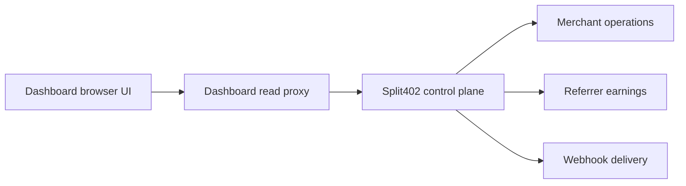

# @split402/dashboard

Operational dashboard for the Split402 public-alpha merchant and referrer flows.

The app serves a focused browser UI and a narrow same-origin proxy for the
control-plane read APIs. It is intentionally API-first: it visualizes the
merchant dashboard summary, reliability profile, merchant payout obligations,
webhook delivery feed, referrer balances, referrer routes, and referrer payouts
that Phase 7 exposes.

## Surface



## Run

```bash
corepack pnpm dashboard
```

Environment:

```text
SPLIT402_DASHBOARD_CONTROL_PLANE_URL=http://localhost:4021
SPLIT402_DASHBOARD_PORT=4027
SPLIT402_DASHBOARD_MERCHANT_ID=mrc_...
SPLIT402_DASHBOARD_REFERRER_WALLET=...
SPLIT402_DASHBOARD_CONTROL_PLANE_TOKEN=...
SPLIT402_DASHBOARD_VIEWER_TOKEN=...
SPLIT402_DASHBOARD_SESSION_COOKIE_NAME=split402_dashboard_session
SPLIT402_DASHBOARD_SESSION_COOKIE_SECURE=true
SPLIT402_DASHBOARD_SESSION_MAX_AGE_SECONDS=28800
```

The dashboard forwards a caller-provided `Authorization` header when present.
Otherwise it uses `SPLIT402_DASHBOARD_CONTROL_PLANE_TOKEN` if configured.
Set `SPLIT402_DASHBOARD_VIEWER_TOKEN` for hosted staging or public-alpha
deployments; dashboard API routes then require a viewer session cookie or the
separate `x-split402-dashboard-token` header. `/health` remains public for
uptime checks. Browser sessions use signed, expiring HTTP-only cookies; tune
their lifetime with `SPLIT402_DASHBOARD_SESSION_MAX_AGE_SECONDS`.
Merchant payout obligations show `covered` or `deficit` when the control plane
has `SPLIT402_FUNDING_BALANCE_PROVIDER=solana-rpc`; otherwise funding status is
reported as `unknown`.

## Status

Phase 7 public-alpha UI. It is a merchant/referrer operations surface for local
and staging control-plane APIs with an optional viewer gate and expiring session
cookies for hosted staging. It is not a production mainnet dashboard service
yet.
