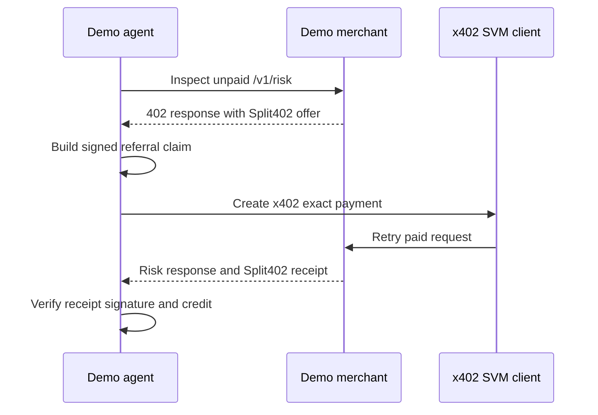

# @split402/demo-agent

Runnable buyer/agent harness for the Split402 Solana Devnet proof loop.

The demo agent sets up disposable Devnet keys and token accounts, inspects a
Split402-enabled merchant offer, creates a signed referral claim, pays the API
through the x402 SVM `exact` client, and verifies the merchant-signed receipt.

## Flow



## Commands

```bash
corepack pnpm demo:setup-buyer
corepack pnpm demo:setup-existing-token
corepack pnpm demo:inspect-offer
corepack pnpm demo:preflight
corepack pnpm demo:paid-suite
```

## Status

Public-alpha Devnet harness. Keys and funds used here must be disposable test
assets only.
