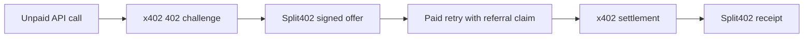
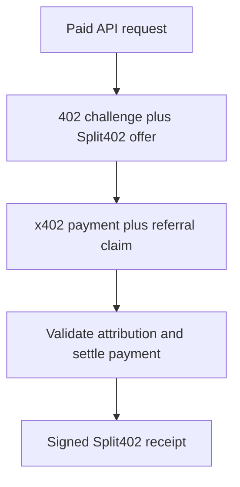

# @split402/demo-merchant

Solana Devnet merchant API that demonstrates Split402 on top of a normal x402
USDC payment.

The merchant advertises a signed Split402 offer in the unpaid x402 challenge,
validates incoming referral attribution before settlement, settles the payment
through the x402 SVM path, and returns a merchant-signed Split402 receipt.

## What It Demonstrates



## Flow



## Commands

```bash
corepack pnpm demo:merchant
corepack pnpm --filter @split402/demo-merchant test
```

## Status

Public-alpha demo server for Devnet and local protocol validation. It is not a
production merchant template, custody service, or payout engine.
