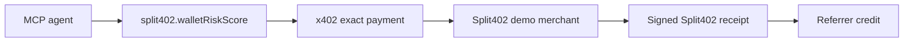

# @split402/mcp-demo

MCP-facing demo bundle for the Split402 public-alpha paid tool flow.

The bundle describes one agent-callable paid tool, the x402 payment requirement,
the Split402 referral campaign, receipt verification expectations, and the
commands needed to run the local proof loop.

## Tool Card



## Generate The Bundle

```bash
corepack pnpm demo:mcp-bundle
```

The command emits deterministic JSON that can be copied into MCP-client or
agent-runner configuration while the real demo server is running locally.

## Proof Commands

```bash
corepack pnpm demo:merchant
corepack pnpm demo:inspect-offer
corepack pnpm demo:mcp-bundle
corepack pnpm demo:paid-suite
```

## Status

Phase 7 public-alpha bundle. It is a demo manifest and runbook for agent-facing
tooling, not a hosted MCP gateway.
