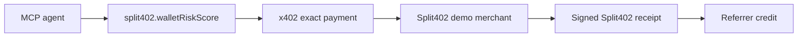

# @split402/mcp-demo

MCP-facing demo bundle and stdio gateway for the Split402 public-alpha paid tool
flow.

The package describes one agent-callable paid tool, the x402 payment
requirement, the Split402 referral campaign, receipt verification expectations,
and the commands needed to run the local proof loop. It can also run as a small
MCP stdio gateway for clients that want to inspect or call the demo tool through
MCP directly.

## Tool Card



## Generate The Bundle

```bash
corepack pnpm demo:mcp-bundle
```

The command emits deterministic JSON that can be copied into MCP-client or
agent-runner configuration while the real demo server is running locally.

## Run The Gateway

```bash
corepack pnpm demo:mcp-gateway
```

The gateway supports `initialize`, `tools/list`, and `tools/call` over stdio
JSON-RPC. Calling `split402.walletRiskScore` returns the paid HTTP request
shape, x402 payment requirement, Split402 campaign metadata, and expected
commission economics for the supplied wallet.

## Proof Commands

```bash
corepack pnpm demo:merchant
corepack pnpm demo:inspect-offer
corepack pnpm demo:mcp-bundle
corepack pnpm demo:paid-suite
```

Run `corepack pnpm demo:mcp-gateway` in an MCP client stdio session when the
proof needs direct MCP tool discovery.

## Status

Phase 7 public-alpha bundle and stdio gateway for agent-facing tooling. It is
not a production hosted MCP service.
