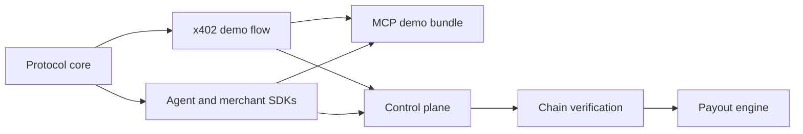

# Current State

Split402 is a public-alpha implementation of referral attribution and commission
accounting for x402-paid APIs.

In simple words: an agent pays a merchant through normal x402 USDC settlement and
attaches a signed Split402 referral claim. The merchant still receives the gross
x402 payment. Split402 records the referral commission as an auditable payable,
verifies the settlement, and later pays accumulated commissions from a
merchant-funded payout flow.

## What Is Built

| Area | State |
| --- | --- |
| Protocol primitives | Implemented: schemas, hashes, IDs, amount math, operation digests, signatures, and test vectors. |
| x402 integration | Implemented: Split402 offers, referral claims, request digests, and receipts around standard x402 settlement. |
| Demo path | Implemented for Solana Devnet paid-suite proof runs. |
| MCP demo bundle | Implemented first Phase 7 slice: paid tool card, x402 payment metadata, Split402 campaign metadata, expected referral economics, and proof commands. |
| Agent SDK | Implemented for offer inspection, claim creation, paid calls, and receipt verification. |
| Merchant SDK | Implemented for campaign caching, service-key rotation helpers, payment identifiers, operation digests, and receipt outbox primitives. |
| Control plane | Implemented foundation: receipt ingestion, merchant/campaign/route registries, wallet auth, PostgreSQL persistence, outbox workers, chain verification, public merchant reliability profiles, merchant dashboard summaries, webhook delivery feeds, referrer balances/routes, Bazaar-compatible route metadata, and signed webhooks for accepted receipts and payout lifecycle events. |
| Payout engine | In progress: preview, allocation, Solana transfer planning, simulation, signer policy, local-dev signer, remote signer client, signer appliance scaffold, signer deployment and private-network artifacts, custody evidence gates, signed-byte persistence, broadcast boundary, finality monitor, rollup, lifecycle events, unknown-outcome reconciliation queue, referrer payout views, and ledger closure are present. |

## What Is Not Built Yet

- The original x402 payment is not atomically split onchain in the MVP.
- `$SPLIT` route bonding is not in the critical path yet.
- The merchant/referrer dashboard UI is not built yet; current dashboard work is
  API-first.
- Mainnet production operation is not approved.
- Phase 6 still needs completed staging deployment evidence and all pending
  custody gates in `docs/checklists/phase6-custody-review.md` before any mainnet
  payout custody.

## Current Direction

The near-term objective is to finish Phase 7 productization: a usable
merchant/referrer dashboard, agent-demo packaging, and staging proof that an
agent can discover, pay, and verify Split402 earnings without manual database
work.
