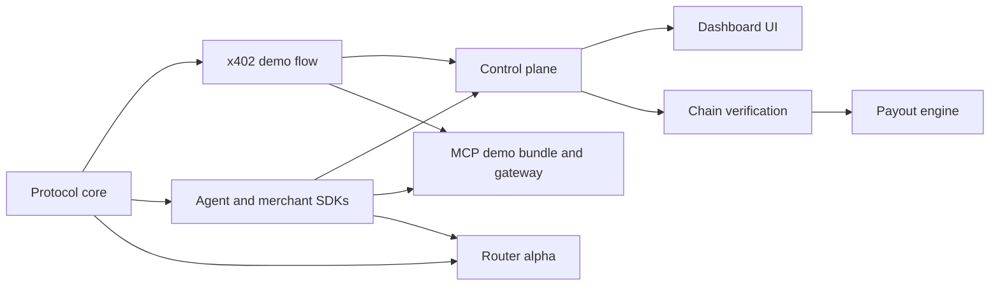

# Current State

Split402 is a public-alpha implementation of referral attribution and commission
accounting for x402-paid APIs.

The public repository is now scoped as the open protocol foundation under
Apache-2.0. Production hosted services, commercial router operations, private
provider registries, custody evidence from real environments, and mainnet
deployment details belong outside this public repository unless explicitly
sanitized for release. See [Public and private boundary](PUBLIC_PRIVATE_BOUNDARY.md).

In simple words: an agent pays a merchant through normal x402 USDC settlement and
attaches a signed Split402 referral claim. The merchant still receives the gross
x402 payment. Split402 records the referral commission as an auditable payable,
optionally separates a protocol fee from that commission, verifies the
settlement, and later pays accumulated referrer credits from a merchant-funded
payout flow.

## What Is Built

| Area | State |
| --- | --- |
| Protocol primitives | Implemented: schemas, hashes, IDs, amount math, operation digests, signatures, and test vectors. |
| x402 integration | Implemented: Split402 offers, referral claims, request digests, and receipts around standard x402 settlement. |
| Demo path | Implemented for Solana Devnet paid-suite proof runs. |
| Router alpha | Implemented `@split402/router` public-alpha router with static providers, control-plane route discovery, capability search, budget filtering, deterministic ranking, retry/fallback, pay-to wallet checks, and fail-closed receipt verification. |
| MCP demo bundle and gateway | Implemented public-alpha demo bundle and narrow stdio gateway: paid tool card, x402 payment metadata, Split402 campaign metadata, expected referral economics, router-backed `split402.searchCapabilities`, `split402.execute`, `split402.getReceipt`, optional control-plane route discovery, and proof commands. It is a runnable demo gateway, not production MCP hosting. |
| Dashboard UI | Implemented public-alpha merchant/referrer operations UI with a narrow read proxy for dashboard summary, reliability, payout obligations, webhook delivery, referrer routes, balances, payouts, and an optional hosted-staging viewer gate with signed, expiring session cookies. The referrer views render the canonical control-plane `{ summary }` balance and `{ items }` payout response contracts. |
| Phase 7 hosted staging | Implemented compose stack for PostgreSQL, control plane, migration job, dashboard, optional demo merchant, optional workers, and an operator-only Devnet seed command for active demo merchant/campaign/route setup without public self-approval endpoints. |
| Phase 7 staging proof | Implemented proof scaffold, assembly, status validator, hosted preflight collector, read collector, artifact manifest validation, funding-balance semantic validation, template, and runbooks for hosted end-to-end evidence, including payout-obligation funding coverage. |
| Agent SDK | Implemented for offer inspection, claim creation, paid calls, and receipt verification. |
| Merchant SDK | Implemented for campaign caching, service-key rotation helpers, payment identifiers, operation digests, and receipt outbox primitives. |
| Control plane | Implemented foundation: receipt ingestion, merchant/campaign/route registries, wallet auth, PostgreSQL persistence, receipt economic-policy verification, pending-only public merchant/origin registration, outbox workers, chain verification, public merchant reliability profiles, merchant dashboard summaries, payout-obligation summaries with optional Solana RPC funding balances, webhook delivery feeds, referrer balances/routes, Bazaar-compatible route metadata, and signed webhooks for accepted receipts and payout lifecycle events. |
| Payout engine | In progress: preview, allocation, safe allocation release, Solana transfer planning, simulation, signer policy, local-dev signer, remote signer client, signer appliance scaffold, signer deployment and private-network artifacts, custody evidence gates, signed-byte persistence, broadcast boundary, finality monitor, rollup, lifecycle events, terminal accrual states for chain rejection and paid payout closure, unknown-outcome reconciliation queue, referrer payout views, and ledger closure are present. |

## What Is Not Built Yet

- The original x402 payment is not atomically split onchain in the MVP.
- `$SPLIT` route bonding is not in the critical path yet.
- The full production business machine is not public: hosted operations,
  commercial provider strategy, custody evidence, private URLs, and live
  deployment configuration belong in private Split402 infrastructure.
- The dashboard UI is a public-alpha operations surface with a hosted-staging
  viewer gate and expiring sessions, not a production mainnet dashboard service
  yet.
- Public merchant/origin approval workflows are not production admin workflows
  yet; public registration creates pending state only.
- Mainnet production operation is not approved.
- Phase 6 still needs completed staging deployment evidence and all pending
  custody gates in `docs/checklists/phase6-custody-review.md` before any mainnet
  payout custody.

## Current Direction

The near-term objective is the correctness-router sprint. Protocol fee wiring,
self-referral semantics, receipt policy gates, public approval boundaries,
payout terminal states, signer byte verification, finalized transfer-content
verification, transaction-to-item finality mapping, safe allocation release,
dashboard response-contract alignment, production-facing digest-pinned
deployment examples, control-plane route discovery for the router, and
control-plane discovery mode for the MCP gateway are now implemented in the
repository. The Phase 7 proof validator also checks budgeted MCP discovery,
router execution continuity, receipt lookup consistency, route attribution, and
route-discovery continuity, read-artifact continuity across active
route/campaign/referrer/merchant identities, paid-suite to receipt-verification
continuity, plus commission/protocol-fee arithmetic from the receipt bps
fields. Next is hosted proof evidence from a real staging environment.
The hosted staging proof remains `no-go` until a real hosted environment
supplies all required evidence from the same source commit.
Use `corepack pnpm product:evidence:init` to scaffold a local launch-evidence
workspace with Phase 6 and Phase 7 evidence files plus local env templates. The
initializer refuses to overwrite existing scaffold files; use `--missing` to
create only absent scaffold files in a partial workspace, use `--refresh-source`
to update only stale scaffold `source_commit` values before evidence collection,
and pass `--force` only when intentionally replacing scaffold files. Run
`corepack pnpm product:local-proof --brief --output split402-launch-evidence/local-public-alpha-proof.json`
to prove and save the local public-alpha protocol vectors, router alpha tests,
and runnable MCP gateway smoke path before hosted collection. This command does
not approve hosted staging, production custody, mainnet, or commercial
operations. Run
evidence collection and assembly commands with the generated `--evidence-env-file`
option, or use the default launch workspace paths that are auto-loaded when
present. Run
`corepack pnpm product:launch-preflight --brief --workspace split402-launch-evidence`
to check whether the local launch workspace, scaffold `source_commit` values,
Phase 6 custody evidence env paths, and required Phase 7 hosted proof
environment values are ready before collection starts. Run
`corepack pnpm product:launch-checklist --brief` for the exact remaining local
validation, hosted proof, custody evidence, and combined status commands; pass
`--workspace split402-launch-evidence` or the Phase 6 and Phase 7 evidence files
to show checked, blocked, or ready section statuses from real files. Then run
`corepack pnpm product:status --brief --workspace split402-launch-evidence`
for a simple operator view of the Phase 7 hosted proof gate, Phase 6
production custody gate, launch-gate percentages, evidence-env setup commands,
and next actions.
