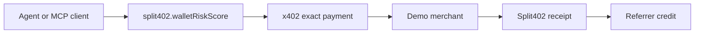
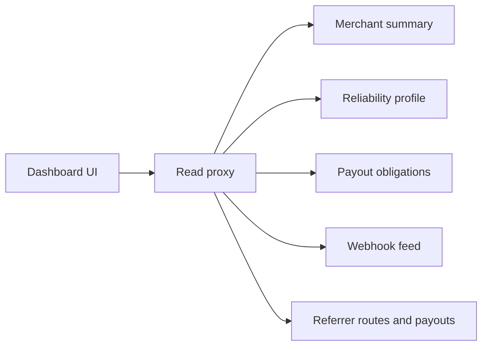

# Phase 7: Dashboard And Discovery

Phase 7 turns the Split402 protocol backend into something merchants,
referrers, and agent operators can actually inspect and demo.

## Current Status

Implemented:

- public merchant reliability profile endpoint;
- referrer balance and payout views;
- referrer route listing for dashboard and discovery surfaces;
- Bazaar-compatible resource metadata projection for active routes;
- merchant dashboard summary endpoint for readiness, campaigns, operations, and
  route status;
- merchant webhook delivery feed for pending, processing, delivered, and
  dead-letter webhook outbox events;
- MCP-facing demo bundle and stdio gateway at `@split402/mcp-demo`, including
  optional control-plane route discovery mode for hosted staging;
- merchant/referrer operations dashboard at `@split402/dashboard`;
- optional dashboard viewer gate with signed, expiring session cookies for
  hosted staging;
- hosted-staging compose stack for control plane, dashboard, optional demo
  merchant, migration job, and workers;
- staging proof scaffold, hosted preflight collector, read collector, artifact
  manifest validator, status validator, template, and runbooks;
- merchant payout-obligation summary endpoint and dashboard view;
- optional Solana RPC funding-balance provider for active payout wallets.

## MCP Demo Bundle

The MCP bundle emits a paid tool card for `split402.walletRiskScore`:



Run it with:

```bash
corepack pnpm demo:mcp-bundle
```

Run `corepack pnpm demo:mcp-gateway` when an MCP client needs direct stdio
tool discovery, router-backed demo execution, or receipt lookup. Set
`SPLIT402_MCP_CONTROL_PLANE_URL` to capture hosted route discovery through the
control plane.

## Dashboard UI

The dashboard app visualizes Phase 7 read APIs through a narrow same-origin
proxy:



Run it with:

```bash
corepack pnpm dashboard
```

Set `SPLIT402_DASHBOARD_VIEWER_TOKEN` before exposing the dashboard in hosted
staging so Phase 7 evidence captures are not publicly readable.

Launch the hosted-staging stack with:

```bash
cp deploy/phase7-staging/phase7-staging.env.example deploy/phase7-staging/phase7-staging.env
docker compose -f deploy/phase7-staging/compose.yaml up postgres control-plane dashboard
```

## Staging Proof

Phase 7 now has a machine-checkable proof record for hosted end-to-end demo
evidence:

```bash
corepack pnpm phase7:staging:init
SPLIT402_PHASE7_SEED_CONFIRM=seed-hosted-staging corepack pnpm phase7:staging:seed
corepack pnpm phase7:staging-proof --evidence-env-file phase7-staging-evidence/phase7-staging.env > phase7-staging-proof.txt
corepack pnpm phase7:hosted:preflight --evidence-env-file phase7-staging-evidence/phase7-staging.env
# Confirm hosted control plane has SPLIT402_FUNDING_BALANCE_PROVIDER=solana-rpc.
corepack pnpm phase7:staging:collect-reads --evidence-env-file phase7-staging-evidence/phase7-staging.env
SPLIT402_MCP_CONTROL_PLANE_URL="$SPLIT402_PHASE7_CONTROL_PLANE_URL" \
SPLIT402_MCP_CONTROL_PLANE_TOKEN="$SPLIT402_PHASE7_CONTROL_PLANE_TOKEN" \
SPLIT402_MCP_CAPABILITY=solana.wallet-risk \
SPLIT402_PHASE7_MCP_GATEWAY_EXECUTE=1 \
SPLIT402_MCP_SVM_PRIVATE_KEY=<funded-buyer-key-base58> \
corepack pnpm phase7:staging:collect-mcp-gateway --evidence-env-file phase7-staging-evidence/phase7-staging.env
corepack pnpm demo:mcp-gateway:smoke
corepack pnpm phase7:staging:commands-template > phase7-staging-evidence/commands.log
corepack pnpm demo:mcp-bundle > phase7-staging-evidence/mcp-bundle.json
corepack pnpm demo:paid-suite > phase7-staging-evidence/paid-suite.log
corepack pnpm phase7:staging:derive-receipt-verification --evidence-env-file phase7-staging-evidence/phase7-staging.env
corepack pnpm phase7:staging:manifest phase7-staging-proof.txt > phase7-staging-evidence/artifact-manifest.json
corepack pnpm phase7:staging:assemble --evidence-env-file phase7-staging-evidence/phase7-staging.env > phase7-staging-proof.txt
corepack pnpm phase7:staging:status phase7-staging-proof.txt
corepack pnpm product:status <phase6-custody-evidence.txt> phase7-staging-proof.txt
```

The proof must attach evidence for hosted preflight, route discovery, x402
payment, Split402 receipt verification, referrer earnings, dashboard summary,
webhook delivery, payout obligations, Solana RPC funding-balance coverage, MCP
bundle output, MCP gateway transcript evidence, and artifact manifest hashes
from the same staging environment.
The MCP gateway collection report must identify the provider used, paid amount,
receipt id, verification status, referrer credit, provider route id, receipt
route id, provider merchant origin, receipt merchant origin, provider operation
id, receipt operation id, provider campaign id, receipt campaign id, provider
referrer wallet, receipt referrer wallet, provider payout wallet, receipt payout
wallet, commission bps, protocol-fee bps, commission amount, and protocol-fee
amount for the executed router call. Demo-mode MCP collection remains no-go;
proof-ready MCP evidence must come from `router-live-agent-sdk` execution
against hosted route discovery.
The final status check verifies that local `attached:` artifacts still match the
recorded local manifest sizes and SHA-256 hashes, and that the hosted preflight
checks passed against the same source commit, control-plane URL, and dashboard
URL listed in the proof.
It also validates the control-plane read artifacts so route discovery, referrer
earnings, dashboard summary, webhook delivery, and payout obligations must be
present and non-empty, and must line up around the same active route, campaign,
referrer wallet, and merchant id. The paid-suite log and receipt-verification
JSON are checked for a successful paid request, a verified commission-bearing
receipt, the invalid-claim zero-commission path, and matching valid/invalid
receipt summaries across both artifacts. The MCP gateway transcript must
prove budget-filtered capability discovery, live router execution, matching
provider network/asset/merchant origin/operation id/campaign id/amount/pay-to
wallet/route id, matching receipt lookup, selected-provider
merchant/campaign/operation/route/referrer/payout attribution, and
commission/protocol-fee amounts derived from the receipt
`commissionBps` and `protocolFeeBpsOfCommission` fields. It must also connect
the selected provider route back to the collected route-discovery artifact. The
command transcript must include the Phase 7 evidence commands and full
validation suite.
The funding-balance artifact is checked separately, requiring every asset to
show a resolved `covered` or `deficit` state instead of unresolved funding.
The top-level `product:status` command combines this Phase 7 result with the
Phase 6 custody evidence status so operators can see the real product launch
decision in one JSON report.

## Remaining Phase 7 Work

- Expand the dashboard from public-alpha operations UI into a production
  multi-tenant merchant/referrer service with hardened auth, tenant isolation,
  and deployment config.
- Run and approve the hosted end-to-end staging proof where an agent discovers a
  route, pays through x402, receives a Split402 receipt, and sees referrer
  earnings without manual database work.
- Run the Solana RPC funding-balance provider against hosted staging wallets and
  attach covered/deficit evidence to the Phase 7 staging proof, with zero
  deficit for covered assets or a positive `fundingDeficitAtomic` for deficit
  assets.

## Current Position

We are near a strong public-alpha demo. Production launch still depends on the
Phase 6 custody evidence gates and the remaining Phase 7 dashboard/staging proof
work.
