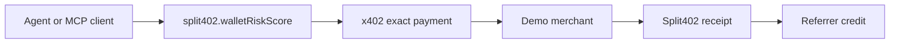
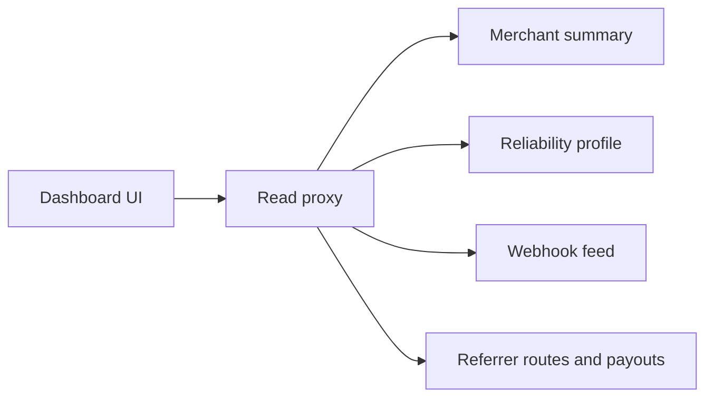

# Phase 7: Dashboard And Discovery

Phase 7 turns the Split402 protocol backend into something merchants,
referrers, and agent operators can actually inspect and demo.

## Current Status

Implemented:

- public merchant reliability profile endpoint;
- referrer balance and payout views;
- referrer route listing for dashboard and discovery surfaces;
- Bazaar-compatible resource metadata projection for active routes;
- merchant dashboard summary endpoint for readiness, campaigns, operations, and
  route status;
- merchant webhook delivery feed for pending, processing, delivered, and
  dead-letter webhook outbox events;
- MCP-facing demo bundle at `@split402/mcp-demo`;
- merchant/referrer operations dashboard at `@split402/dashboard`.

## MCP Demo Bundle

The MCP bundle emits a paid tool card for `split402.walletRiskScore`:



Run it with:

```bash
corepack pnpm demo:mcp-bundle
```

## Dashboard UI

The dashboard app visualizes Phase 7 read APIs through a narrow same-origin
proxy:



Run it with:

```bash
corepack pnpm dashboard
```

## Remaining Phase 7 Work

- Expand the dashboard from public-alpha operations UI into a production hosted
  merchant/referrer service with hardened auth, sessions, and deployment config.
- Add a hosted end-to-end staging proof where an agent discovers a route, pays
  through x402, receives a Split402 receipt, and sees referrer earnings without
  manual database work.
- Add merchant funding and outstanding-obligation views that make payout
  readiness clear before production use.
- Package the MCP demo into a runnable MCP gateway if the demo needs direct
  client integration rather than a manifest/runbook bundle.

## Current Position

We are near a strong public-alpha demo. Production launch still depends on the
Phase 6 custody evidence gates and the remaining Phase 7 dashboard/staging proof
work.
