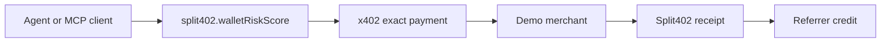
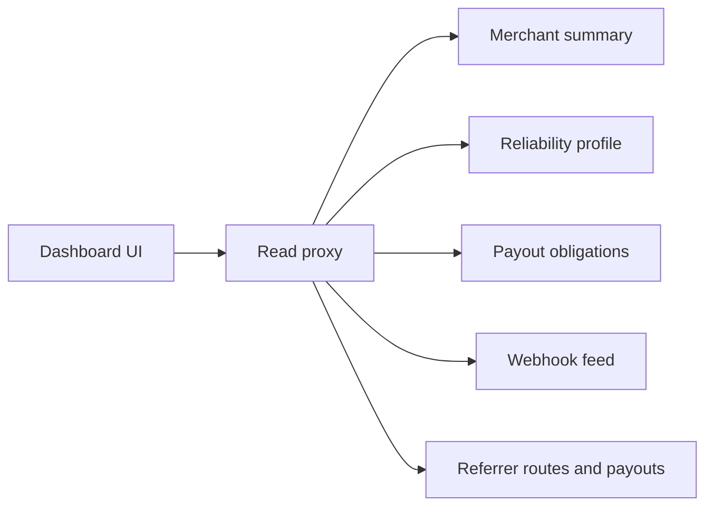

# Phase 7: Dashboard And Discovery

Phase 7 turns the Split402 protocol backend into something merchants,
referrers, and agent operators can actually inspect and demo.

## Current Status

Implemented:

- public merchant reliability profile endpoint;
- referrer balance and payout views;
- referrer route listing for dashboard and discovery surfaces;
- Bazaar-compatible resource metadata projection for active routes;
- merchant dashboard summary endpoint for readiness, campaigns, operations, and
  route status;
- merchant webhook delivery feed for pending, processing, delivered, and
  dead-letter webhook outbox events;
- MCP-facing demo bundle and stdio gateway at `@split402/mcp-demo`, including
  optional control-plane route discovery mode for hosted staging;
- merchant/referrer operations dashboard at `@split402/dashboard`;
- optional dashboard viewer gate with signed, expiring session cookies for
  hosted staging;
- hosted-staging compose stack for control plane, dashboard, optional demo
  merchant, migration job, and workers;
- staging proof scaffold, hosted preflight collector, read collector, artifact
  manifest validator, status validator, template, and runbooks;
- merchant payout-obligation summary endpoint and dashboard view;
- optional Solana RPC funding-balance provider for active payout wallets.

## MCP Demo Bundle

The MCP bundle emits a paid tool card for `split402.walletRiskScore`:



Run it with:

```bash
corepack pnpm demo:mcp-bundle
```

Run `corepack pnpm demo:mcp-gateway` when an MCP client needs direct stdio
tool discovery for the demo. Set `SPLIT402_MCP_CONTROL_PLANE_URL` to capture
hosted route discovery through the control plane.

## Dashboard UI

The dashboard app visualizes Phase 7 read APIs through a narrow same-origin
proxy:



Run it with:

```bash
corepack pnpm dashboard
```

Set `SPLIT402_DASHBOARD_VIEWER_TOKEN` before exposing the dashboard in hosted
staging so Phase 7 evidence captures are not publicly readable.

Launch the hosted-staging stack with:

```bash
cp deploy/phase7-staging/phase7-staging.env.example deploy/phase7-staging/phase7-staging.env
docker compose -f deploy/phase7-staging/compose.yaml up postgres control-plane dashboard
```

## Staging Proof

Phase 7 now has a machine-checkable proof record for hosted end-to-end demo
evidence:

```bash
corepack pnpm phase7:staging:init
corepack pnpm phase7:staging-proof > phase7-staging-proof.txt
corepack pnpm phase7:hosted:preflight
corepack pnpm phase7:staging:collect-reads
corepack pnpm phase7:staging:manifest phase7-staging-proof.txt > phase7-staging-evidence/artifact-manifest.json
corepack pnpm phase7:staging:assemble > phase7-staging-proof.txt
corepack pnpm phase7:staging:status phase7-staging-proof.txt
```

The proof must attach evidence for hosted preflight, route discovery, x402
payment, Split402 receipt verification, referrer earnings, dashboard summary,
webhook delivery, payout obligations, Solana RPC funding-balance coverage, MCP
bundle output, MCP gateway transcript evidence, and artifact manifest hashes
from the same staging environment.
The final status check verifies that local `attached:` artifacts still match the
recorded manifest sizes and SHA-256 hashes, and that the hosted preflight checks
passed against the same control-plane and dashboard URLs listed in the proof.
It also validates the funding-balance artifact, requiring every asset to show a
resolved `covered` or `deficit` state instead of unresolved funding.

## Remaining Phase 7 Work

- Expand the dashboard from public-alpha operations UI into a production
  multi-tenant merchant/referrer service with hardened auth, tenant isolation,
  and deployment config.
- Run and approve the hosted end-to-end staging proof where an agent discovers a
  route, pays through x402, receives a Split402 receipt, and sees referrer
  earnings without manual database work.
- Run the Solana RPC funding-balance provider against hosted staging wallets and
  attach covered/deficit evidence to the Phase 7 staging proof, with zero
  deficit for covered assets or a positive `fundingDeficitAtomic` for deficit
  assets.

## Current Position

We are near a strong public-alpha demo. Production launch still depends on the
Phase 6 custody evidence gates and the remaining Phase 7 dashboard/staging proof
work.
