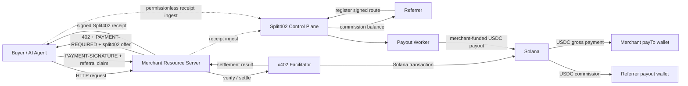
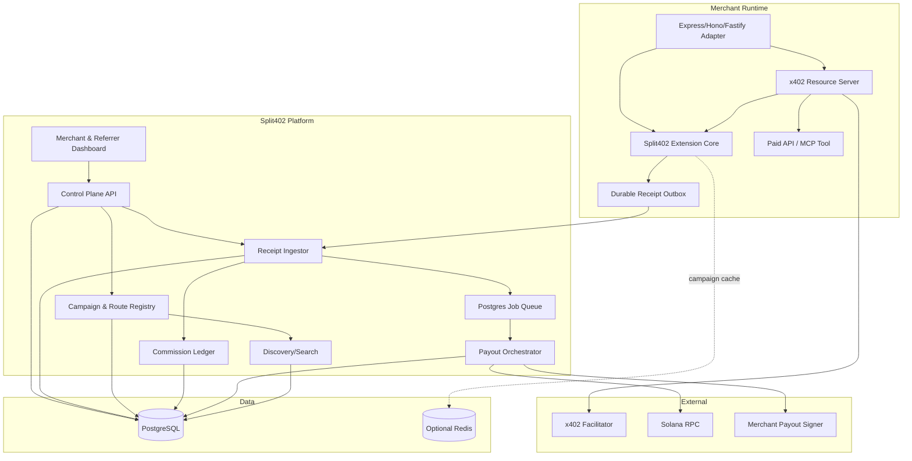
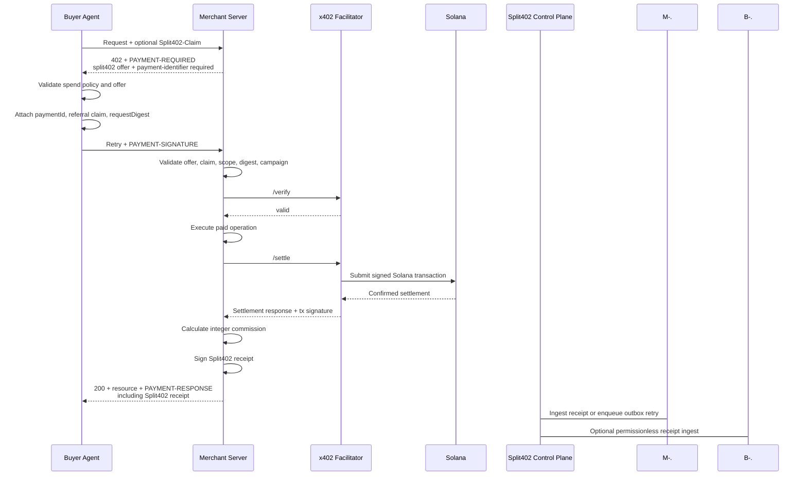
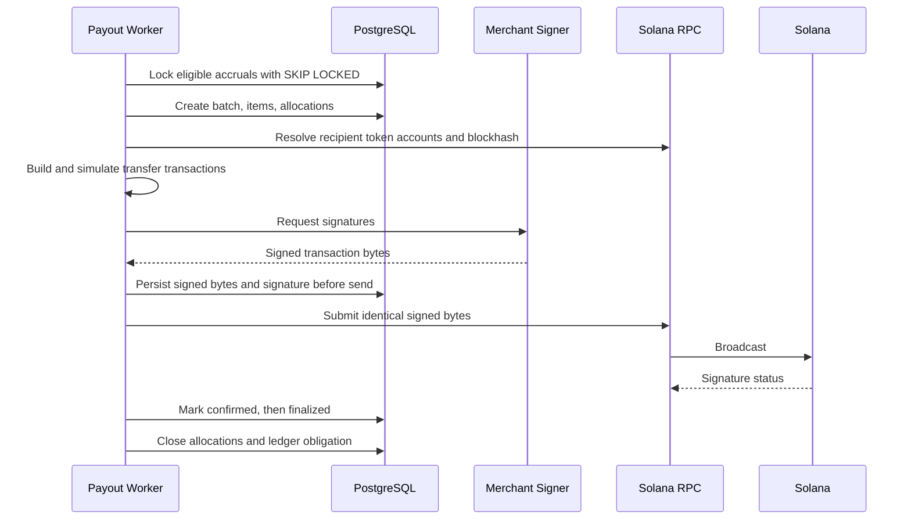
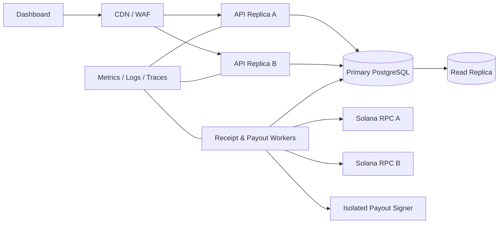

# Split402 Protocol Architecture

**Version:** 0.1-draft  
**Status:** Build specification for MVP  
**Prepared:** 2026-06-24  
**Primary stack:** TypeScript, Node.js, x402 v2, Solana, USDC, PostgreSQL  
**Protocol token:** `$SPLIT` is optional and outside the critical payment path in the MVP

---

## 1. Executive summary

Split402 is a referral, attribution, and commission layer for x402-paid APIs and agent tools on Solana.

The MVP does **not** change x402 settlement semantics:

1. A buyer or agent requests a paid resource.
2. The resource server returns the normal x402 `402 Payment Required` response plus a `split402` extension describing a commission campaign.
3. The buyer attaches a signed referral claim to the x402 payment payload.
4. The existing x402 Solana `exact` scheme verifies and settles the full USDC payment to the merchant.
5. Split402 middleware validates attribution, creates a signed receipt, and records a commission liability.
6. A merchant-controlled payout worker periodically sends accumulated USDC commissions to referrers.

This design is intentionally easy to ship. It preserves compatibility with existing x402 clients, facilitators, Solana wallets, and USDC. Its principal limitation is explicit: the commission is an enforceable protocol record and merchant liability, but is not atomically split onchain in the MVP.

The later trust-minimized upgrade should be implemented as a new Solana-aware x402 payment scheme, tentatively `split-exact`, or as an equivalent facilitator mechanism. A custom extension alone should not be treated as sufficient to change payment settlement semantics.

---

## 2. Normative language

The terms **MUST**, **MUST NOT**, **SHOULD**, **SHOULD NOT**, and **MAY** are requirements for interoperable implementations.

- **MVP** means the first production-capable accrual-and-payout implementation.
- **Atomic version** means the later implementation that splits funds within the payment transaction.
- All token amounts on the wire and in storage MUST be integer atomic units encoded as decimal strings.
- JavaScript `number` MUST NOT be used for token accounting. TypeScript implementations MUST use `bigint` internally.

---

## 3. Product boundary

### 3.1 In scope

- Solana x402 `exact` payments.
- USDC-denominated paid API and MCP tool calls.
- Merchant-created referral campaigns.
- Referrer-signed route claims.
- Attribution attached through an x402 custom extension.
- Merchant-signed offers and settlement receipts.
- Permissionless receipt ingestion.
- Idempotent commission accrual.
- Merchant-funded batched USDC payouts.
- Discovery metadata and route search.
- Optional `$SPLIT` route bonding after the payment product works.

### 3.2 Explicitly out of scope for the MVP

- Atomic payment splitting.
- Custody of buyer funds.
- Paying for APIs in `$SPLIT` by default.
- Unbounded token emissions based on request volume.
- Subjective slashing decisions.
- Cross-chain settlement.
- Fiat payout rails.
- A general affiliate marketplace for non-x402 commerce.
- Automatic tax, sanctions, or legal classification decisions.

---

## 4. Architecture decisions

| ID | Decision | Rationale |
|---|---|---|
| ADR-001 | Build Split402 as an x402 v2 custom resource-server extension. | No x402 fork; uses standard extension and lifecycle hooks. |
| ADR-002 | Keep x402 commercial payments in USDC. | Stable pricing and immediate merchant utility. |
| ADR-003 | Merchant receives the full x402 payment in the MVP. | Works with the existing Solana `exact` scheme and facilitators. |
| ADR-004 | Record commission as an immutable signed receipt and ledger liability. | Enables auditability without changing settlement. |
| ADR-005 | Require the standard x402 payment-identifier extension on Split402 routes. | Provides logical-request idempotency and safe retries. |
| ADR-006 | Use merchant service keys for offers and receipts; do not reuse the merchant payment-wallet key. | Reduces blast radius and permits key rotation. |
| ADR-007 | Use referrer Solana-wallet signatures for route claims. | Permissionless identity and payout authorization. |
| ADR-008 | Make receipt ingestion permissionless. | A buyer, merchant, referrer, or relay can record a valid receipt. |
| ADR-009 | PostgreSQL is the source of truth. Redis is optional acceleration only. | Simpler MVP and strong transactional guarantees. |
| ADR-010 | `$SPLIT` is not required to buy or sell API calls. | Prevents token friction from blocking product adoption. |
| ADR-011 | Atomic splitting is a separate payment scheme or facilitator mechanism. | Extensions add metadata and hooks; they should not silently redefine payment outcome. |
| ADR-012 | Campaign versions are immutable. | A receipt must always resolve to the exact terms offered at payment time. |

---

## 5. Actors and terminology

| Actor | Responsibility |
|---|---|
| Buyer | Pays for and consumes an x402 resource. Usually an application or AI agent. |
| Referrer | Publishes or routes buyers to a merchant resource and earns commission. |
| Merchant | Operates the paid API or MCP tool and funds referral payouts. |
| Resource server | Merchant HTTP server protected by x402 middleware. |
| Facilitator | Verifies and settles x402 payment payloads on Solana. |
| Split402 control plane | Stores merchants, campaigns, routes, keys, receipts, and ledger state. |
| Receipt ingestor | Verifies signed receipts and creates exactly one commission accrual. |
| Payout worker | Builds, signs, submits, and confirms USDC payout transactions. |
| Route registry | Searchable set of active referral routes and optional route bonds. |
| Campaign | Immutable-versioned merchant offer defining commission terms. |
| Route | Referrer-owned registration that points to a campaign and payout wallet. |
| Referral claim | Referrer-signed object authorizing attribution to a route and payout wallet. |
| Split402 offer | Merchant-signed object included with the x402 payment requirement. |
| Split402 receipt | Merchant-signed proof that an attributed x402 payment settled. |

---

## 6. System context



### 6.1 Trust boundaries

1. **Buyer boundary:** buyer controls its payment wallet and selected referral claim.
2. **Merchant boundary:** merchant controls API execution, campaign terms, offer/receipt signing, and payout funding.
3. **Facilitator boundary:** facilitator verifies and settles only according to the buyer-signed payment payload and its sponsor policy.
4. **Control-plane boundary:** Split402 validates protocol artifacts and accounts for commissions; it does not move buyer funds.
5. **Payout boundary:** a merchant-controlled signer moves only the merchant’s commission-funding USDC.
6. **Onchain boundary:** Solana is the settlement record for gross payments and payouts.

### 6.2 MVP trust statement

A valid Split402 receipt proves that the merchant promised a commission for a settled payment. It does not, by itself, guarantee that the merchant will keep its commission-funding wallet solvent. The dashboard MUST expose unpaid obligations, payout latency, and merchant funding status. This limitation disappears only after an atomic settlement mechanism is deployed.

---

## 7. Logical component architecture



---

## 8. End-to-end flows

## 8.1 Merchant onboarding

1. Merchant connects a Solana owner wallet.
2. Control plane issues a single-use authentication challenge.
3. Merchant signs a domain-separated message.
4. Control plane verifies the Ed25519 signature and creates the merchant record.
5. Merchant registers:
   - one or more x402 `payTo` wallets;
   - a separate service-signing public key for offers and receipts;
   - a commission-funding wallet for payouts;
   - permitted API origins.
6. Merchant proves control of each API origin by serving `/.well-known/split402.json` or by a DNS verification record.
7. Merchant creates a campaign version.
8. Campaign becomes active only after all referenced keys, origin proofs, network identifiers, and token mints validate.

The merchant service-signing private key MUST remain in the merchant runtime or isolated signer. The Split402 control plane stores only its public key.

## 8.2 Campaign creation and versioning

A campaign version contains:

- merchant ID;
- resource origin;
- operation IDs or method/path templates;
- Solana network identifier;
- payment asset mint;
- commission basis points;
- commission base;
- referral-claim policy;
- validity window;
- payout threshold and schedule policy;
- self-referral policy;
- per-payment and campaign caps;
- a deterministic terms hash;
- merchant signature.

Campaign versions are immutable. Editing terms creates `version + 1`. Pausing a campaign stops new offers but SHOULD honor already signed, unexpired offers. Emergency key revocation MAY invalidate offers signed by a compromised key.

## 8.3 Referrer route registration

1. Referrer chooses an active campaign.
2. Client creates a route draft containing the payout wallet, campaign scope, expiry, and metadata hash.
3. Client canonicalizes the route claim.
4. Referrer signs the canonical bytes with its Solana wallet.
5. Control plane verifies the signature and creates an active route.
6. Control plane returns:
   - route ID;
   - portable referral claim;
   - agent configuration snippet;
   - optional referral URL carrying the claim;
   - optional MCP tool metadata.

A route MAY be registered without a token bond during MVP. When route bonding is enabled, activation additionally requires a confirmed `$SPLIT` bond account.

## 8.4 Paid request with attribution



### Required ordering

- Attribution MUST be validated before settlement.
- Commission MUST NOT accrue on verification alone.
- The paid operation SHOULD execute before settlement only when the selected x402 server wrapper settles exclusively after a successful application response. Otherwise, the merchant MUST define compensation behavior for paid-but-failed operations.
- Receipt creation MUST occur only after a successful settlement response.
- Receipt ingestion MUST be idempotent.

## 8.5 Receipt ingestion and commission accrual

1. Any party submits the complete signed receipt.
2. Ingestor validates schema and size limits.
3. Ingestor resolves the merchant signing key by `kid`.
4. Ingestor verifies the merchant signature.
5. Ingestor resolves the exact immutable campaign version.
6. Ingestor verifies the campaign terms hash.
7. Ingestor validates the referrer claim and route status.
8. Ingestor verifies the request digest and payment identifier fields are present.
9. Ingestor verifies the settlement transaction against Solana or an accepted facilitator attestation.
10. In a single database transaction, it:
    - inserts the receipt;
    - creates one commission accrual;
    - creates a zero-sum ledger transaction;
    - writes an outbox event.
11. Unique constraints reject duplicate receipt, payment ID, or settlement transaction ingestion.

Chain verification MAY initially be asynchronous for responsiveness, but the accrual then remains `pending_chain_verification` and MUST NOT be paid until confirmed.

## 8.6 Payout flow



### Payout requirements

- Payouts MUST use the same asset mint as the accrual unless an explicit conversion product is introduced later.
- The funding wallet MUST be merchant-controlled.
- The worker MUST persist signed transaction bytes and expected transaction signature before broadcast.
- A retry before blockhash expiry MUST resend the identical signed bytes.
- The worker MUST query chain state before rebuilding an expired transaction.
- Payout items MUST remain allocated while transaction outcome is unknown.
- Accounting closes only after the configured finality threshold.

## 8.7 Retry and duplicate behavior

Split402 routes MUST declare the x402 `payment-identifier` extension as required.

The server MUST bind a payment ID to this fingerprint:

```text
network
asset mint
required amount
payTo wallet
merchant ID
campaign ID and version
operation ID
request digest
referral route ID, or "none"
```

Reusing a payment ID with the same fingerprint returns the previously stored logical result. Reusing it with a different fingerprint returns `409 Conflict` and MUST NOT settle another payment.

For Solana duplicate settlement protection, do not rely solely on an in-memory facilitator cache. Split402 MUST also enforce persistent uniqueness on the settlement transaction signature and receipt ID. A multi-instance merchant deployment SHOULD use a shared idempotency store.

---

## 9. Protocol objects and wire rules

## 9.1 General encoding rules

- JSON is UTF-8.
- IDs are lowercase prefixed identifiers such as `cmp_`, `rte_`, `rcp_`, `pay_`, and `pob_` followed by at least 128 bits of randomness.
- Timestamps are RFC 3339 UTC strings on JSON APIs and Unix seconds only where required by an x402-compatible object.
- Wallets and token mints are base58 Solana public keys.
- Signatures are base64url without padding unless a dependent SDK requires another encoding.
- Hashes use lowercase hexadecimal with an algorithm prefix, for example `sha256:8f...`.
- Atomic token amounts are decimal strings, for example `"10000"`.
- Canonical JSON MUST follow RFC 8785 JSON Canonicalization Scheme or an equivalent implementation proven by shared test vectors.
- Protocol objects MUST reject unknown critical fields. Non-critical metadata MAY be ignored.
- The maximum decoded Split402 extension payload SHOULD default to 8 KiB.

## 9.2 Operation and request digest

Receipts must bind payment to the actual operation, not only to a URL.

Each paid route defines a stable `operationId`, method, path template, and input schema. After parsing and validating the request, the server constructs:

```json
{
  "version": "split402-operation-v1",
  "merchantId": "mrc_01...",
  "operationId": "wallet-risk-score",
  "method": "POST",
  "pathTemplate": "/v1/risk/:wallet",
  "pathParams": { "wallet": "7abc..." },
  "query": {},
  "body": { "includeLabels": true },
  "paymentId": "pay_7d5d...",
  "offerNonce": "ofn_a92e..."
}
```

Then:

```text
requestDigest = "sha256:" + hex(
  SHA-256(UTF8(JCS(operationObject)))
)
```

Canonicalization rules:

- Method is uppercase.
- `pathTemplate`, not the concrete raw path, is signed separately from `pathParams`.
- Inputs are the validated, typed values used by the application.
- Missing body is `null`; missing path/query collections are `{}`.
- Duplicate query keys are rejected unless the operation schema declares an array.
- File uploads, streaming bodies, and bodies larger than the configured digest limit are excluded from the first MVP.
- The referral query parameter `s402` is removed before operation canonicalization.

The merchant adapter computes the digest before x402 verification and places it in request-scoped context. The generic extension core MUST NOT assume that x402 lifecycle hooks expose a parsed request body.

## 9.3 Referral claim

A referral claim is portable and signed by the referrer wallet.

```ts
export interface ReferralClaimV1 {
  version: "1";
  routeId: string;
  campaignId: string;
  campaignVersionMin: number;
  referrerWallet: string;
  payoutWallet: string;
  resourceOrigin: string;
  operationIds: string[] | ["*"];
  issuedAt: string;
  expiresAt: string;
  nonce: string;
  metadataHash?: `sha256:${string}`;
  signature: {
    type: "solana-ed25519";
    publicKey: string;
    value: string;
  };
}
```

The signed payload excludes the `signature` object and is prefixed with domain separation:

```text
split402:referral-claim:v1\n
<JCS bytes of claim without signature>
```

Validation requirements:

- `signature.publicKey` MUST equal `referrerWallet`.
- `resourceOrigin` MUST exactly match the verified merchant origin after canonical origin normalization.
- The requested `operationId` MUST be in scope.
- The route and campaign MUST be active unless the campaign allows offline claims.
- `issuedAt <= settlement time <= expiresAt`.
- `payoutWallet` MAY differ from `referrerWallet`; the signature explicitly authorizes it.
- A claim MUST NOT contain secrets. It is designed to be copied in links, headers, MCP configuration, or agent manifests.

## 9.4 Split402 offer

The resource server adds a merchant-signed offer to `PaymentRequired.extensions["split402"]`.

```ts
export interface Split402OfferV1 {
  protocolVersion: "0.1";
  campaignId: string;
  campaignVersion: number;
  campaignTermsHash: `sha256:${string}`;
  merchantId: string;
  resourceOrigin: string;
  operationId: string;
  network: string;
  asset: string;
  requiredAmountAtomic: string;
  commissionBps: number;
  commissionBase: "required_amount";
  settlementMode: "accrual";
  attributionRequired: boolean;
  allowSelfReferral: boolean;
  offerNonce: string;
  issuedAt: string;
  validUntil: string;
  kid: string;
  signature: string;
}
```

Offer signature input:

```text
split402:offer:v1\n
<JCS bytes of offer without signature>
```

The offer MUST bind the x402 payment requirement’s network, asset, amount, and merchant destination through the campaign terms hash or explicit fields. The server MUST reject a payment payload that echoes an offer inconsistent with the selected x402 requirement.

`offerNonce`, `issuedAt`, `validUntil`, and `signature` are dynamic per challenge. The custom extension implementation MUST declare dynamic fields according to the exact x402 SDK version pinned in the repository and maintain contract tests for extension echo validation.

## 9.5 Buyer attribution envelope

The buyer client starts from the server-provided extension and appends attribution data before creating the payment payload.

```ts
export interface Split402AttributionV1 {
  protocolVersion: "0.1";
  offer: Split402OfferV1;
  paymentId: string;
  requestDigest: `sha256:${string}`;
  referralClaim?: ReferralClaimV1;
  buyerProof?: {
    type: "solana-ed25519";
    publicKey: string;
    signature: string;
  };
}
```

MVP transport options:

- Initial request header: `Split402-Claim: <base64url-encoded claim>`.
- Referral URL query parameter: `s402=<base64url-encoded claim>`.
- Direct SDK configuration: `split402: { claim }`.

The client SDK moves the claim into the x402 payment extension. It SHOULD remove the `s402` query parameter before sending the paid retry, so application handlers and operation digests do not treat referral data as business input.

`buyerProof` is optional in MVP. When enabled, it signs the JCS representation of `{paymentId, requestDigest, offerNonce, routeId}` and MUST match the payer identity recovered from the settled payment.

## 9.6 Split402 receipt

After successful x402 settlement, the merchant signs this object and adds it to `SettlementResponse.extensions["split402"]`.

```ts
export interface Split402ReceiptV1 {
  protocolVersion: "0.1";
  receiptId: string;
  merchantId: string;
  merchantOrigin: string;
  operationId: string;
  requestDigest: `sha256:${string}`;

  campaignId: string;
  campaignVersion: number;
  campaignTermsHash: `sha256:${string}`;
  routeId?: string;
  referrerWallet?: string;
  payoutWallet?: string;

  paymentId: string;
  network: string;
  asset: string;
  payerWallet: string;
  payToWallet: string;
  requiredAmountAtomic: string;
  settledAmountAtomic?: string;
  settlementTxSignature: string;

  commissionBps: number;
  commissionBaseAtomic: string;
  commissionAmountAtomic: string;
  protocolFeeAtomic: string;
  referrerCreditAtomic: string;
  settlementMode: "accrual";

  offerNonce: string;
  settledAt: string;
  issuedAt: string;
  recordingStatus: "accepted" | "deferred";
  eventId?: string;

  kid: string;
  signature: string;
}
```

Receipt signature input:

```text
split402:receipt:v1\n
<JCS bytes of receipt without signature>
```

Receipt requirements:

- `settlementTxSignature` MUST come from a successful settlement response.
- `requiredAmountAtomic` MUST match the selected x402 payment requirement.
- `commissionBaseAtomic` is `requiredAmountAtomic` in v0.1, even when the Solana payment transaction transfers more than the minimum required amount.
- An unattributed payment MAY carry a receipt with no route/referrer and zero commission. This is useful for complete merchant analytics but is not required.
- A receipt is immutable. Recording state changes are separate database events; they do not mutate the signed receipt.
- Anyone MAY submit a valid receipt to the ingestion endpoint.

## 9.7 Commission calculation

```ts
export function calculateCommission(
  requiredAmountAtomic: bigint,
  commissionBps: bigint,
  protocolFeeBpsOfCommission = 0n,
): {
  commission: bigint;
  protocolFee: bigint;
  referrerCredit: bigint;
} {
  if (requiredAmountAtomic < 0n) throw new Error("negative amount");
  if (commissionBps < 0n || commissionBps > 10_000n) {
    throw new Error("invalid commission bps");
  }
  if (protocolFeeBpsOfCommission < 0n || protocolFeeBpsOfCommission > 10_000n) {
    throw new Error("invalid protocol fee bps");
  }

  const commission = (requiredAmountAtomic * commissionBps) / 10_000n;
  const protocolFee = (commission * protocolFeeBpsOfCommission) / 10_000n;
  return {
    commission,
    protocolFee,
    referrerCredit: commission - protocolFee,
  };
}
```

Example:

```text
Required USDC amount: 10000 atomic units = 0.010000 USDC
Commission:          2000 bps = 20%
Commission credit:   floor(10000 × 2000 / 10000) = 2000 atomic units
Referrer credit:     0.002000 USDC when protocol fee is zero
```

Rounding is always toward zero. No floating-point conversions are permitted in accounting code.

## 9.8 Campaign eligibility rules

A commission accrues only when all required checks pass:

1. x402 settlement succeeded.
2. The receipt signature is valid and key was valid at `issuedAt`.
3. Campaign version and terms hash exist.
4. Offer was valid when payment was created.
5. Claim signature, route, scope, and expiry are valid.
6. Operation ID and resource origin match.
7. Payment ID fingerprint is unique and consistent.
8. Settlement transaction is not already associated with another receipt.
9. Required amount, asset, network, and payee match campaign terms.
10. Self-referral and campaign risk policies pass.
11. Commission does not exceed configured per-payment or campaign caps.

Failure of attribution SHOULD NOT invalidate the underlying x402 payment unless the merchant configured `attributionRequired: true`. When attribution is optional, the paid resource is served and commission is zero if the claim is absent or invalid.

## 9.9 Standard error model

HTTP APIs use `application/problem+json`:

```json
{
  "type": "https://split402.dev/errors/claim-scope-mismatch",
  "title": "Referral claim does not cover this operation",
  "status": 400,
  "code": "S402_CLAIM_SCOPE_MISMATCH",
  "requestId": "req_01...",
  "details": {
    "operationId": "wallet-risk-score"
  }
}
```

Core error codes:

| Code | HTTP | Meaning |
|---|---:|---|
| `S402_OFFER_INVALID` | 400 | Offer schema or signature invalid. |
| `S402_OFFER_EXPIRED` | 400 | Offer validity window elapsed. |
| `S402_CAMPAIGN_INACTIVE` | 409 | Campaign is paused, ended, or revoked. |
| `S402_CLAIM_INVALID_SIGNATURE` | 400 | Referrer signature failed. |
| `S402_CLAIM_SCOPE_MISMATCH` | 400 | Origin or operation is outside claim scope. |
| `S402_REQUEST_DIGEST_MISMATCH` | 409 | Buyer and server operation digests differ. |
| `S402_PAYMENT_ID_CONFLICT` | 409 | Payment ID reused for another fingerprint. |
| `S402_DUPLICATE_SETTLEMENT` | 409 | Settlement transaction already recorded. |
| `S402_RECEIPT_INVALID` | 400 | Receipt schema, signature, or terms invalid. |
| `S402_CHAIN_VERIFICATION_PENDING` | 202 | Receipt accepted but not yet payout-eligible. |
| `S402_PAYOUT_INSUFFICIENT_FUNDS` | 409 | Merchant commission wallet lacks funds. |
| `S402_PAYOUT_OUTCOME_UNKNOWN` | 503 | Submitted transaction outcome is not yet safe to retry. |

---
## 10. Component specifications

## 10.1 `@split402/protocol`

Framework-independent package containing:

- wire interfaces;
- Zod schemas;
- JSON canonicalization;
- hash functions;
- signature-message builders;
- commission calculation;
- origin normalization;
- ID generation;
- error codes;
- test vectors.

This package MUST have no database, HTTP framework, or private-key dependency. It is the shared source of truth for the client, merchant SDK, control plane, and verifier CLI.

Suggested exports:

```ts
export {
  ReferralClaimV1Schema,
  Split402OfferV1Schema,
  Split402AttributionV1Schema,
  Split402ReceiptV1Schema,
  canonicalizeProtocolObject,
  hashProtocolObject,
  buildReferralClaimSigningBytes,
  buildOfferSigningBytes,
  buildReceiptSigningBytes,
  calculateCommission,
  normalizeOrigin,
  calculateOperationDigest,
};
```

## 10.2 `@split402/x402-extension`

Implements the x402 `ResourceServerExtension` integration.

Responsibilities by hook:

| Extension point | Split402 action |
|---|---|
| `enrichDeclaration` | Resolve campaign ID, operation ID, and static configuration. |
| `enrichPaymentRequiredResponse` | Load immutable campaign version, build and sign offer. |
| `onBeforeVerify` | Parse attribution, validate offer/claim, bind request digest and payment ID. |
| `onAfterVerify` | Capture verified payer information in request context. |
| `onBeforeSettle` | Reserve idempotency fingerprint when strict mode is enabled. |
| `onAfterSettle` | Build receipt, write to local outbox or remote ingestor. |
| `onSettleFailure` | Release temporary reservation; never accrue commission. |
| `enrichSettlementResponse` | Attach the signed receipt to the x402 settlement response. |

The extension core receives a narrow dependency interface:

```ts
export interface Split402ExtensionDependencies {
  campaignResolver: CampaignResolver;
  requestContext: RequestContextStore;
  offerSigner: ProtocolSigner;
  receiptSigner: ProtocolSigner;
  receiptSink: ReceiptSink;
  clock: Clock;
  logger: Logger;
}
```

No control-plane API call is allowed inside signature verification after the necessary campaign and route state is cached, unless merchant policy explicitly chooses fail-closed online validation.

## 10.3 HTTP framework adapters

Initial adapters:

- `@split402/express` first;
- `@split402/hono` second;
- `@split402/fastify` after protocol stabilization;
- `@split402/next` only for API routes that settle after successful handler execution.

Adapter responsibilities:

- capture referral header or query parameter;
- parse and validate operation input before payment verification;
- compute operation digest;
- expose request-scoped state to extension hooks;
- strip referral transport fields from application input;
- enforce header and body size limits;
- attach correlation IDs;
- configure response behavior for deferred receipt ingestion.

MVP supported request types:

- GET with typed path/query input;
- POST with `application/json` body no larger than 64 KiB;
- deterministic JSON responses.

Streaming, multipart, and WebSocket operations are deferred.

## 10.4 Merchant SDK facade

Target integration:

```ts
import { paymentMiddleware, x402ResourceServer } from "@x402/express";
import { ExactSvmScheme } from "@x402/svm/exact/server";
import { HTTPFacilitatorClient } from "@x402/core/server";
import { createSplit402 } from "@split402/express";

const facilitator = new HTTPFacilitatorClient({
  url: process.env.X402_FACILITATOR_URL!,
});

const split402 = createSplit402({
  merchantId: process.env.SPLIT402_MERCHANT_ID!,
  controlPlaneUrl: process.env.SPLIT402_CONTROL_PLANE_URL!,
  serviceKeyId: process.env.SPLIT402_SERVICE_KEY_ID!,
  serviceSigner: merchantServiceSigner,
  receiptOutbox: postgresReceiptOutbox,
});

const resourceServer = new x402ResourceServer(facilitator)
  .register("solana:*", new ExactSvmScheme())
  .registerExtension(split402.extension());

app.use(express.json({ limit: "64kb" }));
app.use(split402.requestContext());
app.use(
  paymentMiddleware(
    {
      "POST /v1/risk/:wallet": {
        accepts: [{
          scheme: "exact",
          price: "$0.01",
          network: process.env.SOLANA_NETWORK!,
          payTo: process.env.MERCHANT_PAY_TO_WALLET!,
        }],
        description: "Wallet risk score",
        mimeType: "application/json",
        extensions: {
          ...split402.declare({
            campaignId: "cmp_wallet_risk",
            operationId: "wallet-risk-score",
          }),
          // Also declare x402 payment-identifier as required.
        },
      },
    },
    resourceServer,
  ),
);
```

The actual compile-ready sample MUST be generated and tested against the exact pinned x402 version. The architecture depends on stable protocol concepts, not unpinned package signatures.

## 10.5 `@split402/client`

Responsibilities:

- accept claims from URL, header, local config, or MCP metadata;
- validate merchant offer signature before allowing spend;
- enforce buyer spend policy in code;
- require a logical payment ID that survives retries;
- compute or compare request digest;
- append Split402 attribution to the x402 payment payload;
- extract and locally verify settlement receipts;
- optionally submit receipts to the control plane;
- persist receipts for agent accounting.

Recommended buyer policy interface:

```ts
export interface Split402SpendPolicy {
  allowedNetworks: string[];
  allowedAssets: string[];
  allowedMerchantOrigins?: string[];
  maximumAtomicPerRequest: bigint;
  maximumAtomicPerDay?: bigint;
  requireValidMerchantOffer: boolean;
  allowUnattributedPayment: boolean;
}
```

A model prompt MUST NOT be the only spend-control mechanism. Policy checks run in deterministic application code before the wallet signs.

## 10.6 Control plane API

A stateless TypeScript API serving:

- authentication;
- merchants and keys;
- campaigns and versions;
- routes and claims;
- receipt ingestion and verification status;
- balances and accruals;
- payout controls;
- search and discovery;
- webhook subscriptions;
- public key and well-known documents.

Recommended implementation:

- Node.js 20 or newer;
- Hono or Fastify on a standard Node runtime;
- Zod validation;
- Drizzle ORM or direct typed SQL;
- PostgreSQL;
- OpenAPI generated from route schemas;
- structured JSON logs;
- no edge runtime for payout or chain workers.

## 10.7 Receipt ingestor

The ingestor is the security-critical accounting boundary.

It MUST:

- validate raw-body size before parsing;
- canonicalize and verify signatures;
- resolve historical key validity;
- verify campaign terms by hash;
- enforce unique transaction and payment identifiers;
- calculate commission independently rather than trusting receipt arithmetic;
- compare calculated values to signed receipt values;
- verify or enqueue verification of Solana transaction outcome;
- execute insert, accrual, ledger entries, and outbox event atomically;
- return the existing result for exact duplicate submissions.

It MUST NOT:

- accept a commission amount supplied only by the client;
- trust mutable campaign `current_version` state;
- mark an unverified settlement payout-eligible;
- call external webhooks inside the database transaction.

## 10.8 Campaign and route registry

Registry responsibilities:

- immutable campaign version storage;
- route activation, suspension, expiry, and revocation;
- signature and origin proof records;
- search indexes;
- optional route-bond state;
- merchant and referrer reputation aggregates.

The registry SHOULD support cached read models optimized for merchant middleware. The signed offer and receipt remain authoritative artifacts; registry responses are operational lookup data.

## 10.9 Ledger service

The ledger is an immutable zero-sum operational ledger, not a replacement for a merchant’s statutory accounting.

Accounts:

- `referrer_available:<wallet>:<asset>`;
- `referrer_in_flight:<wallet>:<asset>`;
- `merchant_obligation:<merchant>:<asset>`;
- `protocol_available:<treasury>:<asset>` when protocol fees are enabled.

Transactions:

### Accrual

```text
+C  referrer_available
-C  merchant_obligation
```

With protocol fee `F` included in total commission `C`:

```text
+(C-F) referrer_available
+F     protocol_available
-C     merchant_obligation
```

### Payout allocation

```text
-C  referrer_available
+C  referrer_in_flight
```

### Payout finalized

```text
-C  referrer_in_flight
+C  merchant_obligation
```

### Payout failed and released

```text
-C  referrer_in_flight
+C  referrer_available
```

### Pre-payout reversal

```text
-C  referrer_available
+C  merchant_obligation
```

Each ledger transaction MUST sum to zero per asset. Each source event MUST map to at most one ledger transaction.

## 10.10 Payout orchestrator

The orchestrator is split into:

1. **Eligibility selector:** locks available accruals.
2. **Batch planner:** groups by merchant, asset, and funding wallet.
3. **Transaction builder:** resolves associated token accounts and dynamically packs transfers.
4. **Simulation gate:** rejects transactions that do not simulate successfully.
5. **Signer adapter:** obtains Ed25519 signatures without exposing keys to the API process.
6. **Broadcaster:** sends identical signed bytes to one or more RPC endpoints.
7. **Confirmation monitor:** advances submitted, confirmed, and finalized states.
8. **Reconciler:** detects missing, expired, or inconsistent transactions.

Do not hardcode a fixed number of recipients per transaction. Pack based on serialized transaction size, account list, compute budget, and simulation outcome. Versioned transactions and address lookup tables MAY be added after a simple legacy-transaction implementation is proven.

## 10.11 Durable merchant receipt outbox

A production merchant adapter SHOULD persist receipts locally before returning the final response when possible.

Outbox record:

```ts
interface MerchantReceiptOutboxRecord {
  id: string;
  receiptId: string;
  receiptJson: Split402ReceiptV1;
  attempts: number;
  nextAttemptAt: string;
  status: "pending" | "accepted" | "dead_letter";
  lastError?: string;
}
```

Delivery semantics are at least once. The control-plane ingestion endpoint is idempotent.

For serverless environments without durable local storage, the adapter MAY call the ingestor synchronously. If unavailable, it returns a valid signed receipt with `recordingStatus: "deferred"`; the buyer can submit it later.

## 10.12 Dashboard

Merchant views:

- gross x402 payment volume;
- attributed volume;
- accrued commissions;
- unpaid obligations;
- funding-wallet USDC and SOL fee balance;
- payout batches and failures;
- campaign and route performance;
- invalid-claim and abuse signals.

Referrer views:

- available, in-flight, and paid balances by asset;
- receipts and settlement links;
- route conversion metrics;
- payout wallet and threshold;
- route bond state when enabled.

Public merchant profile:

- verified origin;
- active campaigns;
- payout-latency percentiles;
- unpaid-obligation ratio;
- route count;
- settled attributed volume;
- signed terms and key history.

---

## 11. Public and internal APIs

## 11.1 Authentication

### `POST /v1/auth/challenges`

Request:

```json
{
  "wallet": "7abc...",
  "network": "solana:5eyk...",
  "purpose": "merchant-session"
}
```

Response:

```json
{
  "challengeId": "chl_01...",
  "message": "split402:auth:v1\n...",
  "expiresAt": "2026-06-24T12:05:00Z"
}
```

### `POST /v1/auth/sessions`

Verifies the wallet signature and returns a short-lived access token plus refresh mechanism. Challenges are single-use.

Server-to-server merchant ingestion MAY additionally use scoped API credentials. Store only a strong hash of the credential and include a key ID for rotation.

## 11.2 Merchants and keys

| Method | Path | Purpose |
|---|---|---|
| `POST` | `/v1/merchants` | Create merchant after wallet authentication. |
| `GET` | `/v1/merchants/:merchantId` | Merchant profile and funding state. |
| `POST` | `/v1/merchants/:merchantId/origins` | Start origin verification. |
| `POST` | `/v1/merchants/:merchantId/keys` | Register service-signing public key. |
| `POST` | `/v1/merchants/:merchantId/keys/:kid/revoke` | Revoke key with reason and effective time. |
| `POST` | `/v1/merchants/:merchantId/payout-wallets` | Register commission funding wallet. |

## 11.3 Campaigns

### `POST /v1/campaigns`

```json
{
  "merchantId": "mrc_01...",
  "resourceOrigin": "https://api.example.com",
  "operations": [
    {
      "operationId": "wallet-risk-score",
      "method": "POST",
      "pathTemplate": "/v1/risk/:wallet"
    }
  ],
  "network": "solana:5eykt4UsFv8P8NJdTREpY1vzqKqZKvdp",
  "asset": "EPjFWdd5AufqSSqeM2qN1xzybapC8G4wEGGkZwyTDt1v",
  "commissionBps": 2000,
  "commissionBase": "required_amount",
  "attributionRequired": false,
  "allowSelfReferral": false,
  "payoutThresholdAtomic": "100000",
  "startsAt": "2026-06-24T00:00:00Z",
  "endsAt": null
}
```

Response returns `campaignId`, `version`, canonical terms, terms hash, and signing bytes. Activation requires a merchant signature over the domain-separated signing bytes for the canonical terms.

| Method | Path | Purpose |
|---|---|---|
| `GET` | `/v1/campaigns/:campaignId` | Current campaign summary. |
| `POST` | `/v1/campaigns/:campaignId/activate` | Activate current signed version after merchant key and origin checks. |
| `GET` | `/v1/campaigns/:campaignId/versions/:version` | Immutable version. |
| `POST` | `/v1/campaigns/:campaignId/versions` | Create next immutable version. |
| `POST` | `/v1/campaigns/:campaignId/pause` | Stop issuing new offers. |
| `POST` | `/v1/campaigns/:campaignId/resume` | Resume if dates and keys are valid. |
| `POST` | `/v1/campaigns/:campaignId/close` | Permanently close campaign. |

## 11.4 Routes and claims

| Method | Path | Purpose |
|---|---|---|
| `POST` | `/v1/routes/drafts` | Create canonical unsigned claim and signing bytes. |
| `POST` | `/v1/routes` | Submit signed claim and activate route. |
| `GET` | `/v1/routes/:routeId` | Route, status, campaign, and claim. |
| `POST` | `/v1/routes/:routeId/suspend` | Referrer or authorized merchant suspension. |
| `POST` | `/v1/routes/:routeId/rotate-payout` | Creates a new signed route version. |
| `GET` | `/v1/routes/search` | Search active routes and campaigns. |

Changing the payout wallet MUST create a new signed claim. Historical receipts continue referencing the old immutable route version.

## 11.5 Receipt ingestion

### `POST /v1/receipts`

Public, rate-limited, idempotent endpoint.

Request:

```json
{
  "receipt": { "protocolVersion": "0.1", "receiptId": "rcp_..." },
  "source": "buyer"
}
```

Responses:

- `201 Created`: new receipt and accrual recorded.
- `200 OK`: identical receipt already recorded.
- `202 Accepted`: valid receipt pending chain verification.
- `409 Conflict`: same unique identifier with different content.
- `400 Bad Request`: invalid receipt.

### `GET /v1/receipts/:receiptId`

Returns signed receipt, verification state, accrual state, and payout allocation. Sensitive internal risk notes are excluded.

## 11.6 Earnings

| Method | Path | Purpose |
|---|---|---|
| `GET` | `/v1/referrers/:wallet/balances` | Available, in-flight, paid totals by asset. |
| `GET` | `/v1/referrers/:wallet/accruals` | Paginated receipts and credits. |
| `GET` | `/v1/referrers/:wallet/payouts` | Payout history and chain signatures. |
| `POST` | `/v1/referrers/:wallet/payout-threshold` | Set threshold, subject to merchant minimum. |

Private earnings endpoints require proof of wallet control. Public aggregate route statistics MUST not expose unnecessary payer-level data.

## 11.7 Payouts

| Method | Path | Purpose |
|---|---|---|
| `POST` | `/v1/merchants/:merchantId/payouts/preview` | Eligible recipients, fees, and funding deficit. |
| `POST` | `/v1/merchants/:merchantId/payout-batches` | Create a payout batch. |
| `GET` | `/v1/payout-batches/:batchId` | Batch, transactions, and status. |
| `POST` | `/v1/payout-batches/:batchId/cancel` | Cancel only before signing. |
| `POST` | `/v1/payout-batches/:batchId/reconcile` | Force chain reconciliation. |

## 11.8 Discovery

### `GET /.well-known/split402.json`

Served by merchant origin:

```json
{
  "protocolVersion": "0.1",
  "merchantId": "mrc_01...",
  "origin": "https://api.example.com",
  "keys": [
    {
      "kid": "did:web:api.example.com#split402-1",
      "type": "Ed25519",
      "publicKey": "base64url..."
    }
  ],
  "campaignIndex": "https://api.split402.dev/v1/merchants/mrc_01/campaigns"
}
```

Split402 SHOULD also publish compatible Bazaar metadata for the paid resource. Bazaar is a discovery integration, not the authoritative campaign or ledger store.

## 11.9 Webhooks

Events:

- `campaign.activated`;
- `route.activated`;
- `route.suspended`;
- `receipt.recorded`;
- `receipt.rejected`;
- `commission.accrued`;
- `payout.batch_created`;
- `payout.submitted`;
- `payout.confirmed`;
- `payout.finalized`;
- `payout.failed`;
- `merchant.funding_low`.

Webhook deliveries include event ID, timestamp, body hash, and HMAC signature. Delivery is at least once; consumers deduplicate by event ID.

---
## 12. PostgreSQL data model

The following schema is intentionally explicit enough to begin implementation. Names and constraints may be refined through migrations, but the uniqueness and accounting invariants are required.

```sql
create extension if not exists pgcrypto;

create table merchants (
  id uuid primary key default gen_random_uuid(),
  public_id text not null unique,
  slug text not null unique,
  display_name text not null,
  owner_wallet text not null,
  status text not null check (status in ('pending', 'active', 'suspended', 'closed')),
  created_at timestamptz not null default now(),
  updated_at timestamptz not null default now()
);

create table merchant_origins (
  id uuid primary key default gen_random_uuid(),
  merchant_id uuid not null references merchants(id),
  origin text not null,
  verification_method text not null check (verification_method in ('well_known', 'dns')),
  status text not null check (status in ('pending', 'verified', 'failed', 'revoked')),
  verified_at timestamptz,
  created_at timestamptz not null default now(),
  unique (merchant_id, origin)
);

create table merchant_keys (
  id uuid primary key default gen_random_uuid(),
  merchant_id uuid not null references merchants(id),
  kid text not null unique,
  algorithm text not null check (algorithm in ('Ed25519', 'ES256')),
  public_key text not null,
  purpose text not null check (purpose in ('offer_receipt', 'webhook')),
  valid_from timestamptz not null,
  valid_until timestamptz,
  revoked_at timestamptz,
  revocation_reason text,
  created_at timestamptz not null default now()
);

create table merchant_payout_wallets (
  id uuid primary key default gen_random_uuid(),
  merchant_id uuid not null references merchants(id),
  network text not null,
  wallet text not null,
  asset_mint text not null,
  signer_reference text not null,
  status text not null check (status in ('active', 'paused', 'retired')),
  created_at timestamptz not null default now(),
  unique (merchant_id, network, wallet, asset_mint)
);

create table campaigns (
  id uuid primary key default gen_random_uuid(),
  public_id text not null unique,
  merchant_id uuid not null references merchants(id),
  resource_origin text not null,
  status text not null check (status in ('draft', 'active', 'paused', 'closed')),
  current_version integer not null default 0,
  created_at timestamptz not null default now(),
  updated_at timestamptz not null default now()
);

create table campaign_versions (
  campaign_id uuid not null references campaigns(id),
  version integer not null check (version > 0),
  terms_hash text not null,
  terms_json jsonb not null,
  network text not null,
  asset_mint text not null,
  commission_bps integer not null check (commission_bps between 0 and 10000),
  protocol_fee_bps integer not null default 0 check (protocol_fee_bps between 0 and 10000),
  payout_threshold_atomic numeric(78,0) not null check (payout_threshold_atomic >= 0),
  starts_at timestamptz not null,
  ends_at timestamptz,
  merchant_kid text not null references merchant_keys(kid),
  merchant_signature text not null,
  created_at timestamptz not null default now(),
  primary key (campaign_id, version),
  unique (campaign_id, terms_hash)
);

create table campaign_operations (
  campaign_id uuid not null,
  campaign_version integer not null,
  operation_id text not null,
  method text not null,
  path_template text not null,
  input_schema jsonb,
  primary key (campaign_id, campaign_version, operation_id),
  foreign key (campaign_id, campaign_version)
    references campaign_versions(campaign_id, version)
);

create table routes (
  id uuid primary key default gen_random_uuid(),
  public_id text not null unique,
  campaign_id uuid not null references campaigns(id),
  referrer_wallet text not null,
  payout_wallet text not null,
  claim_version integer not null default 1,
  claim_hash text not null unique,
  claim_json jsonb not null,
  signature text not null,
  status text not null check (status in ('pending', 'active', 'suspended', 'expired', 'revoked')),
  issued_at timestamptz not null,
  expires_at timestamptz not null,
  metadata jsonb not null default '{}'::jsonb,
  created_at timestamptz not null default now()
);

create index routes_campaign_status_idx
  on routes(campaign_id, status);
create index routes_referrer_idx
  on routes(referrer_wallet, status);

create table payment_idempotency (
  id uuid primary key default gen_random_uuid(),
  merchant_id uuid not null references merchants(id),
  payment_id text not null,
  fingerprint text not null,
  state text not null check (state in ('reserved', 'settled', 'failed', 'expired')),
  response_reference text,
  expires_at timestamptz not null,
  created_at timestamptz not null default now(),
  updated_at timestamptz not null default now(),
  unique (merchant_id, payment_id)
);

create table payment_receipts (
  id uuid primary key default gen_random_uuid(),
  public_id text not null unique,
  receipt_hash text not null unique,
  receipt_json jsonb not null,
  merchant_id uuid not null references merchants(id),
  campaign_id uuid not null references campaigns(id),
  campaign_version integer not null,
  route_id uuid references routes(id),
  payment_id text not null,
  request_digest text not null,
  network text not null,
  asset_mint text not null,
  payer_wallet text not null,
  pay_to_wallet text not null,
  settlement_tx_signature text not null,
  required_amount_atomic numeric(78,0) not null check (required_amount_atomic >= 0),
  commission_amount_atomic numeric(78,0) not null check (commission_amount_atomic >= 0),
  referrer_credit_atomic numeric(78,0) not null check (referrer_credit_atomic >= 0),
  protocol_fee_atomic numeric(78,0) not null check (protocol_fee_atomic >= 0),
  merchant_kid text not null references merchant_keys(kid),
  signature text not null,
  chain_verification_state text not null check (
    chain_verification_state in ('pending', 'verified', 'failed')
  ),
  ingestion_state text not null check (
    ingestion_state in ('accepted', 'rejected', 'duplicate')
  ),
  settled_at timestamptz not null,
  created_at timestamptz not null default now(),
  foreign key (campaign_id, campaign_version)
    references campaign_versions(campaign_id, version),
  unique (merchant_id, payment_id),
  unique (network, settlement_tx_signature)
);

create index receipts_campaign_created_idx
  on payment_receipts(campaign_id, created_at desc);
create index receipts_payer_idx
  on payment_receipts(payer_wallet, created_at desc);

create table commission_accruals (
  id uuid primary key default gen_random_uuid(),
  public_id text not null unique,
  receipt_id uuid not null unique references payment_receipts(id),
  merchant_id uuid not null references merchants(id),
  route_id uuid not null references routes(id),
  referrer_wallet text not null,
  payout_wallet text not null,
  asset_mint text not null,
  amount_atomic numeric(78,0) not null check (amount_atomic >= 0),
  status text not null check (
    status in ('pending_verification', 'available', 'held', 'allocated', 'paid', 'reversed')
  ),
  available_at timestamptz,
  hold_reason text,
  created_at timestamptz not null default now(),
  updated_at timestamptz not null default now()
);

create index accruals_payout_selection_idx
  on commission_accruals(merchant_id, asset_mint, status, available_at)
  where status = 'available';
create index accruals_referrer_idx
  on commission_accruals(referrer_wallet, asset_mint, status);

create table ledger_transactions (
  id uuid primary key default gen_random_uuid(),
  public_id text not null unique,
  source_type text not null,
  source_id text not null,
  asset_mint text not null,
  description text not null,
  created_at timestamptz not null default now(),
  unique (source_type, source_id, asset_mint)
);

create table ledger_entries (
  id bigint generated always as identity primary key,
  transaction_id uuid not null references ledger_transactions(id),
  account_type text not null check (
    account_type in ('referrer_available', 'referrer_in_flight', 'merchant_obligation', 'protocol_available')
  ),
  account_reference text not null,
  amount_atomic numeric(78,0) not null check (amount_atomic <> 0),
  created_at timestamptz not null default now()
);

create index ledger_account_idx
  on ledger_entries(account_type, account_reference, created_at);

create table payout_batches (
  id uuid primary key default gen_random_uuid(),
  public_id text not null unique,
  merchant_id uuid not null references merchants(id),
  payout_wallet_id uuid not null references merchant_payout_wallets(id),
  network text not null,
  asset_mint text not null,
  status text not null check (
    status in ('draft', 'planned', 'signing', 'submitted', 'confirmed', 'finalized', 'failed', 'cancelled', 'outcome_unknown')
  ),
  total_amount_atomic numeric(78,0) not null check (total_amount_atomic >= 0),
  item_count integer not null check (item_count >= 0),
  failure_code text,
  failure_message text,
  created_at timestamptz not null default now(),
  updated_at timestamptz not null default now()
);

create table payout_items (
  id uuid primary key default gen_random_uuid(),
  payout_batch_id uuid not null references payout_batches(id),
  destination_wallet text not null,
  destination_token_account text,
  amount_atomic numeric(78,0) not null check (amount_atomic > 0),
  status text not null check (
    status in ('allocated', 'submitted', 'confirmed', 'finalized', 'failed', 'released')
  ),
  created_at timestamptz not null default now(),
  unique (payout_batch_id, destination_wallet)
);

create table payout_allocations (
  payout_item_id uuid not null references payout_items(id),
  accrual_id uuid not null references commission_accruals(id),
  amount_atomic numeric(78,0) not null check (amount_atomic > 0),
  primary key (payout_item_id, accrual_id),
  unique (accrual_id)
);

create table payout_transactions (
  id uuid primary key default gen_random_uuid(),
  payout_batch_id uuid not null references payout_batches(id),
  sequence integer not null,
  attempt integer not null default 1,
  recent_blockhash text,
  last_valid_block_height bigint,
  signed_transaction_base64 text,
  expected_signature text,
  status text not null check (
    status in ('planned', 'signed', 'submitted', 'confirmed', 'finalized', 'expired', 'failed', 'outcome_unknown')
  ),
  submitted_at timestamptz,
  confirmed_at timestamptz,
  finalized_at timestamptz,
  error_json jsonb,
  created_at timestamptz not null default now(),
  unique (payout_batch_id, sequence, attempt),
  unique (expected_signature)
);

create table outbox_events (
  id uuid primary key default gen_random_uuid(),
  event_type text not null,
  aggregate_type text not null,
  aggregate_id text not null,
  payload jsonb not null,
  status text not null default 'pending' check (status in ('pending', 'processing', 'delivered', 'dead_letter')),
  attempts integer not null default 0,
  available_at timestamptz not null default now(),
  locked_at timestamptz,
  last_error text,
  created_at timestamptz not null default now()
);

create index outbox_ready_idx
  on outbox_events(status, available_at)
  where status in ('pending', 'processing');
```

### 12.1 Required database invariants

- A receipt, merchant payment ID, and Solana settlement signature can each create at most one accrual.
- Every accrual maps to exactly one receipt.
- An accrual can be allocated to at most one payout item at a time.
- A finalized payout allocation cannot return to `available` without an explicit compensating ledger transaction.
- Every ledger transaction sums to zero for its asset.
- Campaign versions and signed receipts are immutable.
- Key revocation is append-only; do not delete historical keys.
- Monetary updates and outbox insertion occur in the same database transaction.

### 12.2 Transaction pattern for receipt ingestion

```sql
begin;

-- 1. Insert receipt. Unique constraints provide hard idempotency.
-- 2. Insert commission accrual.
-- 3. Insert ledger transaction.
-- 4. Insert balanced ledger entries.
-- 5. Insert outbox event.

commit;
```

On unique violation, load the existing receipt and compare its canonical hash. Return `200` only if identical; otherwise return `409`.

### 12.3 Payout selection query pattern

```sql
select id
from commission_accruals
where merchant_id = $1
  and asset_mint = $2
  and status = 'available'
  and available_at <= now()
order by available_at, id
for update skip locked
limit $3;
```

The selector then creates batch, items, allocations, state changes, ledger movement to `referrer_in_flight`, and an outbox job in one transaction.

---
## 13. Security architecture

## 13.1 Threat model

| Threat | Control |
|---|---|
| Forged referral claim | Verify Ed25519 signature, wallet equality, scope, expiry, and canonical bytes. |
| Referral claim copied by another buyer | Allowed by design unless campaign adds buyer binding; the route is an affiliate code. |
| Claim swapped in transit | HTTPS; optional buyer proof binds claim route to payer, request, and offer nonce. |
| Merchant changes commission after referral | Immutable campaign version and merchant-signed offer. |
| Merchant fabricates payment receipt | Verify Solana settlement and payment recipient/amount. |
| Buyer fabricates commission receipt | Merchant signature and historical key validation. |
| Duplicate x402 settlement used for multiple resources | Required payment ID, persistent transaction uniqueness, and facilitator duplicate cache. |
| Same receipt ingested concurrently | Unique receipt hash/ID/transaction constraints inside one transaction. |
| Payout sent twice after RPC timeout | Persist signed bytes/signature before send; resend identical bytes; reconcile before rebuild. |
| Payout worker compromised | Separate funding wallet, minimum balance, withdrawal limits, isolated signer, allowlisted mint/programs. |
| Merchant service key compromised | Separate from payment wallet, rapid revocation, short offer validity, historical key records. |
| Control plane compromised | Cannot move buyer funds; database audit log; signer separation; least privilege. |
| Self-referral or wash trading | Payer/referrer comparison, velocity limits, unique payer analysis, campaign caps, hold states. |
| Malicious route metadata | Length/type validation, no server-side URL fetch, SSRF-safe icon policy. |
| Header exhaustion | Decoded extension and overall header limits; return `431`. |
| JSON ambiguity | JCS canonicalization, strict schemas, reject duplicate JSON keys at ingress where parser supports it. |
| Database race | Transactions, `FOR UPDATE`, unique indexes, and state-transition guards. |
| Supply-chain compromise | Lockfile, pinned x402 packages, dependency review, provenance checks, reproducible CI. |
| Model-induced overspend | Deterministic client spend policy outside the model prompt. |

## 13.2 Key separation

A merchant SHOULD use at least three distinct key roles:

1. **Owner wallet:** authenticates administrative changes.
2. **Service key:** signs offers and receipts; cannot move funds.
3. **Payout signer:** moves only commission-funding USDC and pays payout transaction fees.

The x402 `payTo` wallet MAY be a fourth address and SHOULD not need to sign in normal receipt processing.

Private keys MUST NOT be logged, transmitted to the control plane, or stored in source code. Production signers SHOULD run in an isolated process or remote signing boundary. Environment variables are acceptable only for local development.

## 13.3 Merchant service-key rotation

1. Register new public key with future `validFrom`.
2. Deploy merchant runtime capable of signing with the new key.
3. Begin issuing new offers with the new `kid`.
4. Keep old public key resolvable for historical receipt verification.
5. Revoke old key only after its last offer validity window has elapsed, unless compromise requires immediate revocation.

Key revocation records MUST include effective time. Historical receipts issued before a non-compromise retirement remain valid.

## 13.4 Replay protection

Replay boundaries:

- Offer nonce is short-lived and bound to operation and payment terms.
- Payment ID is bound to the complete logical request fingerprint.
- Request digest binds validated operation input.
- Referral claim has its own nonce and expiry.
- Receipt ID and settlement transaction signature are globally unique in the control plane.
- Authentication challenges are single-use and short-lived.

## 13.5 Solana settlement verification

The receipt verifier MUST verify at least:

- transaction exists on the declared cluster;
- transaction reached required confirmation state;
- transaction signature matches receipt;
- token mint matches campaign asset;
- destination token account belongs to or is the associated token account of `payTo`, according to x402 SVM semantics;
- transfer amount satisfies the x402 requirement;
- payer identity is consistent with the payment payload or transaction authorities;
- transaction has not already been credited;
- failed or reverted transaction is rejected.

The verifier SHOULD reuse the same conceptual outcome checks as the pinned x402 SVM exact implementation. It SHOULD not invent a weaker transfer parser.

## 13.6 Solana duplicate-settlement race

The x402 SVM implementation includes a short-lived settlement cache for duplicate submissions. Split402 adds persistent defenses because:

- merchant services may run multiple instances;
- retries can outlive an in-memory cache;
- a receipt can be submitted independently of the merchant runtime.

Required persistent keys:

```text
unique(network, settlementTxSignature)
unique(merchantId, paymentId)
unique(receiptHash)
```

A transaction signature already used for one receipt MUST never create another commission.

## 13.7 Payout signer policy

Before signing, the signer validates:

- expected network/cluster;
- allowed SPL Token program IDs;
- allowed USDC mint;
- source token account and owner;
- destination and amount list hash;
- maximum total per transaction and batch;
- no instructions that transfer SOL or tokens from unrelated accounts;
- no account-close, approve, delegate, mint, burn, or authority-change instructions;
- fee and compute limits;
- batch ID memo when included.

The API process sends a structured signing request plus transaction bytes. The signer independently decodes and verifies the transaction; it does not blindly sign opaque bytes.

## 13.8 Risk and abuse controls

Risk signals MAY place accruals in `held` state but MUST not silently delete them.

Initial signals:

- payer wallet equals referrer wallet;
- payer or referrer equals merchant-controlled wallet;
- high payment velocity among a small wallet cluster;
- repeated minimum-value calls whose only apparent purpose is rewards;
- route conversion rate far outside campaign baseline;
- repeated receipts from one IP or agent identity;
- campaign cap exceeded;
- merchant funding wallet persistently insolvent;
- mismatched or stale route metadata.

Objective controls:

- per-wallet daily commission cap;
- per-route daily cap;
- minimum economic payment size;
- payout delay for new routes;
- unique funded-payer requirement for token incentives;
- deny self-referral by default;
- manual review with explicit reason codes.

Token rewards MUST NOT be calculated directly from uncapped gross request count.

## 13.9 Data privacy

Wallet addresses and transaction signatures are public-chain identifiers but can still be personal data in some contexts. Store only data needed for protocol operation.

- Do not store full HTTP bodies in receipts unless the campaign explicitly requires them; store the request digest.
- Redact authentication signatures and raw payment payloads from normal logs.
- Separate public route analytics from private payer-level records.
- Define retention for IP addresses and abuse telemetry.
- Support deletion of mutable profile metadata while preserving immutable accounting records required for integrity.

## 13.10 Security review gates

Before mainnet:

- independent review of canonicalization and signature code;
- concurrency test of receipt ingestion;
- payout signer threat-model review;
- transaction decoder and allowlist tests;
- dependency and secret scan;
- incident runbook and key-revocation drill;
- restore test from database backup;
- mainnet RPC failover test.

Before token bonding:

- Anchor program audit;
- formal specification of slashable conditions;
- governance and upgrade-authority review;
- token-mint authority review.

---

## 14. Availability and failure policy

## 14.1 Dependency matrix

| Dependency unavailable | Required behavior |
|---|---|
| Split402 control plane during initial unpaid request | Use cached campaign terms within TTL; otherwise omit campaign or fail according to merchant policy. |
| Split402 control plane after settlement | Sign receipt locally, mark `deferred`, persist outbox, serve paid response. |
| Route registry | Use valid cached route; fail open or closed according to campaign policy and maximum stale age. |
| Solana RPC during receipt ingestion | Accept as pending verification; do not make payout-eligible. |
| Solana RPC during payout | Do not sign or submit if blockhash/account state cannot be trusted. |
| Payout signer | Leave batch planned/signing; no allocations are released until safe. |
| PostgreSQL | Control plane fails closed for writes; merchant server can still serve paid response with deferred receipt if local signing works. |
| Facilitator verify/settle | Follow normal x402 failure behavior; no receipt or commission accrual. |

## 14.2 Campaign cache

Merchant runtime cache key:

```text
campaignId:version
```

Recommended behavior:

- active campaign lookup TTL: 60 seconds;
- immutable version cache: long-lived with hash verification;
- route status cache: 60 seconds;
- maximum stale route status: configurable, default 15 minutes;
- revoked service key list: refresh at least every 60 seconds;
- cache entries contain signed terms hash and retrieval time.

These are initial operational defaults, not wire-protocol constants.

## 14.3 Backpressure

- Receipt ingestion returns `429` with retry guidance under overload.
- Merchant outbox uses exponential backoff with jitter and a dead-letter state.
- Payout workers limit concurrent RPC submissions per funding wallet.
- Search indexing and webhooks never block accounting transactions.
- Chain-verification workers use bounded queues and circuit breakers per RPC provider.

---

## 15. Observability

## 15.1 Correlation identifiers

Every paid request should be traceable using:

- `requestId`;
- `paymentId`;
- `offerNonce`;
- `receiptId`;
- `campaignId/version`;
- `routeId`;
- `settlementTxSignature`;
- `payoutBatchId` and payout transaction signature.

Never place private keys, full signed transaction bytes, or authentication bearer tokens in logs.

## 15.2 Metrics

Suggested Prometheus-style metrics:

```text
split402_offers_issued_total{merchant,campaign,operation}
split402_claim_validation_total{result,reason}
split402_payment_id_conflicts_total{merchant}
split402_receipts_ingested_total{result}
split402_receipt_ingest_latency_seconds
split402_chain_verification_total{result,network}
split402_commission_accrued_atomic_total{asset}
split402_accruals_held_total{reason}
split402_outbox_pending{merchant}
split402_payout_batches_total{status}
split402_payout_amount_atomic_total{asset,status}
split402_payout_confirmation_latency_seconds{network}
split402_merchant_obligation_atomic{merchant,asset}
split402_merchant_funding_atomic{merchant,asset}
```

Avoid payer/referrer wallet labels in metrics because they create unbounded cardinality.

## 15.3 Alerts

Critical alerts:

- ledger transaction not balanced;
- duplicate unique-key conflict with different canonical content;
- payout transaction outcome unknown beyond policy threshold;
- signer policy rejection spike;
- merchant obligation exceeds funding balance by configured ratio;
- receipt outbox age exceeds threshold;
- chain verification failure spike;
- database replication or backup failure;
- key-revocation propagation delay.

## 15.4 Audit log

Administrative actions are append-only audit events:

- actor wallet/user;
- action;
- resource type and ID;
- before/after hashes;
- request ID;
- source IP and user agent where appropriate;
- timestamp;
- authorization method.

Campaign terms, key changes, holds, reversals, and payout cancellation require audit entries.

---
## 16. Deployment architecture

## 16.1 Local development

Services:

```text
postgres
split402-api
split402-worker
merchant-demo-api
buyer-demo-agent
nextjs-dashboard
```

Use Solana Devnet and a testnet-capable x402 facilitator. Local development MAY use an in-process service signer and a file-based payout signer, but keys must be disposable and funded only with test assets.

Suggested `docker-compose` boundaries:

- PostgreSQL with health check and persistent volume;
- API container running migrations separately from application startup;
- worker container using the same code image with a worker entry point;
- demo merchant and buyer as independent containers;
- optional local object storage only if receipt exports are added.

## 16.2 Staging

- Solana Devnet.
- Managed PostgreSQL with point-in-time recovery.
- At least two API replicas.
- One or more idempotent workers.
- Dedicated staging merchant service key and payout wallet.
- Hosted dashboard behind authentication.
- Structured logs, metrics, tracing, and alert delivery.
- Full devnet payout cycle enabled.

Staging data MUST not share keys, database credentials, or webhook secrets with production.

## 16.3 Production



Production requirements:

- separate API and worker autoscaling;
- database connection pooling;
- migrations run as a controlled release step;
- point-in-time database recovery;
- encrypted backups and periodic restore tests;
- at least two Solana RPC providers for reconciliation-critical reads;
- dedicated signer network policy;
- outbound egress allowlist for workers where practical;
- no production private key in CI/CD variables visible to build jobs;
- WAF/rate limits on public receipt ingestion and search;
- canary deployment for x402 package upgrades.

## 16.4 Facilitator abstraction

Define an adapter so merchant integrations are not bound to one operator:

```ts
export interface X402FacilitatorAdapter {
  verify(input: unknown): Promise<unknown>;
  settle(input: unknown): Promise<unknown>;
  supported(): Promise<unknown>;
  health(): Promise<{ ok: boolean; latencyMs: number }>;
}
```

The merchant uses the official x402 facilitator client wherever possible. Split402 does not proxy buyer payments in the MVP.

## 16.5 RPC abstraction

```ts
export interface SolanaRpcPool {
  getTransaction(signature: string): Promise<unknown>;
  getSignatureStatuses(signatures: string[]): Promise<unknown>;
  getLatestBlockhash(): Promise<{
    blockhash: string;
    lastValidBlockHeight: bigint;
  }>;
  simulateTransaction(bytes: Uint8Array): Promise<unknown>;
  sendRawTransaction(bytes: Uint8Array): Promise<string>;
}
```

Read quorum policy for ambiguous payout outcomes:

1. Query primary RPC.
2. Query secondary RPC if result is missing, inconsistent, or behind.
3. Do not rebuild a transaction until the previous blockhash is expired and the signature is absent from both providers at an acceptable commitment level.
4. Record all evidence used for the decision.

## 16.6 Configuration

Representative environment variables:

```dotenv
NODE_ENV=development
PORT=8080
DATABASE_URL=postgresql://...
PUBLIC_BASE_URL=http://localhost:8080

X402_FACILITATOR_URL=https://...
SOLANA_NETWORK=solana:EtWTRABZaYq6iMfeYKouRu166VU2xqa1
SOLANA_RPC_URL_PRIMARY=https://...
SOLANA_RPC_URL_SECONDARY=https://...
USDC_MINT=<cluster-specific-mint>

SPLIT402_CONTROL_PLANE_URL=http://localhost:8080
SPLIT402_MERCHANT_ID=mrc_...
SPLIT402_SERVICE_KEY_ID=did:web:localhost#split402-1
SPLIT402_SERVICE_SIGNER_REF=local-dev:merchant-service-key
SPLIT402_RECEIPT_MAX_BYTES=8192
SPLIT402_ROUTE_CACHE_TTL_SECONDS=60
SPLIT402_MAX_STALE_ROUTE_SECONDS=900

PAYOUT_WORKER_ENABLED=true
PAYOUT_SIGNER_REF=local-dev:payout-key
PAYOUT_MIN_SOL_LAMPORTS=<configured-value>
PAYOUT_CONFIRMATION_POLICY=finalized
```

Never assume that the same token mint address applies to Devnet and Mainnet. Network and asset are always explicit campaign fields.

---

## 17. Repository structure

```text
split402/
├── apps/
│   ├── api/                       # Control plane HTTP API
│   ├── worker/                    # Receipt, chain verification, payouts, webhooks
│   ├── dashboard/                 # Next.js merchant/referrer UI
│   ├── demo-merchant/             # Solana x402 paid API
│   ├── demo-agent/                # Buyer agent using referral claim
│   └── verifier-cli/              # Offline offer/claim/receipt verification
├── packages/
│   ├── protocol/                  # Canonical types, schemas, signatures, hashes
│   ├── x402-extension/            # Framework-independent x402 extension
│   ├── express/                   # Express request-context adapter
│   ├── hono/                      # Hono adapter, after Express
│   ├── client/                    # Buyer/referrer client helpers
│   ├── db/                        # Schema, migrations, repositories
│   ├── ledger/                    # Accounting transactions and invariants
│   ├── solana/                    # RPC, transaction parsing, payout builder
│   ├── auth/                      # Wallet challenges and sessions
│   ├── config/                    # Typed configuration
│   ├── observability/             # Logging, metrics, tracing
│   └── test-vectors/              # Cross-package protocol fixtures
├── programs/
│   └── route-bond/                # Later Anchor `$SPLIT` bonding program
├── infra/
│   ├── docker/
│   ├── migrations/
│   ├── monitoring/
│   └── deployment/
├── docs/
│   ├── architecture.md
│   ├── protocol/
│   ├── runbooks/
│   └── adr/
├── pnpm-workspace.yaml
├── package.json
├── tsconfig.base.json
└── turbo.json
```

## 17.1 Package dependency direction

```text
protocol
  ↑
  ├── client
  ├── x402-extension
  ├── ledger
  ├── solana
  └── auth
       ↑
express/hono adapters
       ↑
apps
```

`protocol` MUST never import application, database, x402 framework adapter, or Solana RPC code.

## 17.2 Coding standards

- TypeScript `strict: true`.
- No implicit `any`.
- All external inputs validated at boundaries.
- Monetary values are `bigint` in code and decimal strings in JSON.
- Exhaustive switches on protocol state machines.
- Database repositories accept an explicit transaction context.
- Time comes from an injected clock in protocol-critical code.
- Random IDs and nonces come from cryptographically secure randomness.
- Errors carry stable machine codes.
- Business logic is not embedded in HTTP handlers.
- No direct RPC calls outside the Solana adapter package.
- No direct ledger-table writes outside the ledger package.

## 17.3 State machines

### Receipt

```text
received
  -> pending_chain_verification
  -> verified
  -> accrued

received
  -> rejected

pending_chain_verification
  -> rejected
```

### Accrual

```text
pending_verification
  -> available
  -> held

available
  -> held
  -> allocated
  -> reversed

held
  -> available
  -> reversed

allocated
  -> paid
  -> available     # only after safe payout failure/release
```

### Payout batch

```text
draft
  -> planned
  -> signing
  -> submitted
  -> confirmed
  -> finalized

signing/submitted
  -> outcome_unknown
  -> confirmed/finalized
  -> failed

planned
  -> cancelled
```

Transitions MUST be compare-and-set updates that include the expected prior state.

---

## 18. Testing strategy

## 18.1 Protocol unit tests

- canonical JSON fixtures;
- domain-separated signing bytes;
- valid and invalid Ed25519 signatures;
- origin normalization;
- operation digest for path/query/body combinations;
- commission arithmetic at zero, one atomic unit, maximum bps, and large `u64`-range amounts;
- campaign terms hash stability;
- unknown/critical field behavior;
- timestamp boundary conditions.

## 18.2 Shared test vectors

Store language-neutral JSON fixtures:

```text
test-vectors/
├── referral-claim-valid.json
├── referral-claim-invalid-signature.json
├── offer-valid.json
├── attribution-valid.json
├── receipt-valid.json
├── request-digest-cases.json
└── commission-cases.json
```

Each vector includes:

- unsigned object;
- canonical UTF-8 hex;
- expected SHA-256;
- public key;
- signature;
- expected validation result.

Any future Go or Python implementation must pass the same vectors.

## 18.3 Database tests

- concurrent duplicate receipt ingestion creates one accrual;
- same payment ID with different fingerprint returns conflict;
- same transaction signature with another receipt returns conflict;
- ledger transaction balances to zero;
- payout selector workers do not select the same accrual;
- payout allocation uniqueness survives rollback/retry;
- outbox event is committed atomically with accounting state;
- campaign version cannot be mutated.

Run concurrency tests against real PostgreSQL, not an in-memory substitute.

## 18.4 x402 contract tests

Pin an exact x402 version and test:

- Split402 extension appears in `PAYMENT-REQUIRED`;
- client can append attribution without extension echo failure;
- `payment-identifier` is required;
- invalid attribution fails before settle when required;
- optional invalid attribution produces zero commission without blocking payment;
- receipt appears in `PAYMENT-RESPONSE` after successful settlement;
- settlement failure produces no receipt/accrual;
- current SVM exact scheme and facilitator return the transaction reference fields expected by receipt creation.

These tests are release blockers for every x402 dependency upgrade.

## 18.5 Devnet integration tests

End-to-end cases:

1. Create merchant and campaign.
2. Register signed referrer route.
3. Buyer agent calls paid endpoint with claim.
4. x402 settles Devnet payment.
5. Merchant returns signed receipt.
6. Receipt ingests once.
7. Referrer balance increases by expected atomic amount.
8. Identical request retry does not pay or accrue twice.
9. Payout worker transfers test USDC.
10. Payout reaches configured finality and ledger closes obligation.

Negative cases:

- expired offer;
- expired claim;
- wrong origin;
- wrong operation;
- altered payout wallet;
- self-referral when forbidden;
- reused payment ID with changed body;
- duplicate settlement submission;
- insufficient payout USDC;
- missing recipient token account;
- RPC timeout after broadcast;
- revoked service key.

## 18.6 Property tests

Properties:

- `commission <= requiredAmount` when `commissionBps <= 10000`;
- `referrerCredit + protocolFee = commission`;
- canonicalization is deterministic;
- valid signed object fails after any signed-field mutation;
- ledger entries for each transaction sum to zero;
- a receipt cannot move from rejected to accrued without a new valid verification event;
- an accrual is never present in two active payout allocations.

## 18.7 Load and chaos tests

- burst of receipt submissions with 90% duplicates;
- simultaneous payout workers;
- control-plane outage during merchant settlement;
- primary RPC outage after transaction submission;
- database failover during outbox delivery;
- signer latency and temporary unavailability;
- route-registry cache staleness;
- webhook endpoint returning errors for an extended period.

## 18.8 Security tests

- malformed base64 and oversized headers;
- duplicate JSON keys;
- signature malleability attempts;
- Unicode origin and path confusion;
- path traversal and encoded slash cases;
- SSRF metadata values;
- SQL injection and authorization bypass;
- transaction with malicious extra instructions presented to payout signer;
- replayed auth challenge;
- API credential rotation and revocation.

---

## 19. Ordered implementation plan

## Milestone 0 — Repository and protocol core

Deliverables:

- pnpm monorepo;
- strict TypeScript configuration;
- `@split402/protocol` package;
- schemas for claim, offer, attribution, and receipt;
- canonicalization and signing functions;
- commission calculator;
- shared test vectors;
- CI for lint, typecheck, unit tests, and dependency audit.

Exit criteria:

- offline CLI can create and verify all four protocol artifacts;
- test vectors are deterministic across repeated runs;
- monetary code contains no floating-point arithmetic.

## Milestone 1 — Single merchant Devnet demo

Deliverables:

- demo x402 Solana paid API;
- Express request-context adapter;
- Split402 x402 extension;
- in-memory campaign resolver;
- local merchant service signer;
- buyer client that attaches a hardcoded valid referral claim;
- signed receipt returned after settlement.

Exit criteria:

- one Devnet API call returns a verifiable receipt with correct 20% commission;
- invalid claim does not accrue;
- x402 payment itself remains unchanged.

## Milestone 2 — Control plane, registry, and persistent ingestion

Deliverables:

- PostgreSQL migrations;
- wallet authentication;
- merchant/key/origin APIs;
- campaign version APIs;
- route draft/sign/activate flow;
- public receipt ingestion;
- chain verification worker;
- accrual and zero-sum ledger;
- outbox events.

Exit criteria:

- receipt submitted by merchant and buyer produces one accrual total;
- duplicate and conflict behavior matches specification;
- campaign and route history is immutable and auditable.

## Milestone 3 — Production-grade merchant SDK

Deliverables:

- remote and cached campaign resolver;
- durable merchant receipt outbox;
- payment-identifier integration;
- operation digest for GET and JSON POST;
- service-key rotation support;
- compile-ready integration example;
- package documentation and version compatibility matrix.

Exit criteria:

- platform outage after settlement still returns a signed deferred receipt;
- outbox later records it without duplication;
- logical request retry cannot create a second payment or commission.

## Milestone 4 — Payout engine

Deliverables:

- funding-wallet registration;
- payout preview;
- selector and allocations;
- Solana transaction builder;
- signer policy;
- simulation and broadcasting;
- confirmation/finality monitor;
- reconciliation and unknown-outcome runbook;
- referrer payout history.

Exit criteria:

- Devnet payout closes ledger obligation exactly once;
- RPC timeout after broadcast cannot cause a duplicate payout;
- insufficient funds is visible and does not lose allocations.

## Milestone 5 — Dashboard and discovery

Deliverables:

- merchant campaign dashboard;
- referrer balances and routes;
- public merchant payment-reliability profile;
- route search;
- Bazaar metadata integration;
- MCP demo bundle and stdio gateway;
- webhook management.

Exit criteria:

- an agent can discover a route, pay an API, and verify earnings without manual database work;
- merchant can inspect and fund all outstanding obligations.

## Milestone 6 — `$SPLIT` route bonding

Deliverables:

- standard SPL token integration;
- Anchor route-bond program;
- bond indexing;
- objective challenge/slash process;
- ranking signals that cap stake influence;
- governance-controlled parameters.

Exit criteria:

- core USDC payments still work without `$SPLIT`;
- bonded routes are discoverable;
- no subjective slash can execute without the defined evidence and authority path.

## Milestone 7 — Atomic settlement research and prototype

Deliverables:

- `split-exact` scheme specification;
- Anchor split-payment program or equivalent facilitator mechanism;
- x402 client/server/facilitator prototype;
- exact recipient and rounding rules;
- migration plan from accrued receipts to atomic receipts.

Exit criteria:

- buyer-signed transaction deterministically pays merchant and referrer in one settlement;
- facilitator cannot redirect funds;
- replay and duplicate behavior passes the same idempotency suite.

---
## 20. Atomic settlement upgrade: `split-exact`

## 20.1 Why it is a separate scheme

The MVP `split402` extension describes attribution and records an obligation after the normal x402 payment. It does not alter who receives funds during settlement.

An atomic split changes the payment outcome itself. The verifier must validate multiple recipients, exact allocation rules, a program invocation, and possibly a protocol fee. Therefore the upgrade SHOULD be specified as a new payment scheme or an explicit SVM facilitator mechanism, not hidden inside a metadata-only extension.

## 20.2 Proposed payment requirement

```json
{
  "scheme": "split-exact",
  "network": "solana:5eykt4UsFv8P8NJdTREpY1vzqKqZKvdp",
  "asset": "EPjFWdd5AufqSSqeM2qN1xzybapC8G4wEGGkZwyTDt1v",
  "amount": "10000",
  "payTo": "MerchantWallet...",
  "maxTimeoutSeconds": 60,
  "extra": {
    "programId": "SplitProgram...",
    "campaignId": "cmp_...",
    "campaignVersion": 7,
    "routeId": "rte_...",
    "allocations": [
      { "role": "merchant", "wallet": "MerchantWallet...", "amount": "8000" },
      { "role": "referrer", "wallet": "ReferrerWallet...", "amount": "2000" }
    ],
    "feePayer": "FacilitatorWallet...",
    "offerNonce": "ofn_..."
  }
}
```

Invariant:

```text
sum(allocation.amount) = amount
```

All amounts are determined before the buyer signs. The facilitator MUST NOT modify recipients or amounts.

## 20.3 Proposed Anchor program

Program accounts:

- `ProtocolConfig` PDA: governance authority, allowed mints, fee limits, pause state.
- `CampaignConfig` PDA: merchant, asset, commission policy, version/hash.
- `RouteConfig` PDA: referrer and payout wallet, route state, optional bond reference.
- Merchant and referrer associated token accounts.
- Optional treasury token account.

Instruction:

```rust
pub fn settle_split(
    ctx: Context<SettleSplit>,
    gross_amount: u64,
    merchant_amount: u64,
    referrer_amount: u64,
    protocol_fee_amount: u64,
    payment_id_hash: [u8; 32],
    offer_nonce_hash: [u8; 32],
) -> Result<()>;
```

Checks:

- campaign and route are active;
- campaign terms hash/version match the signed offer;
- mint is allowed and matches all token accounts;
- all arithmetic uses checked integer operations;
- allocations sum exactly to gross amount;
- merchant/referrer/treasury destinations match state;
- payer authority signed;
- payment ID hash has not been settled if replay state is stored onchain;
- no arbitrary remaining-account recipient substitution;
- protocol pause and per-payment caps pass.

Transfers:

- transfer merchant amount from payer token account to merchant token account;
- transfer referrer amount to payout token account;
- transfer optional protocol fee to treasury;
- emit a structured settlement event.

A design that requires one transfer to a temporary vault and then disperses funds introduces additional custody and verification questions. Direct program-controlled transfers are preferred if they can satisfy the final scheme specification and facilitator sponsor policy.

## 20.4 Facilitator verification

The `split-exact` SVM verifier must decode the complete transaction and ensure:

- expected program ID and instruction discriminator;
- expected payer and fee payer;
- no hidden alternate transfer path;
- exact mint, source, recipients, and amounts;
- signer set matches policy;
- address lookup tables are fully resolved;
- fee payer cannot be debited beyond approved network fees;
- compute budget is bounded;
- exactly one valid `settle_split` instruction matches the requirement;
- no second instruction can drain or redirect payer/fee-payer funds.

## 20.5 Migration compatibility

The same claim, campaign, route, operation digest, payment ID, and signed receipt concepts remain useful.

Receipt difference:

```ts
settlementMode: "atomic";
merchantAmountAtomic: string;
referrerAmountAtomic: string;
protocolFeeAtomic: string;
```

No offchain merchant obligation is created for atomic receipts. The ledger records the referrer payment as immediately paid after chain verification.

## 20.6 Fallback behavior

A merchant MAY advertise both:

- `split-exact` when a valid referral claim is present and supported by the client/facilitator;
- normal `exact` when no referral applies or the client lacks support.

The client chooses only schemes allowed by its spend policy. The server MUST not substitute a more expensive requirement after the buyer has selected and signed.

---

## 21. `$SPLIT` token architecture

## 21.1 Role of the token

`$SPLIT` secures and curates the referral graph. It is not the default payment currency for API calls.

Initial protocol utilities:

- route bonding;
- campaign publishing bonds for high-reach discovery listings;
- objective anti-spam penalties;
- discounted registry or campaign fees;
- governance over bond sizes, caps, and treasury budgets;
- capped ranking signal.

The token MUST NOT be necessary for a buyer to make a normal USDC x402 payment.

## 21.2 Mint recommendation

For initial compatibility, use the standard SPL Token Program unless a concrete Token-2022 feature is required before mint creation.

Avoid initially:

- transfer-fee extensions;
- permanent delegate;
- non-transferable behavior;
- interest-bearing or scaled UI semantics;
- confidential-transfer complexity.

Many Token-2022 extensions must be selected at mint initialization and some combinations are incompatible. Token design should be finalized before mint creation if Token-2022 is chosen.

## 21.3 Route-bond program

Suggested PDAs:

```text
ProtocolConfig = PDA("config")
RouteBond      = PDA("route-bond", sha256(routeId))
Challenge      = PDA("challenge", sha256(routeId), challengeId)
Treasury       = PDA("treasury")
```

Suggested instructions:

- `initialize_protocol`;
- `update_parameters`;
- `bond_route`;
- `increase_bond`;
- `request_unbond`;
- `complete_unbond` after cooldown;
- `open_challenge`;
- `resolve_challenge`;
- `slash_route` only through the defined resolution authority;
- `pause_program`.

`RouteBond` state:

```rust
pub struct RouteBond {
    pub route_hash: [u8; 32],
    pub owner: Pubkey,
    pub amount: u64,
    pub status: u8,
    pub bonded_at: i64,
    pub unbond_available_at: i64,
    pub bump: u8,
}
```

## 21.4 Objective slash conditions

Start with conditions that can be demonstrated from signed or onchain artifacts:

- route owner signed a claim for a payout wallet it later denies;
- route is cryptographically linked to malicious payload substitution under a formally defined proof;
- route remains registered after an objective ownership/key revocation condition and ignores a required remediation window;
- duplicate route identity used to evade a previously finalized protocol penalty, when the linkage proof is deterministic.

Do not slash merely because:

- an API had temporary downtime;
- a referrer generated low conversion;
- a merchant disputes marketing quality;
- governance dislikes content without a precise, predeclared rule.

For the earliest version, route suspension without slashing is safer than broad subjective penalties.

## 21.5 Ranking model

Stake should be a bounded signal, not the dominant ranking factor.

Example normalized score:

```text
score =
  0.35 * verified_unique_payers
+ 0.25 * settled_attributed_usdc
+ 0.15 * merchant_diversity
+ 0.10 * route_uptime
+ 0.10 * payout_reliability
+ 0.05 * bounded_bond_score
- abuse_penalties
```

Exact weights are governance parameters. Use logarithmic or capped transforms so wealthy stakers cannot purchase the entire discovery surface.

## 21.6 Token incentive safety

Any token reward program SHOULD be based on multiple sybil-resistant signals:

- unique funded payer wallets;
- minimum payment value;
- merchant diversity;
- retention across time windows;
- capped contribution per payer/referrer/merchant;
- exclusion of self-referrals and related wallets;
- payout reliability.

Do not mint rewards linearly for raw requests or gross volume. That is easily wash-traded.

## 21.7 Governance boundaries

Governance MAY control:

- route bond minimum and cooldown;
- objective challenge parameters;
- protocol fee ceiling;
- discovery ranking weights within bounded ranges;
- treasury grants;
- program upgrades through an explicit timelock/multisig process.

Governance SHOULD NOT be able to alter historical receipts, reassign accrued commissions, or seize buyer funds.

---

## 22. First implementation backlog

Ordered tickets suitable for an implementation workflow:

1. Initialize pnpm monorepo and strict shared TypeScript config.
2. Add lint, format, typecheck, unit-test, and migration CI jobs.
3. Implement prefixed cryptographic ID generator.
4. Implement atomic-amount parser/serializer using `bigint`.
5. Add JCS canonicalization wrapper and fixtures.
6. Define Zod schema for `ReferralClaimV1`.
7. Implement claim signing-byte builder and Ed25519 verifier.
8. Define `Split402OfferV1` and terms-hash logic.
9. Implement offer signer/verifier interface.
10. Define `Split402AttributionV1`.
11. Implement operation canonicalization and request digest.
12. Define `Split402ReceiptV1`.
13. Implement receipt signer/verifier.
14. Implement commission calculation and property tests.
15. Build offline verifier CLI.
16. Create PostgreSQL migrations for merchants, keys, campaigns, routes.
17. Implement wallet authentication challenges.
18. Implement merchant origin verification.
19. Implement campaign create/sign/activate flow.
20. Implement route draft/sign/activate flow.
21. Build demo merchant x402 Solana endpoint.
22. Build Express request-context adapter.
23. Implement Split402 x402 extension offer hook.
24. Implement client claim transport and attribution append helper.
25. Implement settlement receipt hook.
26. Add required payment-identifier integration.
27. Create receipt-ingestion tables and endpoint.
28. Implement chain-verification adapter.
29. Implement commission accrual and balanced ledger transaction.
30. Add durable outbox and worker.
31. Implement referrer balances endpoint.
32. Implement payout-wallet registration.
33. Implement payout selection with `SKIP LOCKED`.
34. Implement associated-token-account resolver.
35. Implement payout transaction planner and simulation.
36. Implement isolated signer interface and local-dev signer.
37. Implement signed-byte persistence and broadcaster.
38. Implement confirmation/finality monitor.
39. Implement payout reconciliation.
40. Build end-to-end Devnet test and dashboard minimal view.

Each ticket should include unit tests, typed errors, and an update to the relevant OpenAPI or protocol fixture.

---

## 23. MVP definition of done

The MVP is complete when all conditions hold:

### Protocol

- A referrer can create a portable signed route claim.
- A merchant emits a signed Split402 offer in an x402 v2 payment requirement.
- A buyer attaches the claim and a persistent payment ID.
- The merchant validates operation, offer, and claim before settlement.
- Successful Solana settlement returns a merchant-signed receipt.
- Receipt verifies offline without access to merchant private keys.

### Accounting

- Any party can ingest the same valid receipt.
- Exactly one commission accrual is created.
- Commission is calculated independently in integer atomic units.
- Ledger entries sum to zero.
- Invalid or unverified receipts cannot become payout-eligible.

### Reliability

- A control-plane outage after payment does not prevent the merchant from serving the paid resource and issuing a deferred receipt.
- Merchant outbox retries without duplicates.
- Reused payment ID with changed input is rejected.
- Duplicate Solana settlement cannot create multiple credits.

### Payouts

- Merchant can preview obligations and funding deficit.
- Worker batches available credits by destination.
- Signed transaction bytes are stored before broadcast.
- RPC timeout cannot cause an unsafe immediate rebuild.
- Finalized payout marks allocations paid and clears merchant obligation.

### Security

- Owner, service, and payout keys are separated.
- Service-key rotation and revocation work.
- Payout signer rejects unapproved transaction instructions.
- Oversized or malformed extension payloads are rejected safely.
- Mainnet deployment has backup, restore, monitoring, and incident runbooks.

### Product

- Demo agent discovers or receives a route, pays a Solana x402 API, and shows the referrer’s USDC credit.
- `$SPLIT` is not required for the demo payment.
- Merchant and referrer dashboards reconcile to signed receipts and onchain transactions.

---

## 24. Defaults requiring an explicit pre-build decision

These choices should be recorded as ADRs before Milestone 1. Recommended defaults are included.

| Decision | Recommended default |
|---|---|
| Merchant signature envelope | Detached Ed25519 signature over domain-separated JCS bytes. Add JWS/DID adapter later. |
| Receipt chain-verification timing | Async verification; accrual pending until verified. |
| Payout accounting finality | Close obligation at `finalized`; display `confirmed` earlier. |
| Invalid optional claim | Serve paid resource with zero commission and diagnostic receipt field/log. |
| Registry outage | Use valid cached route up to 15 minutes; then campaign-configured fail mode. |
| Campaign offer lifetime | Short, approximately the x402 payment timeout plus clock-skew allowance. |
| Payout schedule | Threshold plus merchant-triggered batch; automated cadence later. |
| Protocol fee | Zero for MVP. |
| Claim buyer proof | Optional for MVP; required for high-risk campaigns later. |
| Route bond | Disabled until USDC commission product is stable. |
| Search store | PostgreSQL full-text/trigram first; dedicated search engine only after need is proven. |

---

## 25. Primary implementation references

The following primary sources were current when this document was prepared. Pin exact dependency versions and re-run contract tests before implementation or upgrade.

1. x402 protocol repository and v2 specification:  
   https://github.com/x402-foundation/x402
2. x402 HTTP v2 headers and client/server flow:  
   https://docs.x402.org/core-concepts/http-402
3. x402 resource-server extensions and lifecycle hooks:  
   https://docs.x402.org/extensions/overview
4. x402 signed offers and receipts:  
   https://docs.x402.org/extensions/offer-receipt
5. x402 payment-identifier/idempotency extension:  
   https://docs.x402.org/extensions/payment-identifier
6. x402 Bazaar discovery layer:  
   https://docs.x402.org/extensions/bazaar
7. x402 exact payment scheme for SVM:  
   https://github.com/x402-foundation/x402/blob/main/specs/schemes/exact/scheme_exact_svm.md
8. x402 Solana network and token support:  
   https://docs.cdp.coinbase.com/x402/network-support
9. Solana token programs and metadata:  
   https://solana.com/docs/tokens
10. Solana Token-2022 extensions:  
    https://solana.com/docs/tokens/extensions
11. Solana transaction structure and processing:  
    https://solana.com/docs/core/transactions

---

## 26. Final architecture rule

The fastest safe build is:

```text
x402 USDC payment
+ signed referral attribution
+ signed operation-bound receipt
+ idempotent commission ledger
+ merchant-controlled batched payout
```

Do not put `$SPLIT`, an Anchor program, or a custom facilitator in the critical path until this loop works end to end and produces real paid API usage.
