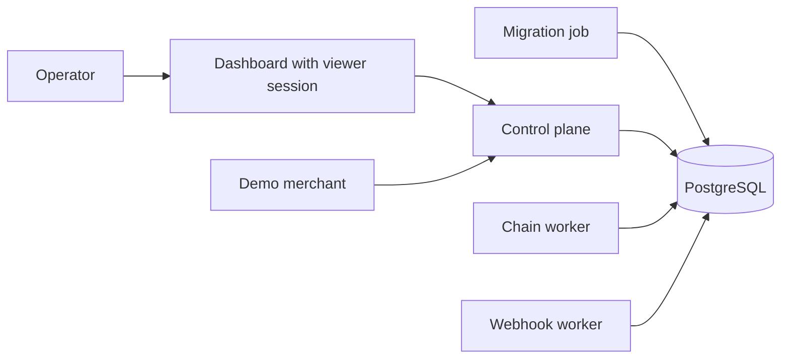

# Phase 7 Hosted Staging

Use this runbook to launch a repeatable Split402 staging surface for Phase 7
proof collection. It is intended for Devnet/public-alpha evidence, not mainnet
production custody.

## Stack



## Start

Create the staging environment file:

```bash
cp deploy/phase7-staging/phase7-staging.env.example deploy/phase7-staging/phase7-staging.env
```

Fill the viewer token, webhook target, Devnet wallets, and demo merchant signing
settings in `deploy/phase7-staging/phase7-staging.env`.

Launch the control plane and dashboard:

```bash
docker compose -f deploy/phase7-staging/compose.yaml up postgres control-plane dashboard
```

The `migrate` service runs `corepack pnpm control-plane:migrate` once before the
control plane starts. Save its JSON output if the launch review asks for schema
migration evidence.

Add the demo merchant and workers when the staging wallets and webhook receiver
are ready:

```bash
docker compose -f deploy/phase7-staging/compose.yaml --profile demo --profile workers up
```

Check the public readiness endpoints:

```bash
curl http://localhost:4021/v1/health
curl http://localhost:4027/health
```

Dashboard API routes require either a browser session created with
`SPLIT402_DASHBOARD_VIEWER_TOKEN` or the `x-split402-dashboard-token` header.

## Proof Capture

Set these values before collecting Phase 7 evidence:

```bash
SPLIT402_PHASE7_CONTROL_PLANE_URL=http://localhost:4021
SPLIT402_PHASE7_DASHBOARD_URL=http://localhost:4027
SPLIT402_PHASE7_DEMO_MERCHANT_URL=http://localhost:4023
SPLIT402_PHASE7_CONTROL_PLANE_TOKEN=<merchant-session-token>
SPLIT402_PHASE7_MERCHANT_ID=<merchant-id>
SPLIT402_PHASE7_REFERRER_WALLET=<referrer-wallet>
```

Then run the normal proof sequence:

```bash
corepack pnpm phase7:staging:init
corepack pnpm phase7:staging-proof > phase7-staging-proof.txt
corepack pnpm phase7:hosted:preflight
corepack pnpm phase7:staging:collect-reads
SPLIT402_MCP_CONTROL_PLANE_URL="$SPLIT402_PHASE7_CONTROL_PLANE_URL" \
SPLIT402_MCP_CONTROL_PLANE_TOKEN="$SPLIT402_PHASE7_CONTROL_PLANE_TOKEN" \
SPLIT402_MCP_CAPABILITY=solana.wallet-risk \
corepack pnpm phase7:staging:collect-mcp-gateway
corepack pnpm demo:mcp-bundle > phase7-staging-evidence/mcp-bundle.json
corepack pnpm demo:paid-suite > phase7-staging-evidence/paid-suite.log
corepack pnpm phase7:staging:manifest phase7-staging-proof.txt > phase7-staging-evidence/artifact-manifest.json
corepack pnpm phase7:staging:assemble > phase7-staging-proof.txt
corepack pnpm phase7:staging:status phase7-staging-proof.txt
```

The status command must pass before Phase 7 can be marked ready for public-alpha
demo review. It verifies that the hosted preflight artifact was captured against
the same control-plane and dashboard URLs listed in the proof, and that the
dashboard is locked without the viewer token while accepting the viewer-token
path.
Attach `phase7-staging-evidence/mcp-gateway.jsonl` as `mcp_gateway_evidence`.
The collector runs the gateway with JSON-RPC `initialize`, `tools/list`, and
`split402.searchCapabilities` requests. Set `SPLIT402_MCP_CONTROL_PLANE_URL` for
hosted route discovery. Leave hosted execution disabled unless the same staging
run has live x402 buyer configuration; when that is ready, set
`SPLIT402_PHASE7_MCP_GATEWAY_EXECUTE=1`, `SPLIT402_MCP_WALLET`, and
`SPLIT402_MCP_MAX_AMOUNT_ATOMIC` to also capture `split402.execute` and
`split402.getReceipt`.

## Shutdown

```bash
docker compose -f deploy/phase7-staging/compose.yaml down
```

Remove the staging database volume only after the proof artifacts have been
captured:

```bash
docker compose -f deploy/phase7-staging/compose.yaml down -v
```
