# Phase 7 Staging Proof Runbook

Use this runbook to close the Phase 7 dashboard/discovery demo gate. The proof
must show that an agent can discover a Split402 route, pay the x402 API, verify
the Split402 receipt, and inspect referrer earnings without manual database
work.

## Commands

```bash
corepack pnpm phase7:staging-proof > phase7-staging-proof.txt
corepack pnpm dashboard
corepack pnpm demo:mcp-bundle
corepack pnpm demo:paid-suite
# Capture payout obligations with SPLIT402_FUNDING_BALANCE_PROVIDER=solana-rpc
# and attach covered/deficit funding evidence to funding_balance_evidence.
corepack pnpm phase7:staging:assemble > phase7-staging-proof.txt
corepack pnpm phase7:staging:status phase7-staging-proof.txt
```

The status report includes `gateStatuses`; each gate is marked `ready`,
`missing`, `placeholder`, `invalid`, or `not_checked` with blockers attached to
the evidence field that must be fixed.

## Required Evidence

```mermaid
flowchart LR
  Discovery["Agent route discovery"]
  Payment["x402 paid request"]
  Receipt["Split402 receipt verification"]
  Earnings["Referrer balances and payouts"]
  Dashboard["Dashboard summary"]
  Webhooks["Webhook delivery feed"]
  Funding["Funding balance coverage"]
  Approval["Approved proof record"]

  Discovery --> Payment
  Payment --> Receipt
  Receipt --> Earnings
  Earnings --> Dashboard
  Dashboard --> Webhooks
  Webhooks --> Funding
  Funding --> Approval
```



Attach response captures or artifact paths for every field in
`docs/templates/phase7-staging-proof.txt`, or set the
`SPLIT402_PHASE7_ASSEMBLE_*` attachment variables and run
`corepack pnpm phase7:staging:assemble`. Leave `approval_decision` as `no-go`
until all attached evidence is from the same staging environment and source
commit.

The validator requires:

- `proof_date` in `YYYY-MM-DD` format;
- `source_commit` as a 7-40 character git SHA;
- all URL fields as `http://` or `https://` URLs;
- every evidence field as either `attached: <artifact-path>` or an `http(s)`
  artifact URL.
