# Phase 7 Staging Proof Runbook

Use this runbook to close the Phase 7 dashboard/discovery demo gate. The proof
must show that an agent can discover a Split402 route, pay the x402 API, verify
the Split402 receipt, and inspect referrer earnings without manual database
work.

For a repeatable local hosted-staging stack, start with
[`phase7-hosted-staging.md`](phase7-hosted-staging.md), then return to this
proof sequence.

## Commands

```bash
corepack pnpm phase7:staging:init
corepack pnpm phase7:staging-proof > phase7-staging-proof.txt
corepack pnpm phase7:hosted:preflight
corepack pnpm phase7:staging:collect-reads
corepack pnpm phase7:staging:collect-mcp-gateway
corepack pnpm dashboard
corepack pnpm demo:mcp-bundle
corepack pnpm demo:paid-suite
corepack pnpm phase7:staging:derive-receipt-verification
# Capture payout obligations with SPLIT402_FUNDING_BALANCE_PROVIDER=solana-rpc
# and attach covered/deficit funding evidence to funding_balance_evidence.
corepack pnpm phase7:staging:manifest phase7-staging-proof.txt > phase7-staging-evidence/artifact-manifest.json
corepack pnpm phase7:staging:assemble > phase7-staging-proof.txt
corepack pnpm phase7:staging:status phase7-staging-proof.txt
```

`phase7:staging:init` creates a `phase7-staging-evidence/` directory README and
`phase7-staging.env` attachment-path template. It does not create evidence
artifact files; those must be captured from the hosted staging run.
`phase7:staging:collect-reads` captures the control-plane read evidence for
referrer routes, referrer balances, dashboard summary, webhook delivery, payout
obligations, and funding-balance coverage using the staging merchant and
referrer environment variables.
`phase7:staging:collect-mcp-gateway` captures `mcp-gateway.jsonl` by sending
`initialize`, `tools/list`, and `split402.searchCapabilities` requests through
the MCP gateway. In default demo mode it also captures `split402.execute` and
`split402.getReceipt`, including provider used, amount paid, receipt id,
receipt verification status, and referrer credit. Set
`SPLIT402_MCP_CONTROL_PLANE_URL` and, when needed, `SPLIT402_MCP_CAPABILITY` so
the transcript proves hosted route discovery. Hosted/live execution is opt-in
with `SPLIT402_PHASE7_MCP_GATEWAY_EXECUTE=1` because it requires live x402 buyer
configuration.
`phase7:hosted:preflight` captures `hosted-preflight.json` with control-plane
health, dashboard health, dashboard session state, locked dashboard access
without a viewer token, and successful dashboard access with the viewer token
before the payment proof run.
`phase7:staging:derive-receipt-verification` derives
`receipt-verification.json` from the captured `paid-suite.log`, preserving the
verified commission-bearing receipt and the invalid-claim zero-commission path
as machine-checkable JSON.
`phase7:staging:manifest` records SHA-256 hashes for local attached artifacts
and remote references for URL-based artifacts. Attach the generated
`artifact-manifest.json` locally; the status checker will not close the proof
against a remote manifest URL. Generate it after the evidence files exist and
before the final assemble/status check.
The MCP gateway transcript is attached as `mcp_gateway_evidence`; it proves
gateway discovery and, in demo or explicitly opted-in live mode, execution plus
receipt lookup in addition to the stable `mcp-bundle.json` evidence.
Attach `mcp-bundle.json` locally as `mcp_bundle_evidence`; the status checker
parses it to verify the paid MCP tool, x402 price, Split402 campaign metadata,
protocol fee basis points, and expected referral economics.

The status report includes `gateStatuses`; each gate is marked `ready`,
`missing`, `placeholder`, `invalid`, or `not_checked` with blockers attached to
the evidence field that must be fixed. When a proof file path is supplied,
`artifactStatuses` also verifies that local `attached:` artifact paths exist
relative to the proof file directory, and `manifestStatus` verifies that local
artifact sizes and SHA-256 hashes still match `artifact-manifest.json`. Remote
`http(s)` artifact URLs are marked as remote references, except for evidence
fields that require local machine parsing and the artifact manifest itself.
`controlPlaneReadStatus`
parses the local read-API artifacts and rejects empty route discovery, zero
referrer earnings, empty dashboard activity, missing delivered webhooks, or
missing payout obligations. `paidRequestStatus` parses the local paid-suite log
and receipt-verification JSON so the x402 paid request and Split402 receipt
verification gates cannot close on placeholder output. `commandEvidenceStatus`
parses `commands.log` and requires the Phase 7 collection commands plus the
full validation suite. `fundingBalanceStatus` parses the local funding-balance
artifact and rejects unresolved funding so the proof shows whether each asset is
covered or exactly how much is missing.

## Required Evidence

```mermaid
flowchart LR
  Preflight["Hosted preflight"]
  Discovery["Agent route discovery"]
  Payment["x402 paid request"]
  Receipt["Split402 receipt verification"]
  Earnings["Referrer balances and payouts"]
  Dashboard["Dashboard summary"]
  Webhooks["Webhook delivery feed"]
  Funding["Funding balance coverage"]
  Mcp["MCP gateway transcript"]
  Approval["Approved proof record"]

  Preflight --> Discovery
  Discovery --> Payment
  Payment --> Receipt
  Receipt --> Earnings
  Earnings --> Dashboard
  Dashboard --> Webhooks
  Webhooks --> Funding
  Funding --> Mcp
  Mcp --> Approval
```



Attach response captures or artifact paths for every field in
`docs/templates/phase7-staging-proof.txt`, or set the
`SPLIT402_PHASE7_ASSEMBLE_*` attachment variables and run
`corepack pnpm phase7:staging:assemble`. Leave `approval_decision` as `no-go`
until all attached evidence is from the same staging environment and source
commit. Include `artifact_manifest_evidence` from
`corepack pnpm phase7:staging:manifest`.

The validator requires:

- `proof_date` in `YYYY-MM-DD` format;
- `source_commit` as a 7-40 character git SHA;
- all URL fields as `http://` or `https://` URLs;
- every evidence field as either `attached: <artifact-path>` or an `http(s)`
  artifact URL.
- local `attached:` artifact paths must exist when
  `corepack pnpm phase7:staging:status <phase7-staging-proof.txt>` checks a
  proof file.
- `hosted_preflight_evidence` must be a local attached
  `hosted-preflight.json` artifact whose checks passed against the proof's
  control-plane and dashboard URLs.
- `agent_discovery_evidence`, `referrer_balance_evidence`,
  `dashboard_summary_evidence`, `webhook_delivery_evidence`, and
  `payout_obligation_evidence` must be local attached JSON artifacts captured
  from the control-plane read APIs. The status checker validates that they show
  at least one active route, positive referrer earnings, at least one active
  campaign and route in the dashboard summary, a delivered webhook event, and a
  positive payout obligation.
- `paid_request_evidence` must be a local attached `paid-suite.log` artifact
  whose final JSON summary reports `paidSuitePassed: true`, a commission-bearing
  valid referral receipt, and a zero-commission invalid-claim receipt.
- `receipt_verification_evidence` must be a local attached JSON artifact that
  names the verified receipt id and reports a verified Split402 receipt with no
  errors.
- `commands_run` must be a local attached command transcript containing the
  Phase 7 staging collection/status commands and the validation commands:
  `corepack pnpm lint`, `corepack pnpm typecheck`, `corepack pnpm test`,
  `corepack pnpm build`, `corepack pnpm vectors:check`, and
  `corepack pnpm audit --audit-level high`.
- `funding_balance_evidence` must be a local attached
  `funding-balance.json` artifact containing a merchant obligation summary.
  Each asset must report `covered` with `fundingDeficitAtomic: "0"` or
  `deficit` with a positive `fundingDeficitAtomic`; `unknown` funding status
  does not close the gate.
- `mcp_bundle_evidence` must be a local attached `mcp-bundle.json` artifact
  with schema `split402.mcp-demo-bundle.v1`, project `Split402`, a
  `split402.walletRiskScore` paid tool, exact x402 pricing, Split402 campaign
  metadata, `protocolFeeBpsOfCommission`, and expected economics that match the
  payment amount, commission bps, protocol fee, referrer credit, and merchant
  retained amount.
- `mcp_gateway_evidence` must be a local attached `mcp-gateway.jsonl`
  transcript containing initialize, tools/list, and
  `split402.searchCapabilities` request/response pairs. The tools/list response
  must advertise `split402.searchCapabilities`, `split402.execute`, and
  `split402.getReceipt`. When the transcript includes `split402.execute`, it
  must also include a matching `split402.getReceipt` response for the returned
  receipt id.
- `artifact_manifest_evidence` must be a local attached
  `artifact-manifest.json` artifact. Local `attached:` artifacts must match the
  generated manifest.
