# Phase 7 Staging Proof Runbook

Use this runbook to close the Phase 7 dashboard/discovery demo gate. The proof
must show that an agent can discover a Split402 route, pay the x402 API, verify
the Split402 receipt, and inspect referrer earnings without manual database
work.

For a repeatable local hosted-staging stack, start with
[`phase7-hosted-staging.md`](phase7-hosted-staging.md), then return to this
proof sequence.

## Commands

```bash
git rev-parse HEAD
git status --short --branch
corepack pnpm product:evidence:init --missing
corepack pnpm product:launch-preflight --brief --workspace split402-launch-evidence
SPLIT402_PHASE7_SEED_CONFIRM=seed-hosted-staging corepack pnpm phase7:staging:seed
corepack pnpm phase7:staging-proof --evidence-env-file split402-launch-evidence/phase7-staging.env split402-launch-evidence/phase7-staging-proof.txt
corepack pnpm phase7:hosted:preflight --evidence-env-file split402-launch-evidence/phase7-staging.env
# Confirm hosted control plane has SPLIT402_FUNDING_BALANCE_PROVIDER=solana-rpc.
corepack pnpm phase7:staging:collect-reads --evidence-env-file split402-launch-evidence/phase7-staging.env
corepack pnpm phase7:staging:collect-mcp-gateway --evidence-env-file split402-launch-evidence/phase7-staging.env
corepack pnpm demo:mcp-gateway:smoke
corepack pnpm phase7:staging:commands-template split402-launch-evidence/phase7-staging-evidence/commands.log
corepack pnpm demo:mcp-bundle split402-launch-evidence/phase7-staging-evidence/mcp-bundle.json
corepack pnpm demo:paid-suite split402-launch-evidence/phase7-staging-evidence/paid-suite.log
corepack pnpm phase7:staging:derive-receipt-verification --evidence-env-file split402-launch-evidence/phase7-staging.env split402-launch-evidence/phase7-staging-evidence/paid-suite.log split402-launch-evidence/phase7-staging-evidence/receipt-verification.json
corepack pnpm phase7:staging:manifest split402-launch-evidence/phase7-staging-proof.txt split402-launch-evidence/phase7-staging-evidence/artifact-manifest.json
corepack pnpm phase7:staging:assemble --evidence-env-file split402-launch-evidence/phase7-staging.env split402-launch-evidence/phase7-staging-proof.txt
corepack pnpm phase7:staging:status split402-launch-evidence/phase7-staging-proof.txt
corepack pnpm product:status --brief --workspace split402-launch-evidence
```

`product:evidence:init --missing` creates the combined
`split402-launch-evidence/` workspace, including Phase 6 custody scaffolds,
`split402-launch-evidence/phase7-staging.env`, and the
`split402-launch-evidence/phase7-staging-evidence/` artifact directory README.
It does not create real evidence artifact files; those must be captured from
the hosted staging run.
The collection and assembly commands auto-load the default evidence env files
when present; use `--evidence-env-file <path>` when the evidence workspace is
not at the default path.
`phase7:staging-proof` and `phase7:staging:assemble` fill `source_commit` from
`SPLIT402_PHASE7_SOURCE_COMMIT` when set, otherwise from `git rev-parse HEAD`.
Use the same value for hosted preflight evidence so the same-source gate can
close. `phase7:staging:status` also compares the proof `source_commit` with the
current checkout's `git rev-parse HEAD`; rerun the proof after any source commit
change instead of approving stale evidence. Run the final status check from a
clean source checkout because uncommitted source changes also keep the proof
no-go. Local proof artifacts such as
`split402-launch-evidence/phase7-staging-proof.txt` and files under
`split402-launch-evidence/phase7-staging-evidence/` are allowed during the
status check.
`phase7:staging:seed` is an operator-only PostgreSQL seed for hosted Devnet
staging. It creates or verifies the active demo merchant, verified origin,
offer/receipt key, payout wallet, active campaign, and active referral route
without adding a public self-approval endpoint. Set `SPLIT402_DATABASE_URL` or
`DATABASE_URL` before running it, and keep
`SPLIT402_PHASE7_SEED_CONFIRM=seed-hosted-staging` out of production
environments.
`phase7:staging:collect-reads` captures the control-plane read evidence for
referrer routes, referrer balances, dashboard summary, webhook delivery, payout
obligations, and funding-balance coverage using the staging merchant and
referrer environment variables. It fails immediately if route discovery,
referrer balances, dashboard summary, webhook delivery, payout obligations, or
funding-balance coverage are missing the semantic fields required by the final
status gate, so weak read evidence cannot slip through as a successful
collection. The collector writes the read artifact files only after every read
artifact has passed validation, avoiding partial evidence directories from
failed runs.
`phase7:staging:collect-mcp-gateway` captures `mcp-gateway.jsonl` by sending
`initialize`, `tools/list`, `split402.searchCapabilities`, `split402.execute`,
and `split402.getReceipt` requests through the MCP gateway. The transcript must
include provider used, amount paid, receipt id, receipt verification status, and
referrer credit, and the collector's JSON report echoes those fields as
`providerId`, `providerNetwork`, `providerAsset`, `providerAmountAtomic`,
`providerMerchantOrigin`, `providerOperationId`, `providerCampaignId`,
`providerPayToWallet`, `providerRouteId`, `providerReferrerWallet`,
`providerPayoutWallet`, `amountPaidAtomic`, `receiptId`,
`receiptVerificationStatus`, `executeExecutionMode`, and `referrerCreditAtomic`,
plus receipt-side `network`, `asset`, `merchantOrigin`, `operationId`,
`campaignId`, `requiredAmountAtomic`, `payToWallet`,
`receiptReferrerCreditAtomic`, `receiptReferrerWallet`, `receiptPayoutWallet`,
route id, commission bps, protocol-fee bps, and commission/protocol-fee amounts
when receipt lookup succeeds. The collector rejects the report if the receipt
amount, selected-provider payment details, selected-provider merchant origin,
operation id, campaign id, route id, referrer wallet, payout wallet, commission,
protocol fee, or referrer credit arithmetic does not match. It also rejects
execute evidence with missing required fields, unsupported execution mode,
unverified receipt status, or zero referrer credit. Demo mode is a local
contract check only and remains no-go for hosted Phase 7 proof. Proof-ready
MCP gateway evidence must run in `router-live-agent-sdk` mode: set
`SPLIT402_MCP_CONTROL_PLANE_URL` for hosted route discovery, set
`SPLIT402_PHASE7_MCP_GATEWAY_EXECUTE=1`, and provide a funded buyer key in
`SPLIT402_MCP_SVM_PRIVATE_KEY` or `SVM_PRIVATE_KEY` for the router-backed x402
execution path.
The status checker also compares `mcp_gateway_evidence` with
`agent_discovery_evidence`: the selected provider route id must appear in route
discovery, and the discovered campaign, referrer wallet, and payout wallet must
match the MCP-selected provider.
`phase7:hosted:preflight` captures `hosted-preflight.json` with the source
commit, control-plane health, dashboard health, dashboard session state, locked
dashboard access without a viewer token, and successful dashboard access with
the viewer token before the payment proof run.
`phase7:staging:derive-receipt-verification` derives
`receipt-verification.json` from the captured `paid-suite.log`, preserving the
verified commission-bearing receipt and the invalid-claim zero-commission path
as machine-checkable JSON.
`phase7:staging:manifest` records SHA-256 hashes for local attached artifacts.
All Phase 7 proof evidence is local-only so the status checker can parse and
hash every artifact. Attach the generated `artifact-manifest.json` locally; the
status checker will not close the proof against a remote manifest URL. Generate
it after the evidence files exist and before the final assemble/status check.
The MCP gateway transcript is attached as `mcp_gateway_evidence`; it proves
gateway discovery, execution, and receipt lookup in addition to the stable
`mcp-bundle.json` evidence.
Attach `mcp-bundle.json` locally as `mcp_bundle_evidence`; the status checker
parses it to verify the paid MCP tool, x402 price, Split402 campaign metadata,
protocol fee basis points, and expected referral economics.

The status report includes `gateStatuses`; each gate is marked `ready`,
`missing`, `placeholder`, `invalid`, or `not_checked` with blockers attached to
the evidence field that must be fixed. When a proof file path is supplied,
`artifactStatuses` also verifies that local `attached:` artifact paths exist
relative to the proof file directory, and `manifestStatus` verifies that local
artifact sizes and SHA-256 hashes still match `artifact-manifest.json`. Phase 7
proof artifacts are local-only; remote `http(s)` evidence references do not
close the status gate.
`controlPlaneReadStatus`
parses the local read-API artifacts and rejects empty route discovery, zero
referrer earnings, empty dashboard activity, missing delivered webhooks, or
missing payout obligations. It also cross-checks that dashboard active
campaign/route ids include the discovered route, referrer balances match the
discovered referrer wallet, and payout obligation plus delivered webhook
evidence match the dashboard merchant id. `paidRequestStatus` parses the local
paid-suite log and receipt-verification JSON so the x402 paid request and
Split402 receipt verification gates cannot close on placeholder output or
receipt summaries from a different run. `commandEvidenceStatus`
parses `commands.log` and requires the Phase 7 collection commands plus the
full validation suite. `fundingBalanceStatus` parses the local funding-balance
artifact and rejects unresolved funding so the proof shows whether each asset is
covered or exactly how much is missing.

## Required Evidence

```mermaid
flowchart LR
  Preflight["Hosted preflight"]
  Discovery["Agent route discovery"]
  Payment["x402 paid request"]
  Receipt["Split402 receipt verification"]
  Earnings["Referrer balances and payouts"]
  Dashboard["Dashboard summary"]
  Webhooks["Webhook delivery feed"]
  Funding["Funding balance coverage"]
  Mcp["MCP gateway transcript"]
  Approval["Approved proof record"]

  Preflight --> Discovery
  Discovery --> Payment
  Payment --> Receipt
  Receipt --> Earnings
  Earnings --> Dashboard
  Dashboard --> Webhooks
  Webhooks --> Funding
  Funding --> Mcp
  Mcp --> Approval
```



Attach response captures or artifact paths for every field in
`docs/templates/phase7-staging-proof.txt`, or set the
`SPLIT402_PHASE7_ASSEMBLE_*` attachment variables and run
`corepack pnpm phase7:staging:assemble`. Assemble rejects URL references for
local-only proof artifacts; use local `attached:` artifacts for evidence that
the status checker parses. Leave `approval_decision` as `no-go` until all
attached evidence is from the same staging environment and source commit.
Include `artifact_manifest_evidence` from
`corepack pnpm phase7:staging:manifest split402-launch-evidence/phase7-staging-proof.txt split402-launch-evidence/phase7-staging-evidence/artifact-manifest.json`.

The validator requires:

- `proof_date` in `YYYY-MM-DD` format;
- `source_commit` as a 7-40 character git SHA;
- all URL fields as `http://` or `https://` URLs;
- every evidence field as either `attached: <artifact-path>` or an `http(s)`
  artifact URL.
- local `attached:` artifact paths must exist when
  `corepack pnpm phase7:staging:status <phase7-staging-proof.txt>` checks a
  proof file.
- `hosted_preflight_evidence` must be a local attached
  `hosted-preflight.json` artifact whose checks passed against the proof's
  source commit, control-plane URL, and dashboard URL.
- `agent_discovery_evidence`, `referrer_balance_evidence`,
  `dashboard_summary_evidence`, `webhook_delivery_evidence`, and
  `payout_obligation_evidence` must be local attached JSON artifacts captured
  from the control-plane read APIs. The status checker validates that they show
  at least one active route, positive referrer earnings, at least one active
  campaign and route in the dashboard summary, a delivered webhook event, and a
  positive payout obligation. The active route/campaign/referrer/merchant
  identities must match across those read artifacts.
- `paid_request_evidence` must be a local attached `paid-suite.log` artifact
  whose final JSON summary reports `paidSuitePassed: true`, a commission-bearing
  valid referral receipt, and a zero-commission invalid-claim receipt.
- `receipt_verification_evidence` must be a local attached JSON artifact that
  names the verified receipt id and reports a verified Split402 receipt with no
  errors. Its valid and invalid-claim receipt summaries must match the receipts
  in the paid-suite log.
- `commands_run` must be a local attached command transcript containing the
  source commit/status commands, the Phase 7 staging collection/status commands,
  and the validation commands:
  `git rev-parse HEAD`, `git status --short --branch`,
  `corepack pnpm lint`, `corepack pnpm typecheck`, `corepack pnpm test`,
  `corepack pnpm build`, `corepack pnpm vectors:check`, and
  `corepack pnpm audit --audit-level high`.
- `funding_balance_evidence` must be a local attached
  `funding-balance.json` artifact containing a merchant obligation summary.
  Each asset must report `covered` with `fundingDeficitAtomic: "0"` or
  `deficit` with a positive `fundingDeficitAtomic`; `unknown` funding status
  does not close the gate.
- `mcp_bundle_evidence` must be a local attached `mcp-bundle.json` artifact
  with schema `split402.mcp-demo-bundle.v1`, project `Split402`, a
  `split402.walletRiskScore` paid tool, exact x402 pricing, Split402 campaign
  metadata, `protocolFeeBpsOfCommission`, and expected economics that match the
  payment amount, commission bps, protocol fee, referrer credit, and merchant
  retained amount.
- `mcp_gateway_evidence` must be a local attached `mcp-gateway.jsonl`
  transcript containing initialize, tools/list, and
  `split402.searchCapabilities` request/response pairs. The search request must
  include `budget.maxAmountAtomic` so the proof demonstrates budget-filtered
  capability discovery. The tools/list response must advertise
  `split402.searchCapabilities`, `split402.execute`, and `split402.getReceipt`.
  The transcript must include `split402.execute` for the same capability and
  `budget.maxAmountAtomic`, using a provider id returned by the search response,
  selected provider network, asset, amount, and `payToWallet`, amount paid at
  or below that budget, verified receipt status, positive referrer credit, and a
  matching `split402.getReceipt` response whose receipt payload has the same
  receipt id, required amount, referrer credit, selected-provider payment
  details, selected-provider merchant origin, selected-provider operation id,
  selected-provider campaign id, selected-provider route attribution,
  selected-provider referrer wallet, and selected-provider payout wallet. The
  selected provider route id must also be present in
  `agent_discovery_evidence` with matching campaign id, referrer wallet, and
  payout wallet. The receipt payload must also include positive
  commission bps, `protocolFeeBpsOfCommission`, positive commission amount,
  non-negative protocol fee, commission and protocol fee amounts derived from
  those bps fields, and referrer credit equal to commission minus protocol fee.
- `artifact_manifest_evidence` must be a local attached
  `artifact-manifest.json` artifact. Local `attached:` artifacts must match the
  generated manifest.
