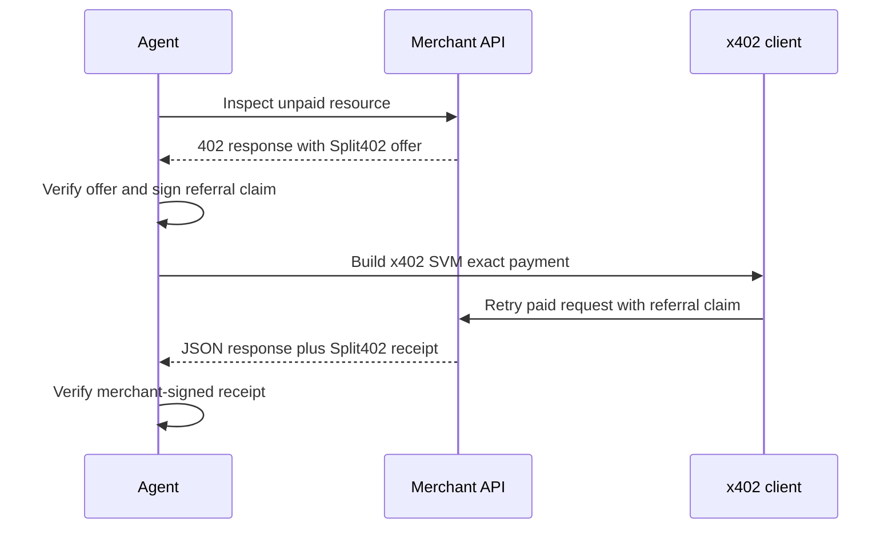

# @split402/agent-sdk

TypeScript SDK for agents that call Split402-enabled x402 APIs and claim
referral credit.

The payment remains a normal x402 USDC payment. Split402 adds a signed referral
claim, so the merchant and control plane can record the campaign commission. For
example, `commissionBps: 1000` means a successful `1.00 USDC` paid call records
`0.10 USDC` as owed to the referrer's payout wallet.

## Agent Flow



## Usage

```ts
import {
  Split402AgentClient,
  createReferralClaim,
  createSvmSignerFromBase58
} from "@split402/agent-sdk";
import { deriveEd25519PublicKey, hexToBytes } from "@split402/protocol";

const signer = await createSvmSignerFromBase58(process.env.SVM_PRIVATE_KEY!);
const referrerSeed = hexToBytes(process.env.SPLIT402_REFERRER_SEED_HEX!);
const payoutSeed = hexToBytes(process.env.SPLIT402_PAYOUT_SEED_HEX!);

const client = new Split402AgentClient({
  merchantOrigin: "https://merchant.example",
  merchantPublicKey: process.env.SPLIT402_MERCHANT_PUBLIC_KEY,
  signer
});

const offer = await client.inspectOffer({
  path: "/v1/risk",
  body: { wallet: signer.address.toString() }
});

const referralClaim = createReferralClaim({
  privateSeed: referrerSeed,
  routeId: "rte_00000000000000000000000000000003",
  campaignId: offer.offer.campaignId,
  campaignVersionMin: offer.offer.campaignVersion,
  payoutWallet: deriveEd25519PublicKey(payoutSeed),
  resourceOrigin: offer.offer.resourceOrigin,
  operationIds: [offer.offer.operationId],
  expiresAt: "2099-06-24T00:00:00Z"
});

const result = await client.postJson({
  path: "/v1/risk",
  pathTemplate: "/v1/risk",
  body: { wallet: signer.address.toString() },
  referralClaim
});

console.log(result.data);
console.log(result.receipt?.referrerCreditAtomic);
console.log(result.receiptVerification);
```

## What It Handles

- inspects a merchant's unpaid `402 Payment Required` response;
- parses the advertised Split402 offer;
- optionally verifies the merchant-signed offer;
- creates signed referral claims;
- attaches Split402 attribution to x402 payments;
- pays with the x402 SVM `exact` client;
- extracts the Split402 settlement receipt;
- optionally verifies merchant-signed receipts.

## Package Status

This package is public-alpha code for the Solana Devnet demo and protocol test
loop. It is not a production wallet, custody system, payout engine, or mainnet
settlement client.
