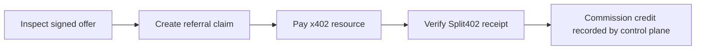
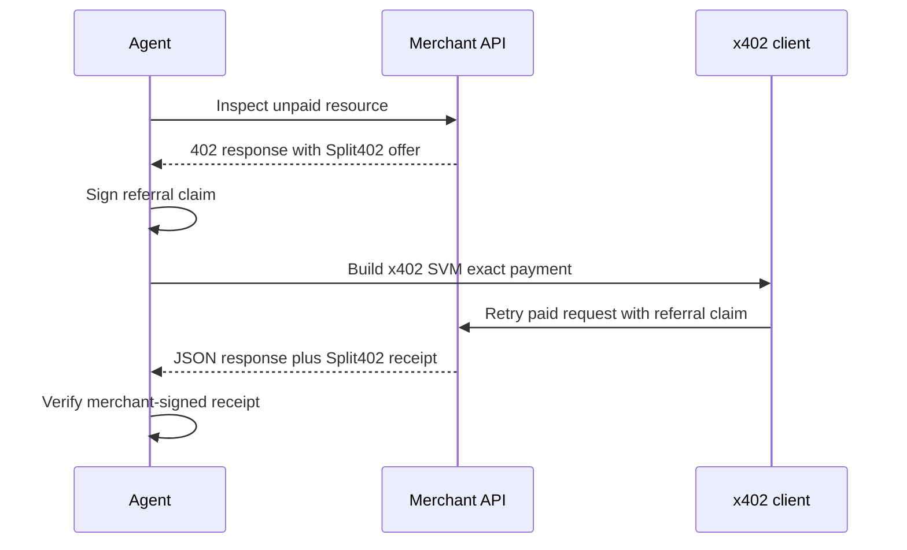

# @split402/agent-sdk

TypeScript SDK for agents that call Split402-enabled x402 APIs and claim referral
credit.

The payment stays a normal x402 USDC payment. Split402 adds a signed referral
claim so the merchant/control plane can record the configured commission, for
example 10 percent when the campaign terms set `commissionBps` to `1000`.

## What The Agent Gets



The SDK helps the agent prove attribution. It does not custody funds and does not
change the merchant's x402 settlement destination.

## Agent Flow



## Use

```ts
import {
  Split402AgentClient,
  createReferralClaim,
  createSvmSignerFromBase58
} from "@split402/agent-sdk";
import { deriveEd25519PublicKey, hexToBytes } from "@split402/protocol";

const signer = await createSvmSignerFromBase58(process.env.SVM_PRIVATE_KEY!);
const referrerSeed = hexToBytes(process.env.SPLIT402_REFERRER_SEED_HEX!);
const payoutSeed = hexToBytes(process.env.SPLIT402_PAYOUT_SEED_HEX!);

const client = new Split402AgentClient({
  merchantOrigin: "https://your-merchant.example",
  merchantPublicKey: process.env.SPLIT402_MERCHANT_PUBLIC_KEY,
  signer
});

const offer = await client.inspectOffer({
  path: "/v1/risk",
  body: { wallet: signer.address.toString() }
});

console.log(offer.offer.commissionBps);

const referralClaim = createReferralClaim({
  privateSeed: referrerSeed,
  routeId: "rte_00000000000000000000000000000003",
  campaignId: "cmp_00000000000000000000000000000002",
  campaignVersionMin: 1,
  payoutWallet: deriveEd25519PublicKey(payoutSeed),
  resourceOrigin: "https://your-merchant.example",
  operationIds: ["wallet-risk-score"],
  expiresAt: "2099-06-24T00:00:00Z"
});

const result = await client.postJson({
  path: "/v1/risk",
  pathTemplate: "/v1/risk",
  body: { wallet: signer.address.toString() },
  referralClaim
});

console.log(result.data);
console.log(result.receipt?.referrerCreditAtomic);
```

For paid x402 resources that are modeled as `GET` routes, inspect and execute
with the same method. Query parameters are included in the Split402 request
digest.

```ts
await client.inspectOffer({
  path: "/price/btc",
  method: "GET",
  query: { format: "json" }
});

const price = await client.getJson({
  path: "/price/btc",
  query: { format: "json" },
  referralClaim
});
```

## What It Handles

- inspects a merchant's unpaid `402 Payment Required` response;
- attaches Split402 referral claims to x402 payments;
- pays `GET` and `POST` JSON resources with the x402 SVM `exact` client;
- extracts the Split402 settlement receipt;
- verifies merchant-signed offers and receipts when a merchant public key is supplied.
