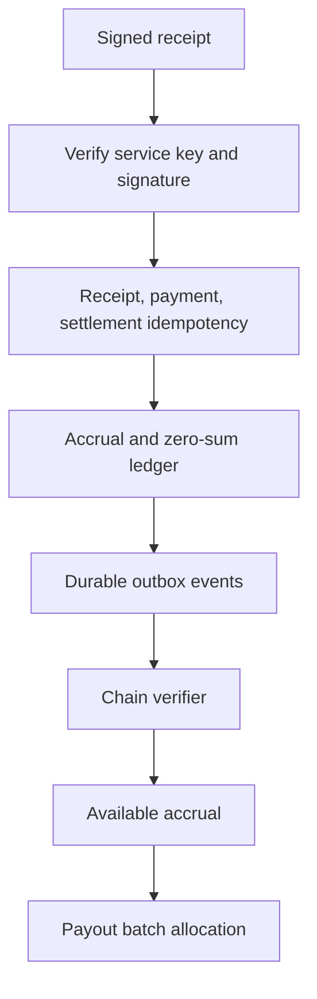

# @split402/control-plane

Control-plane primitives for Split402 receipt ingestion, merchant and campaign
registries, route discovery, chain verification, webhook delivery, commission
accruals, and payout planning.

The control plane receives merchant-signed Split402 receipts after successful
x402 settlement. It verifies the receipt, enforces idempotency, records the
commission liability, moves verified accruals into payout eligibility, and can
plan merchant-funded payout batches without double-allocating accruals.

## Control-Plane Flow



## API Surface

```text
GET  /v1/health
POST /v1/auth/challenges
POST /v1/auth/sessions
POST /v1/auth/sessions/refresh
POST /v1/receipts
POST /v1/merchants
GET  /v1/merchants/:merchantId
POST /v1/merchants/:merchantId/origins
POST /v1/merchants/:merchantId/keys
POST /v1/merchants/:merchantId/keys/:kid/revoke
POST /v1/merchants/:merchantId/payout-wallets
POST /v1/campaigns
GET  /v1/campaigns/:campaignId
POST /v1/campaigns/:campaignId/activate
GET  /v1/campaigns/:campaignId/versions/:version
POST /v1/campaigns/:campaignId/versions
POST /v1/routes/drafts
POST /v1/routes
POST /v1/routes/:routeId/suspend
POST /v1/routes/:routeId/rotate-payout
GET  /v1/routes/search
GET  /v1/routes/:routeId/versions
GET  /v1/routes/:routeId
POST /v1/merchants/:merchantId/payouts/preview
POST /v1/merchants/:merchantId/payout-batches
```

## Stores And Workers

- in-memory stores for deterministic unit tests;
- PostgreSQL merchant, service-key, origin, campaign, route, auth, receipt,
  accrual, ledger, outbox, payout-wallet, and payout-batch persistence;
- packaged PostgreSQL migration runner with checksum tracking;
- chain-verification worker with Solana JSON-RPC signature and transfer checks;
- webhook dispatch worker with signed POST envelopes and retry/dead-letter state;
- payout preview and batch allocation stores that select available accruals and
  mark them `allocated` exactly once;
- PostgreSQL payout batch creation with `FOR UPDATE SKIP LOCKED` eligible-accrual
  selection for concurrent workers;
- deterministic Solana payout transfer planning for allocated batches;
- Solana RPC payout transaction simulation before submission;
- policy-enforced Solana payout signing boundary;
- signed-byte payout transaction persistence before broadcast;
- Solana RPC broadcast submission boundary for persisted signed bytes;
- Solana RPC finality monitoring with retry and outcome-unknown classification;
- payout batch and item status rollup from transaction finality;
- idempotent payout-batch ledger closure for finalized payouts.

## Commands

```bash
corepack pnpm --filter @split402/control-plane test
corepack pnpm --filter @split402/control-plane typecheck
corepack pnpm --filter @split402/control-plane build
corepack pnpm test:postgres
corepack pnpm worker:chain
corepack pnpm worker:webhook
```

## Package Status

Public-alpha foundation. Not production hardened. Do not use for mainnet
settlement, custody, payout execution, or irreversible accounting without a full
security and reconciliation review.
