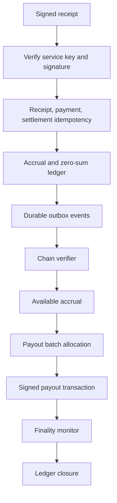
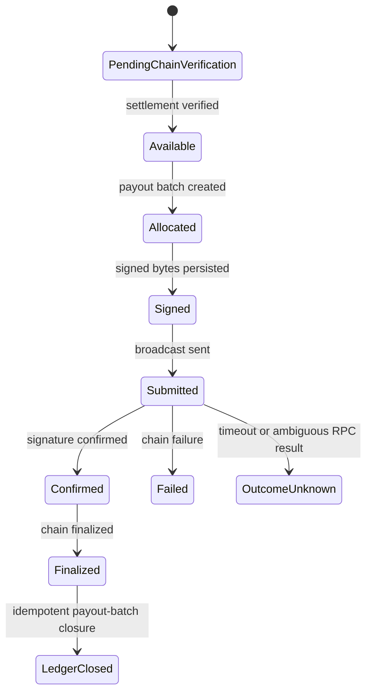

# @split402/control-plane

Control-plane primitives for Split402 receipt ingestion, merchant and campaign
registries, route discovery, chain verification, webhook delivery, commission
accruals, payout planning, payout transaction tracking, and payout ledger
closure.

The control plane receives merchant-signed Split402 receipts after successful
x402 settlement. It verifies the receipt, enforces idempotency, records the
commission liability, moves verified accruals into payout eligibility, and can
plan merchant-funded payout batches without double-allocating accruals.

## Control-Plane Flow



## Payout Lifecycle



The current payout engine is still public-alpha infrastructure. It has the
accounting, transaction, and eventing boundaries needed to prevent duplicate
allocation, duplicate lifecycle notifications, and duplicate ledger closure,
plus disposable local-dev signer wiring for Devnet testing and remote signer
client wiring for isolated custody integrations. Production custody review
remains active hardening work.

## API Surface

```text
GET  /v1/health
POST /v1/auth/challenges
POST /v1/auth/sessions
POST /v1/auth/sessions/refresh
POST /v1/receipts
POST /v1/merchants
GET  /v1/merchants/:merchantId
POST /v1/merchants/:merchantId/origins
POST /v1/merchants/:merchantId/keys
POST /v1/merchants/:merchantId/keys/:kid/revoke
POST /v1/merchants/:merchantId/payout-wallets
POST /v1/campaigns
GET  /v1/campaigns/:campaignId
POST /v1/campaigns/:campaignId/activate
GET  /v1/campaigns/:campaignId/versions/:version
POST /v1/campaigns/:campaignId/versions
POST /v1/routes/drafts
POST /v1/routes
POST /v1/routes/:routeId/suspend
POST /v1/routes/:routeId/rotate-payout
GET  /v1/routes/search
GET  /v1/routes/:routeId/versions
GET  /v1/routes/:routeId
POST /v1/merchants/:merchantId/payouts/preview
GET  /v1/merchants/:merchantId/payouts/reconciliation
POST /v1/payout-batches/:batchId/reconcile
POST /v1/merchants/:merchantId/payout-batches
GET  /v1/referrers/:referrerWallet/balances
GET  /v1/referrers/:referrerWallet/payouts
```

## Stores And Workers

- in-memory stores for deterministic unit tests;
- PostgreSQL merchant, service-key, origin, campaign, route, auth, receipt,
  accrual, ledger, outbox, payout-wallet, and payout-batch persistence;
- packaged PostgreSQL migration runner with checksum tracking;
- chain-verification worker with Solana JSON-RPC signature and transfer checks;
- webhook dispatch worker with signed POST envelopes and retry/dead-letter state;
- payout preview and batch allocation stores that select available accruals and
  mark them `allocated` exactly once;
- unknown-outcome reconciliation queue for merchant/operator review before retry;
- payout reconciliation action endpoint that rechecks chain finality and persists
  observed transaction outcomes before any retry decision;
- referrer payout balance and history views from accruals and payout allocations;
- PostgreSQL payout batch creation with `FOR UPDATE SKIP LOCKED` eligible-accrual
  selection for concurrent workers;
- deterministic Solana payout transfer planning for allocated batches;
- Solana RPC payout transaction simulation before submission;
- policy-enforced Solana payout signing boundary;
- local-dev Solana payout signer factory backed by disposable key material or
  `SPLIT402_PAYOUT_SIGNER_*` environment variables;
- remote Solana payout signer client that posts policy-checked transactions to
  an isolated signer using `SPLIT402_REMOTE_PAYOUT_SIGNER_*` configuration and
  optional HMAC request authentication;
- signed-byte payout transaction persistence before broadcast;
- Solana RPC broadcast submission boundary for persisted signed bytes;
- Solana RPC finality monitoring with retry and outcome-unknown classification;
- payout batch and item status rollup from transaction finality;
- idempotent payout-batch ledger closure for finalized payouts;
- payout submitted, confirmed, finalized, failed, and outcome-unknown internal
  and webhook outbox events.

## Commands

```bash
corepack pnpm --filter @split402/control-plane test
corepack pnpm --filter @split402/control-plane typecheck
corepack pnpm --filter @split402/control-plane build
corepack pnpm test:postgres
corepack pnpm worker:chain
corepack pnpm worker:webhook
```

## Local-Dev Payout Signer

For Devnet-only payout tests, construct the signer with
`createLocalDevSolanaPayoutSigner` or
`createLocalDevSolanaPayoutSignerFromEnv`. The signer reference must start with
`local-dev:` and exactly one key source must be provided:

```bash
SPLIT402_PAYOUT_SIGNER_REF=local-dev:payout-key
SPLIT402_PAYOUT_SIGNER_EXPECTED_ADDRESS=<funding-wallet-address>
SPLIT402_PAYOUT_SIGNER_PRIVATE_KEY_BASE64=<32-byte-private-key-base64>
```

The local-dev signer verifies the configured address against the payout policy
before signing. Do not use these environment variables for production custody.

## Remote Payout Signer

For isolated custody integrations, construct the signer with
`createRemoteSolanaPayoutSigner` or `createRemoteSolanaPayoutSignerFromEnv`.
The signer reference must not start with `local-dev:`. The control plane still
enforces payout policy before delegating to the remote signer:

```bash
SPLIT402_REMOTE_PAYOUT_SIGNER_REF=kms:split402-devnet-payout
SPLIT402_REMOTE_PAYOUT_SIGNER_URL=https://signer.example/v1/solana/payouts/sign
SPLIT402_REMOTE_PAYOUT_SIGNER_KEY_ID=control-plane-key
SPLIT402_REMOTE_PAYOUT_SIGNER_SHARED_SECRET=replace-with-shared-secret
SPLIT402_REMOTE_PAYOUT_SIGNER_TIMEOUT_MS=5000
```

When a shared secret is configured, requests include
`x-split402-signature-timestamp` and `x-split402-signature`, where the signature
is HMAC-SHA256 over `timestamp.body` and encoded as `v1=<hex>`. The isolated
signer rejects stale or future timestamps outside its configured signature
tolerance window, so keep control-plane clocks synchronized.

## Payout Reconciliation

`POST /v1/payout-batches/:batchId/reconcile` uses the configured payout finality
monitor to requery Solana before an operator makes a retry decision. Runtime
configuration is read from `SPLIT402_PAYOUT_FINALITY_*` variables and falls back
to the chain-worker RPC settings when omitted:

```bash
SPLIT402_PAYOUT_FINALITY_NETWORK=solana:EtWTRABZaYq6iMfeYKouRu166VU2xqa1
SPLIT402_PAYOUT_FINALITY_SOLANA_RPC_URL=https://api.devnet.solana.com
SPLIT402_PAYOUT_FINALITY_SOLANA_RPC_URLS=
SPLIT402_PAYOUT_FINALITY_RETRY_DELAY_MS=30000
SPLIT402_PAYOUT_FINALITY_UNKNOWN_OUTCOME_AFTER_MS=300000
```

## Package Status

Public-alpha foundation. Not production hardened. Do not use for mainnet
settlement, custody, payout execution, or irreversible accounting without a full
security and reconciliation review.
