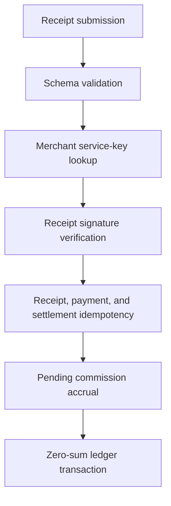

# @split402/control-plane

Control-plane primitives for Split402 receipt ingestion, merchant registry,
wallet authentication, campaign versions, accruals, and ledger records.

The control plane receives merchant-signed Split402 receipts after successful
x402 settlement. It verifies the receipt, enforces idempotency, and records the
commission liability that will later be selected for payout.

## Ingestion Flow



## Main Branch API Surface

```text
GET  /v1/health
POST /v1/auth/challenges
POST /v1/auth/sessions
POST /v1/receipts
POST /v1/merchants
GET  /v1/merchants/:merchantId
POST /v1/merchants/:merchantId/origins
POST /v1/merchants/:merchantId/keys
POST /v1/merchants/:merchantId/keys/:kid/revoke
POST /v1/campaigns
GET  /v1/campaigns/:campaignId
POST /v1/campaigns/:campaignId/activate
GET  /v1/campaigns/:campaignId/versions/:version
POST /v1/campaigns/:campaignId/versions
```

## Stores

- in-memory stores for deterministic unit tests;
- PostgreSQL receipt ingestion store;
- PostgreSQL merchant/key/origin registry;
- PostgreSQL wallet-auth challenge and session store.

Route persistence, durable campaign persistence, outbox processing, chain
verification workers, and runtime wiring are being developed in the active PR
stack and are not part of the current `main` package surface yet.

## Package Status

Public-alpha foundation. Not production hardened. Do not use for mainnet
settlement, custody, payout execution, or irreversible accounting without a full
security and reconciliation review.
