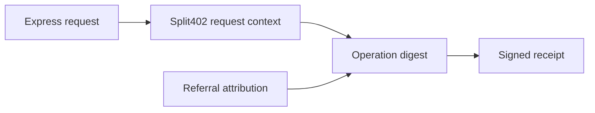

# @split402/express

Express adapter for Split402 operation-digest inputs.

Split402 receipts are bound to a stable operation digest. This package captures
the HTTP method, route template, params, query, body, and optional referral-claim
hint from an Express request so the merchant and agent can calculate the same
request-bound digest.

## Digest Boundary



This package deliberately stays small. It prepares request material for the
protocol and x402 extension layers; it does not verify payments, sign receipts,
or write ledger state.

## Usage

```ts
import express from "express";
import {
  getSplit402RequestContext,
  split402RequestContext
} from "@split402/express";

const app = express();

app.post(
  "/v1/risk",
  express.json(),
  split402RequestContext("/v1/risk"),
  (req, res) => {
    const context = getSplit402RequestContext(req);
    res.json({ operation: context.pathTemplate });
  }
);
```

## Package Status

Implemented as a small adapter for the demo merchant and x402 extension. The
package intentionally avoids payment logic and only handles request context.
