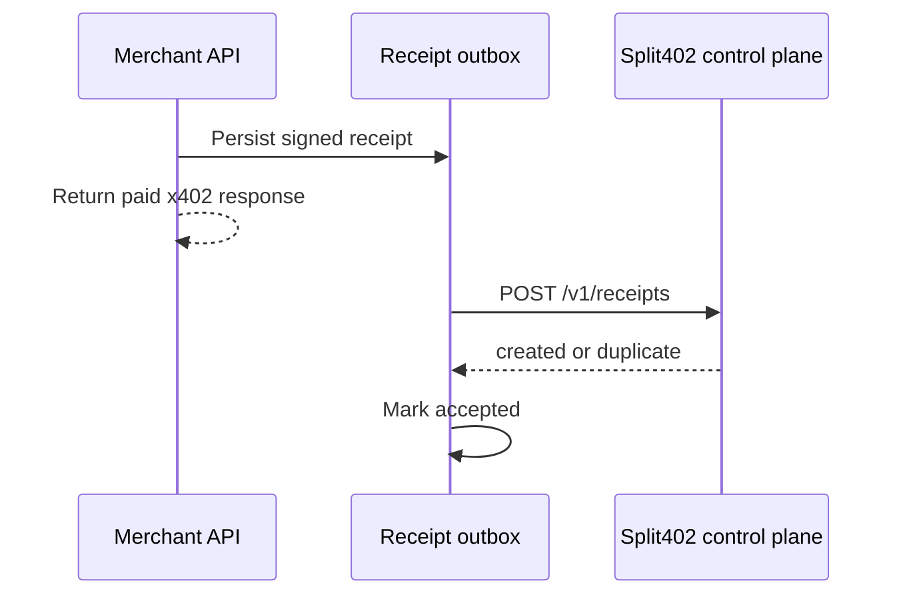

# @split402/merchant-sdk

Production merchant helpers for Split402-enabled x402 APIs.

This package starts with the durable receipt outbox boundary. A merchant can
enqueue a signed Split402 receipt before returning the paid response, then retry
control-plane ingestion later without creating duplicate commissions.

## Receipt Outbox Flow



## Use

```ts
import {
  ControlPlaneReceiptSubmitter,
  InMemoryMerchantReceiptOutboxStore,
  MerchantReceiptOutboxDispatcher
} from "@split402/merchant-sdk";

const store = new InMemoryMerchantReceiptOutboxStore();
await store.enqueueReceipt({ receipt: signedReceipt });

const dispatcher = new MerchantReceiptOutboxDispatcher(
  store,
  new ControlPlaneReceiptSubmitter({
    controlPlaneUrl: process.env.SPLIT402_CONTROL_PLANE_URL!
  })
);

await dispatcher.dispatchNext();
```

`InMemoryMerchantReceiptOutboxStore` is for tests and examples. Production
integrations should implement `MerchantReceiptOutboxStore` with durable local
storage such as PostgreSQL, SQLite, or the merchant's job queue.
