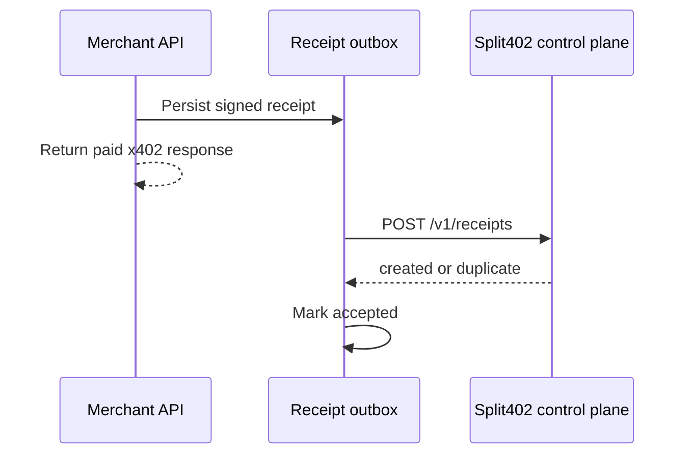

# @split402/merchant-sdk

Production merchant helpers for Split402-enabled x402 APIs.

This package starts with production merchant boundaries:

- a cached campaign resolver for x402 offer and receipt signing;
- service-key rotation helpers for offer and receipt signing;
- explicit x402 payment-identifier helpers for idempotent paid retries;
- operation digest helpers for production GET and JSON POST request shapes;
- a durable receipt outbox for post-settlement control-plane ingestion.

## Cached Campaign Resolver

`CachedControlPlaneCampaignResolver` fetches active campaign terms from the
Split402 control plane and keeps them in memory behind a synchronous
`resolveCampaign` function. That shape plugs directly into
`createSplit402ResourceServerExtension`.

```ts
import { CachedControlPlaneCampaignResolver } from "@split402/merchant-sdk";
import { createSplit402ResourceServerExtension } from "@split402/x402-extension";

const campaignResolver = new CachedControlPlaneCampaignResolver({
  controlPlaneUrl: process.env.SPLIT402_CONTROL_PLANE_URL!
});

await campaignResolver.refreshCampaign("cmp_...");

const split402Extension = createSplit402ResourceServerExtension({
  merchantId: "mrc_...",
  merchantOrigin: "https://api.example.com",
  servicePrivateSeed,
  serviceKid: "kid_merchant_current",
  resolveCampaign: campaignResolver.resolveCampaign
});
```

The resolver keeps serving the last good active campaign snapshot even after the
refresh window becomes stale. Merchants should refresh campaigns on startup and
from a background job so a temporary control-plane outage does not stop paid API
responses from carrying signed Split402 offers.

## Operation Digests

Use the digest helpers when a merchant integration or test needs to precompute
the exact request hash that Split402 binds to payment attribution.

```ts
import { calculateJsonPostOperationDigest } from "@split402/merchant-sdk";

const requestDigest = calculateJsonPostOperationDigest({
  merchantId: "mrc_...",
  operationId: "wallet-risk-score",
  pathTemplate: "/v1/risk/:wallet",
  pathParams: { wallet: "..." },
  query: { includeLabels: "true" },
  body: { includeScore: true },
  paymentId: "pay_...",
  offerNonce: "ofn_..."
});
```

`calculateGetOperationDigest` and `calculateJsonPostOperationDigest` both reject
non-JSON-compatible values before hashing, which avoids signing request material
that a JSON transport would later drop or mutate.

## Payment Identifiers

Split402 routes must require the standard x402 `payment-identifier` extension so
logical request retries reuse one payment and one commission record.

```ts
import {
  declareRequiredPaymentIdentifierExtension
} from "@split402/merchant-sdk";
import { declareSplit402 } from "@split402/x402-extension";

const routeExtensions = {
  ...declareSplit402({
    campaignId: "cmp_...",
    operationId: "wallet-risk-score"
  }),
  ...declareRequiredPaymentIdentifierExtension()
};
```

`createSplit402PaymentIdentifier` generates IDs that are valid for both x402 and
Split402 receipts. `assertRequiredSplit402PaymentIdentifier` fails closed when a
settled payment payload is missing the required identifier.

## Service-Key Rotation

`InMemoryMerchantServiceKeyRing` keeps a current signing key while still
resolving older public keys by `kid`. Pass it to
`createSplit402ResourceServerExtension` as `serviceKeyProvider`.

```ts
import { InMemoryMerchantServiceKeyRing } from "@split402/merchant-sdk";
import { createSplit402ResourceServerExtension } from "@split402/x402-extension";

const serviceKeyProvider = new InMemoryMerchantServiceKeyRing({
  current: {
    kid: "kid_merchant_2026_06",
    privateSeed: currentSeed
  },
  additional: [
    {
      kid: "kid_merchant_2026_05",
      privateSeed: previousSeed
    }
  ]
});

const split402Extension = createSplit402ResourceServerExtension({
  merchantId: "mrc_...",
  merchantOrigin: "https://api.example.com",
  serviceKeyProvider,
  resolveCampaign: campaignResolver.resolveCampaign
});
```

New offers and receipts use the current key. Offers issued before rotation can
still verify as long as their `kid` remains resolvable.

## Receipt Outbox Flow



## Receipt Outbox Use

```ts
import {
  ControlPlaneReceiptSubmitter,
  InMemoryMerchantReceiptOutboxStore,
  MerchantReceiptOutboxDispatcher
} from "@split402/merchant-sdk";

const store = new InMemoryMerchantReceiptOutboxStore();
await store.enqueueReceipt({ receipt: signedReceipt });

const dispatcher = new MerchantReceiptOutboxDispatcher(
  store,
  new ControlPlaneReceiptSubmitter({
    controlPlaneUrl: process.env.SPLIT402_CONTROL_PLANE_URL!
  })
);

await dispatcher.dispatchNext();
```

`InMemoryMerchantReceiptOutboxStore` is for tests and examples. Production
integrations should implement `MerchantReceiptOutboxStore` with durable local
storage such as PostgreSQL, SQLite, or the merchant's job queue.
