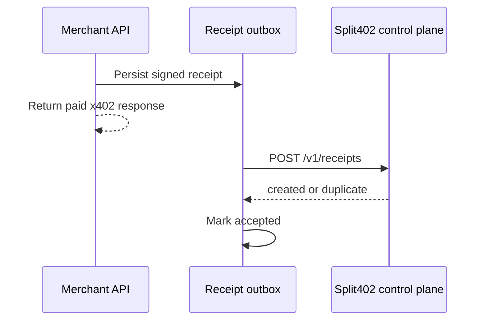

# @split402/merchant-sdk

Production merchant helpers for Split402-enabled x402 APIs.

This package starts with two production reliability boundaries:

- a cached campaign resolver for x402 offer and receipt signing;
- a durable receipt outbox for post-settlement control-plane ingestion.

## Cached Campaign Resolver

`CachedControlPlaneCampaignResolver` fetches active campaign terms from the
Split402 control plane and keeps them in memory behind a synchronous
`resolveCampaign` function. That shape plugs directly into
`createSplit402ResourceServerExtension`.

```ts
import { CachedControlPlaneCampaignResolver } from "@split402/merchant-sdk";
import { createSplit402ResourceServerExtension } from "@split402/x402-extension";

const campaignResolver = new CachedControlPlaneCampaignResolver({
  controlPlaneUrl: process.env.SPLIT402_CONTROL_PLANE_URL!
});

await campaignResolver.refreshCampaign("cmp_...");

const split402Extension = createSplit402ResourceServerExtension({
  merchantId: "mrc_...",
  merchantOrigin: "https://api.example.com",
  servicePrivateSeed,
  serviceKid: "kid_merchant_current",
  resolveCampaign: campaignResolver.resolveCampaign
});
```

The resolver keeps serving the last good active campaign snapshot even after the
refresh window becomes stale. Merchants should refresh campaigns on startup and
from a background job so a temporary control-plane outage does not stop paid API
responses from carrying signed Split402 offers.

## Receipt Outbox Flow



## Receipt Outbox Use

```ts
import {
  ControlPlaneReceiptSubmitter,
  InMemoryMerchantReceiptOutboxStore,
  MerchantReceiptOutboxDispatcher
} from "@split402/merchant-sdk";

const store = new InMemoryMerchantReceiptOutboxStore();
await store.enqueueReceipt({ receipt: signedReceipt });

const dispatcher = new MerchantReceiptOutboxDispatcher(
  store,
  new ControlPlaneReceiptSubmitter({
    controlPlaneUrl: process.env.SPLIT402_CONTROL_PLANE_URL!
  })
);

await dispatcher.dispatchNext();
```

`InMemoryMerchantReceiptOutboxStore` is for tests and examples. Production
integrations should implement `MerchantReceiptOutboxStore` with durable local
storage such as PostgreSQL, SQLite, or the merchant's job queue.
