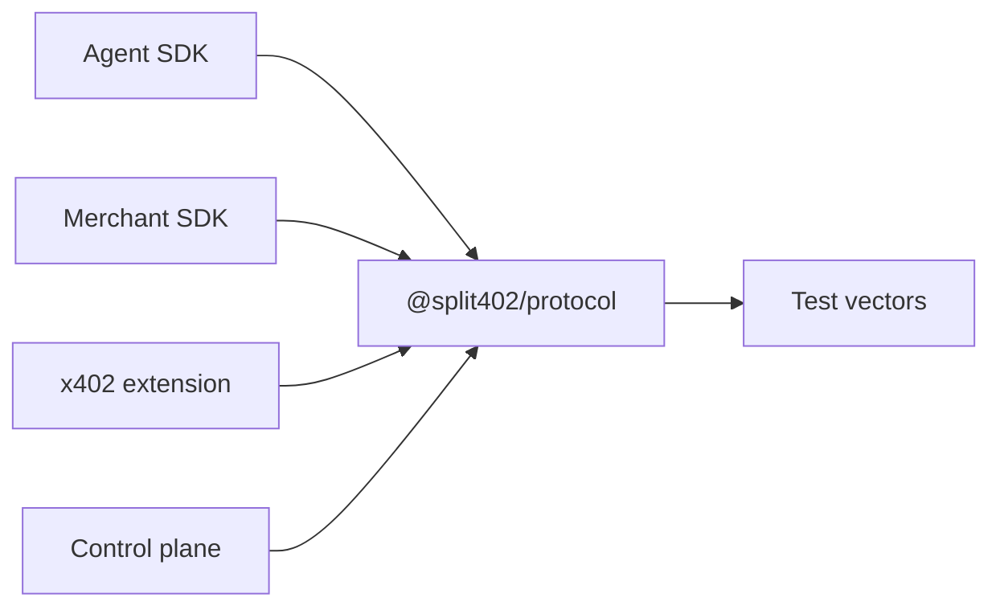
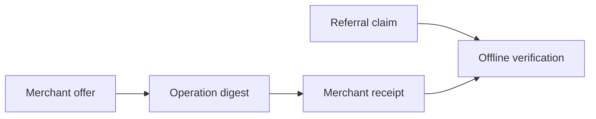

# @split402/protocol

Deterministic protocol primitives for Split402 referral attribution, signed
receipts, and commission accounting.

This package is the stable core used by the x402 extension, SDKs, demos, test
vectors, and control plane. It contains no network client and no database code;
its job is to make the bytes, hashes, signatures, IDs, and amount math identical
everywhere Split402 runs.

## Where It Fits



## Responsibilities

- canonical JSON hashing;
- Split402-prefixed IDs;
- atomic amount parsing and serialization with `bigint`;
- commission math in basis points;
- operation digest calculation;
- referral claim, offer, attribution, and receipt schemas;
- Ed25519 signing and verification helpers;
- language-neutral test-vector generation and checks.

## Flow



## Money Model

The protocol package does not move funds. It defines the signed evidence that
lets the rest of Split402 prove:

- which x402 paid operation happened;
- which merchant campaign applied;
- which referral claim was attached;
- how much commission should be recorded in atomic units;
- which payout wallet should later receive the merchant-funded commission.

## Commands

```bash
corepack pnpm --filter @split402/protocol test
corepack pnpm --filter @split402/protocol typecheck
corepack pnpm --filter @split402/protocol vectors
corepack pnpm --filter @split402/protocol vectors:check
```

## Package Status

Implemented as the Milestone 0 protocol core. Public APIs are still pre-release
and may change before a production version is published.
