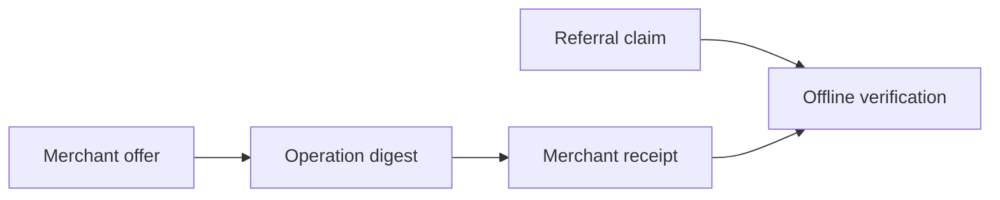

# @split402/protocol

Protocol primitives for Split402 referral attribution and commission accounting.

This package is the deterministic core used by the SDK, x402 extension, demos,
and control plane. It contains no network client and no database code.

## Responsibilities

- canonical JSON hashing;
- Split402-prefixed IDs;
- atomic amount parsing and serialization with `bigint`;
- commission math in basis points;
- operation digest calculation;
- referral claim, offer, attribution, and receipt schemas;
- Ed25519 signing and verification helpers;
- language-neutral test-vector generation and checks.

## Flow



## Commands

```bash
corepack pnpm --filter @split402/protocol test
corepack pnpm --filter @split402/protocol typecheck
corepack pnpm --filter @split402/protocol vectors
corepack pnpm --filter @split402/protocol vectors:check
```

## Package Status

Implemented as the Milestone 0 protocol core. Public APIs are still pre-release
and may change before a production version is published.
