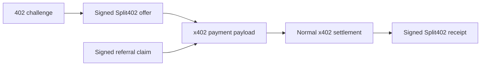
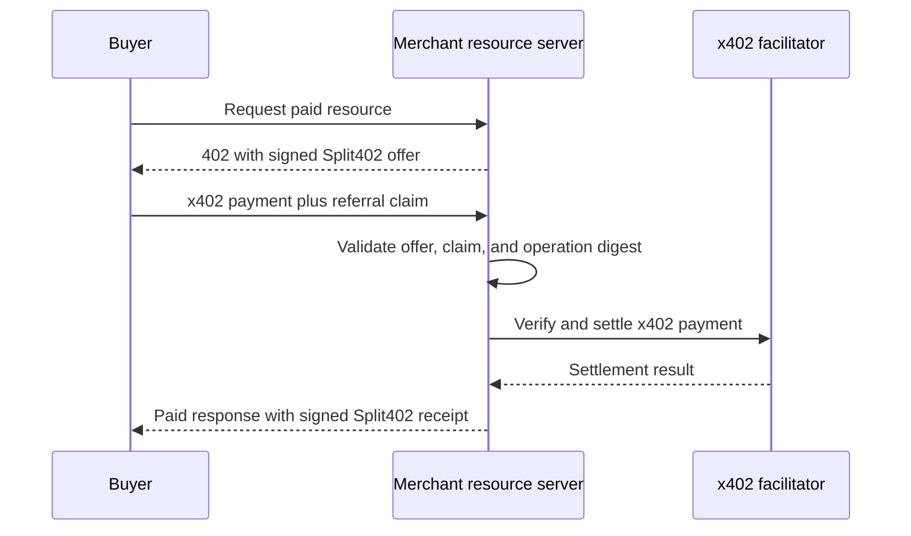

# @split402/x402-extension

x402 extension hooks for Split402 offers, attribution, and receipts.

This package connects the Split402 protocol primitives to x402 client and
resource-server extension points. It keeps the commercial payment path as normal
x402 while adding signed referral context around that payment.

## What It Adds To x402

The extension does not split the original x402 payment. It carries the signed
offer, referral claim, request digest evidence, and receipt needed for later
commission accrual and payout.

Receipts use `protocolFeeBpsOfCommission` to split the merchant commission into
protocol fee and referrer credit. Self-referral checks are based on the settled
payer wallet and merchant-owner policy, not on whether the referrer identity
wallet and payout wallet are the same.

## Resource-Server Flow

## Main Exports

- `declareSplit402` marks a route with its Split402 campaign and operation.
- `createSplit402ClientExtension` attaches payment IDs, request digests, and
  referral claims to x402 payment payloads.
- `createSplit402ResourceServerExtension` advertises signed offers, validates
  incoming attribution, and signs receipts after successful settlement.
- `buildReceipt` builds the receipt body used by the resource-server extension.

## Package Status

Implemented for the Solana Devnet demo path and x402 SVM `exact` flow. Production
deployment still requires operational hardening around settlement monitoring,
receipt outbox durability, and payout reconciliation.
